# 무작정 파리 구경

물랑루즈공연하나 보러 파리에 왔으나, 파리 호텔에 도착한 시각 8시쯤.공연 시작까지는 3시간 정도가 남았다.남는 시간 빈둥빈둥 놀면 뭐하나?내가 내 돈 들여 파리는 올 것 같지도 않고, 파리 구경을 나갔다.

파리하면 생각나는 것 들. 에펠탑. 개선문,샹제리제,루브르 박물관,몽마르뜨..

박물관이 떠오르는 순간, 병인양요가 떠오르는군.우리나라 양민들 죽이고,외규장각 도서를 약탈해 갔지.그리고 TGV 팔면서,외규장각 도서 중 일부 반환하겠다고 약속했으면서, 오리발 내민 놈들.그러고 보니 직지심경이 프랑스에 아직 있구나.. 예전 이집트 박물관을 갔을 때에도 정말 중요한 보물들은 약탈당해 루브르 박물관과 대영박물관에 많이 있다고 씌여있던 게 생각난다.전세계 약탈한 문화재들의 전시장 루브르 박물관은 우선 제외.

목적지로 삼은 곳은 샹제리제.아무래도 가장 유명한 거리인 것 같고, 밤도 화려하겠지라는 기대감 때문이다.그리고 프랑스 노래, ‘오~샹제리제..’이라 하며 간질간질한 목소리로 부르는 것이 생각나서이기도 하다.

그 상제리제를 향해서 지도한 장 들고, 도보로 이동 시작.지도상으로 볼 때 거리는 대략 5km 정도 되는 것 같다.

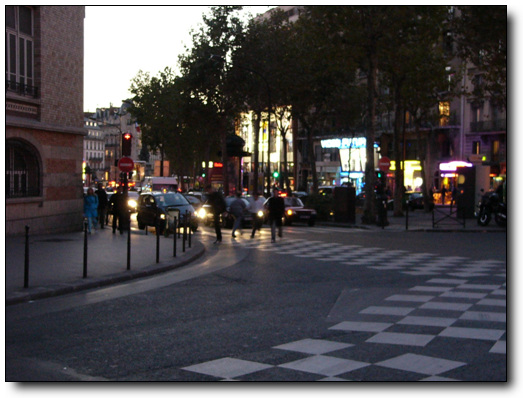

-거리에 나섰다.서서히 어둠이 깔리기 시작한다.

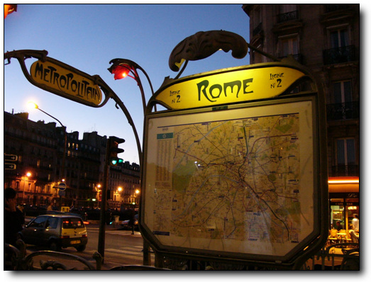

-클리시거리에서 처음 나타난 전철역 로마역.

-건물들은 화려하다.

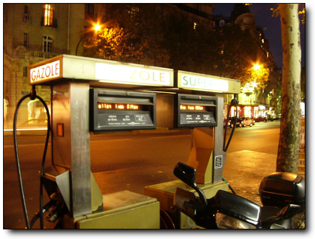

-걸거리에있는 무인 주유소. 단촐하다.

-한 50여분 정도 걷다 보니, 개선문이 보이는군. 샹제리제 거리가 개선문에서 서쪽으로 뻗은 대로이니까, 거의 다 온 것이다.

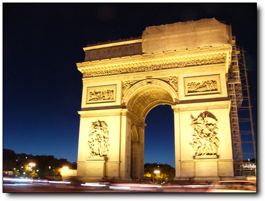

-개선문이다.보수 공사중인가 보다.

-이게 바로 그 샹제리제 거리군.종로거리보다는 별 게 없군.

-샹제리제거리

-그래도 이 거리만큼은 다른 거리와 달리 밤에도 환하군.

-샹제리제거리에서 옆 골목을 슬쩍 보니,낮익은 구조물이 보인다.

에펠타워.보기 전까지는 그까짓 철골 구조물이 뭐 멋있겠느냐.남산타워와 뭐 거기서 거기겠지 여겼였다.한데 막상 보니, 어두운 파리 시내에서 환한 조명을 발하는 타워는 꽤나 근사해 보였다.다음 목적지 에펠타워.에펠타워를 향해 또 걷는다.

-한 30여분 걸어 갔나?사람들이 많이 모여있는 장소가 있군.

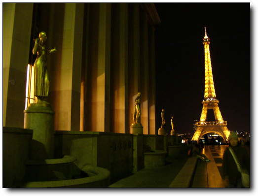

-에펠타워를 볼 수 있는 최적의 전망소인지, 많은 사람이 있었고,곧곧에 한국사람들이 말하는 소리도 들리더군.포르투갈에서 통 못 들어 보다가 여기서 들으니, 반갑기는 하더군.

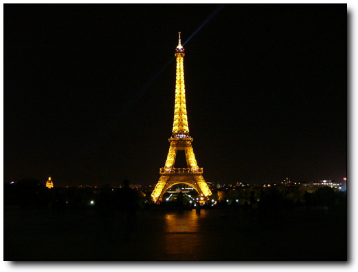

-이렇게 생겼다.

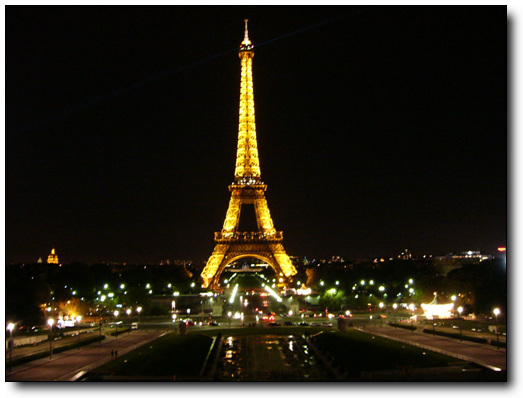

-여기서 거리가 한 500여미터 되는군. 물랑루즈 시작할 시간도 남았겠다 저기까지 가본다.

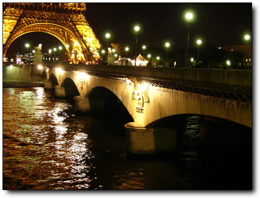

-쎄느강건너에 있군.

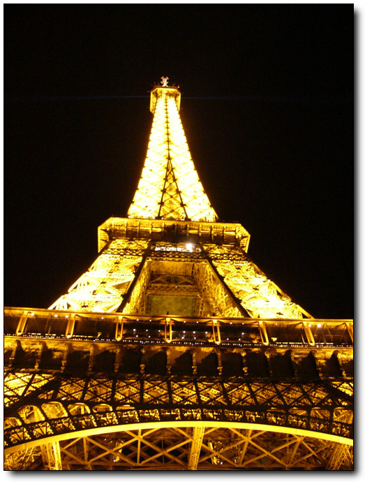

-가까이에서 보니 더 근사한 걸..

-엘리베이터 밑에는 한번 올려가 볼려고 줄 서 있는 사람들이 길게 늘어져 있다.

-다른 나라에 단체 관광온 학생 같아 보이는군.

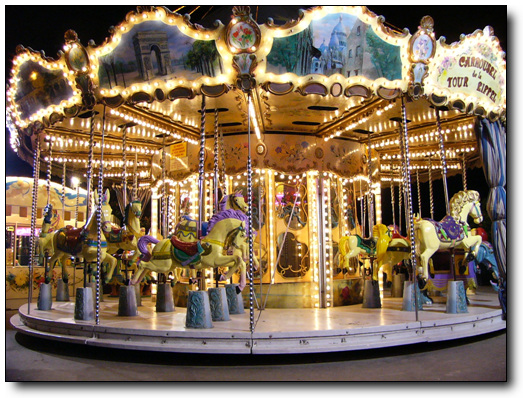

-근처에 회전목마도 있군.혹시 이게 파리연인에서 나온 ‘하드 사줄께 애기야 가자’이 목마인가

-10시넘으니 별도의 반짝이 불도 켜는군.

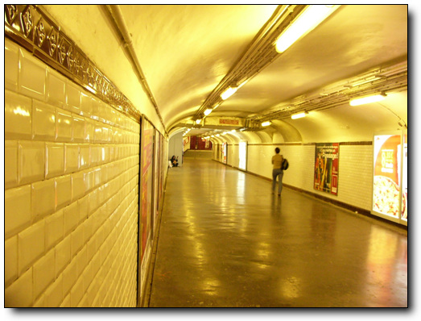

-물랑루즈가있는 블랑쉐 역까지는 지하철로 이동한다.

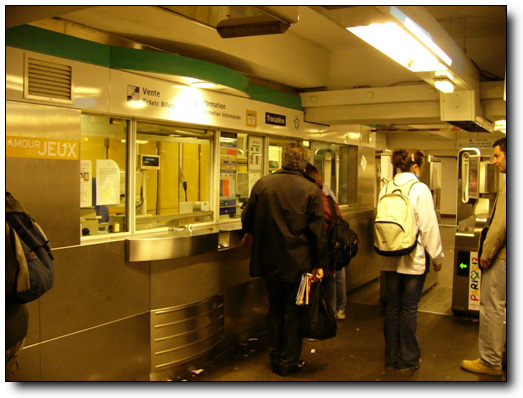

-티켓오피스에서 표를 사고..

-이게 지하철 표. 1.4유로다. 2천원이 조금 넝는 돈이군.비싸군.

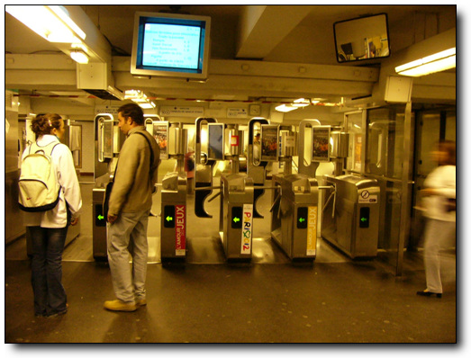

-개찰구를 통과한다.역시 무단 사용자를 원천 봉쇄하기 위해 상하 다 막아놨군.

-지하철 승강장.우리보다 좀 후지군.

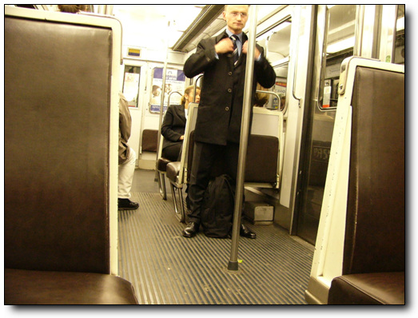

-전철 내부.기차처럼 문 옆에도 의자가 달려있군.

-나가는 출구도 유도의 전방낙법으로 상단 통과를 하지 않는 한 공짜 사용이 어렵겠군.

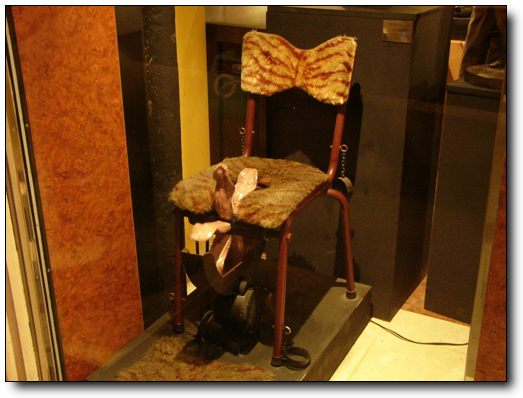

-물랑루즈옆 sex shop에 진열되어 있는 신기한 물건.남자용인가 여자용인가?

물랑루즈공연 후, 다음 날 나머지 파리 구경을 나간다.

비행기는 오후 1시 15분에 출발하는 것. 12시 30분에 탑승 시작이니까, 공항까지는 11시전에 도착을 도착을 해야겠고,그렬려면 호텔에서는 10시에 체크아웃하고 나가야겠군.

서머타임을 적용해서인지, 7시가되서도 해 뜰 생각을 안 한다.

그래도 7시부터는 어둠이 가시기 시작하여, 호텔이 있는 몽마르뜨 언덕을 가보기로 했다.

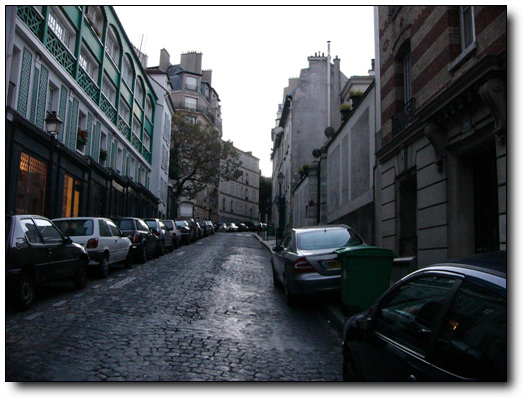

-여기가 몽마르뜨 언덕.그냥 꼭대기까지 올라가 보는 중이다.별 거 없다.

-조용하다.출근하는 사람들도 안 보이는군.

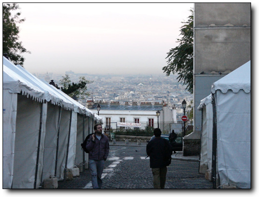

-정상까지 왔다.파리시내가 보이긴 보이는군.

-정상에는 샤크레쾨르 성당이 있군.

이 성당은 19세기 보불전쟁, 즉 독일과의 전쟁에서 패해서 알자스와로렉지역을 내어주고, 그 상심함을 달래기 위해 지은 거라는 하는군.. 이 때 배경으로 하는게 마지막 수업이란 소설도 있다.

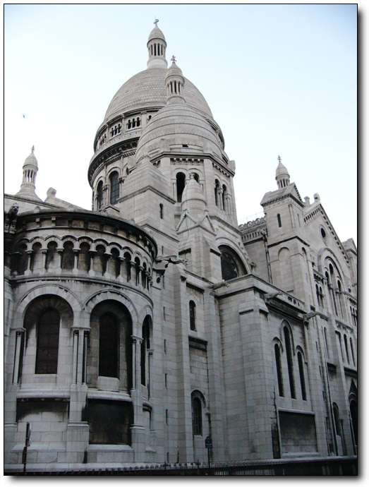

-전쟁에 패하고서도 꽤 화려하게 지었군.

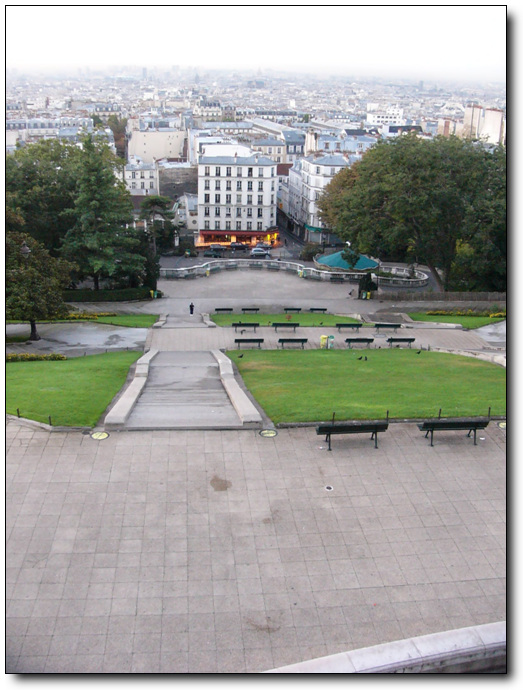

-아래도 넓은 광장과 시내 전경이 나오는군.

-8시가되어서야 해가 뜨는군.

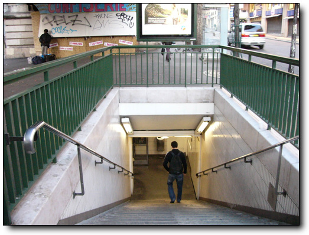

-다시 지하철을 타고,노틀담 보러 간다.

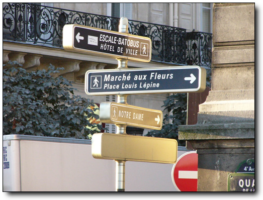

-노틀담표지판을 따라 간다.

-이게 노틀담 성당.파리의 중심부 시떼 섬에 있다.

물론 이 성당도 내가 노틀담의곱추라는 소설만 안 읽었어도 안 찾았겠지..

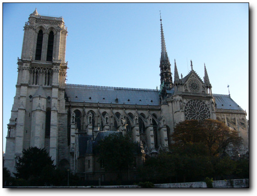

-꽤나 화려하다.

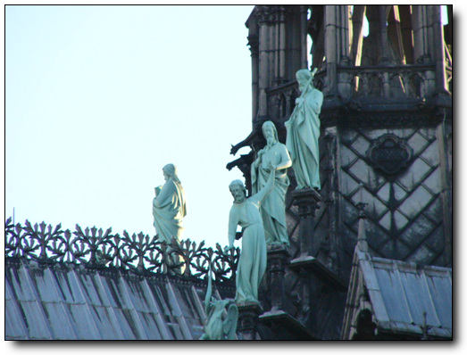

-지붕 곳곳에도 조각이 다 되어 있군.

-햇살이 강해지기 시작한다.이제 갈 때다 되는군..

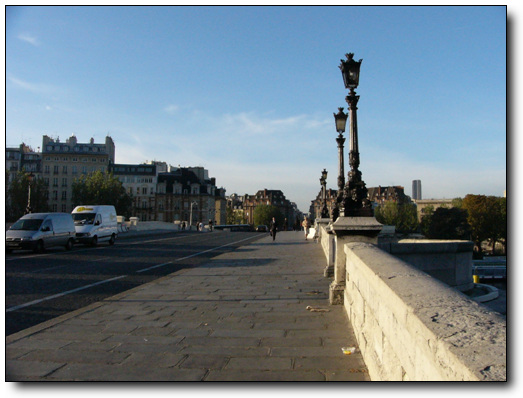

-근처 전철역 퐁뇌프 역으로 가기 위해,퐁뇌프 다리를 건너는 중.이 별 거 없는 다리도 영화 퐁뇌프 연인 때문에, 유명해졌구나..

-전철을 타고, 호텔로 가는 중이다.프랑스인들의 옷은 대부분 때 안 타는 어두운 색깔이다.

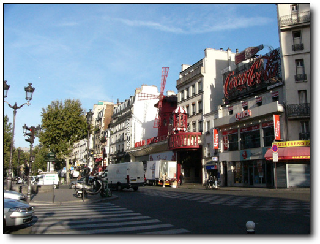

-낮에 보는 물랑루즈에서는 밤에서의 화려함은 느껴지지 않는군.

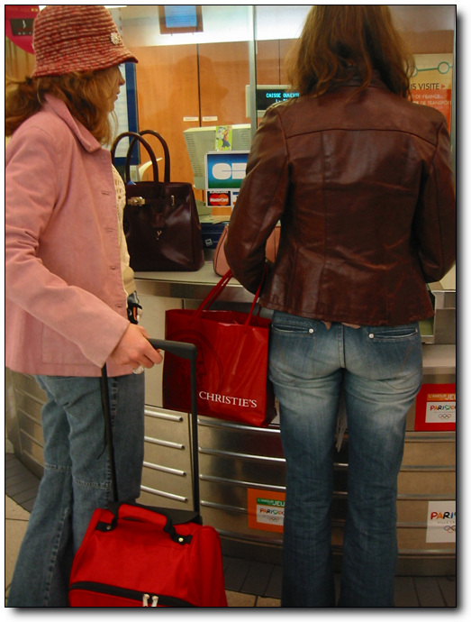

-짧은 파리 관광을 마치고 공항으로 가는 길.기차역으로 기차표를 샀다.역시 7.85유로

-기차를 타니, 거리의 악사가 멋드러진 연주를 한다.남은 동전 25센트 줬다.

-파리 공항에 거의 다 왔다.

-공항 보안검색대 통과 전.

가는 비행기는 에어프랑스.불친절하기로 유명한 항공사다.

밤 비행기를 탔으면, 친절한 대한항공을 탈 수 있었겠지만, 원래 목요일에 도착을 해야 되는 것인데, 회사 몰래 파리 체류하여 논 거라, 금요일 아침에 도착할 수 있도록, 1시 15분 비행기를 탄 거다. 1시 비행기는 에어프랑스.불친절하긴 해도, 그래도 중국 민항기 동방항공이나 남방항공보다야 낫더군.

-기내식 점심 메뉴는 불고기밥.간만에 먹는 한국음식이라 맛있었다.

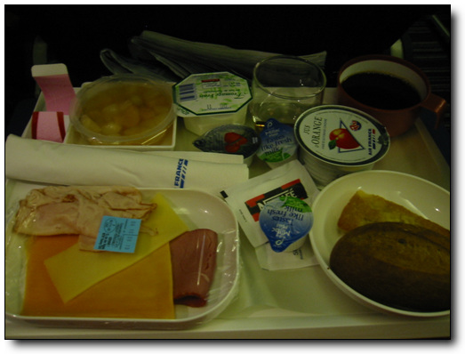

-두번째기내식으로 나온 아침식사. 허접하군.

비행시간 12시간.잠이 안와, 꼬박 깨어있는 채로 서울에 도착했다.

공항에 도착한 시각 7시.입국신고를 하고 짐 찾고,버스타고 집에 가면 잘 하면 9시는 될 수 있을 것 같다.그럼 잘 만 하면 회사에 10시 이전에 출근할 수도 있겠다. 아무일도 없었던 듯이..

출근길이라 그런가 올림픽대로는 막히더군.집에 가는 차에서 전화가 울리기 시작한다.상민의 전화.왜 아직 회사 출근을 안하냐고.. 바쁜 모양이다.

허겁지겁 집에서 면도와 샤워를 한 후, 점심 먹고, 짐만 푼 후, 회사 출근.

마치 아직 시차 적응이 안되어서,늦잠자서 늦게 온 듯..

이 날 피곤해 죽는 줄 알았다.정신도 멍한 상태로..

