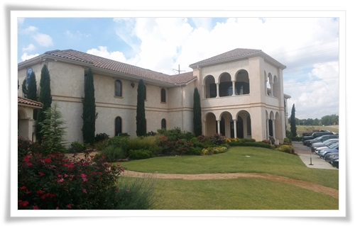
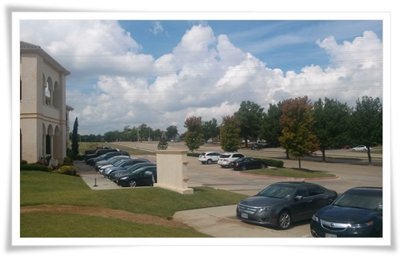
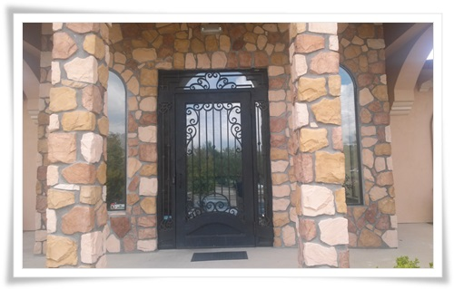
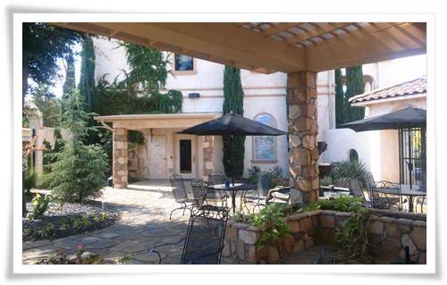
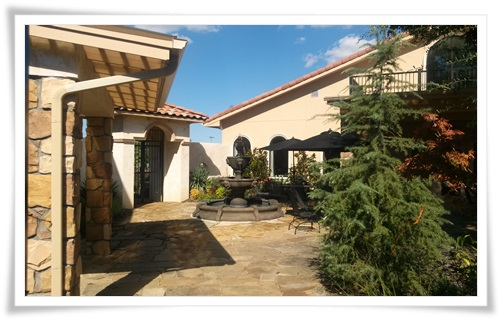

# 달라스 출장지에서 출근한 사무실

숙소와 고객사 사무실간의 거리가 꽤 되었다.

차로 30분 정도 갔고, 고속도로를 타고 다녔다.

그래도 오리역에서 여의도까지 출퇴근한 것 보다야 훨씬 나았다.

\- 나의 출근 경로.

조지부시대통령유료고속도로와 75번 중앙고속도로를 타고 다녔다.

\- 매일 출근한 사무실.

건물 모양만 봤을 때는 사무실이라기 보다는 무슨 마피아 두목 사택 느낌이 든다.

\- 사무실 앞 넓찍한 주차장에 주차하고 사무실에 들어선다.

\- 번호키로 되어 있는 현관을 통과.

\- 사무실에 있는 휴식공간.

\- 전속 정원사가 가꾸는 휴식 공간이라 뭐가 휴양지 느낌이 난다.

