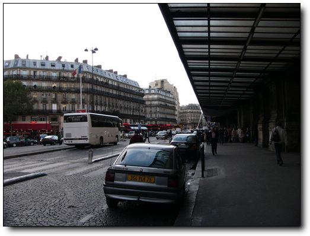
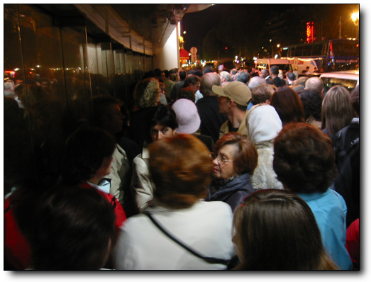

# 몽마르뜨 언덕의 빨간풍차 물랑루즈

프랑스 샤를드골 공항을 경유하는 에어프랑스.

파리, 처음엔 별로 땅기는 게 없었다.

그러나, 포르투갈 가면서 보게 된 기내잡지에 나온 물랑루즈 광고가 이 생각을 바꾸었다.

문화 예술, 특히 영화의 힘이 크다는 것을 나를 보면서 느꼈다.

내가 과연 영화 물랑루즈를 재미있게 보지 않았다면 물랑루즈하나땜에 파리에 머물 생각을 했을까?

뭐 조금은 하긴 했을 지도 모르겠다.

-아주 재미있게 본 영화 물랑루즈 속의 매혹적인 샤틴 역의 니콜키드먼

만약 내가 드라마 파리의 연인을 보았다면, 아마도 그 곳에 나온 장소들을 방문하고 싶어했을지도 모르지.

울연가때문에 일본 관광객들이 준상이네 집에 오는 것처럼..

물랑루즈를두고, 리스본에 머무는 내내 고민을 했다.

물랑루즈 인터넷 홈페이지를 보니, 디너쇼가 150유로정도 하고,드링크쇼는9시가 95유로, 11시가 85유로 하였다.

그리고 이 쇼는 하도 인기가 많아서 그런지 현장 매표는 안하고, 예약을 해야지만 들어갈 수 있는 곳이다.

나의 원래 비행일정은 수요일 오후 3시 30분 비행기를 타고 드골공항에 오후 5시 20분에 도착하여, 밤 9시 50분 비행기를 타고 서울에 그 다음날 오후 4시에 도착하는 거다.

파리->서울 가는 에어프랑스 비행편을 보니, 오후 1시 15분과 밤 9시 50분 두편이 있더군.

자고로 출장 일정은 비행기를 타 봐야 아는 거라서, 결정을 못 하고 있었다.

이곳 vodafone에서의 일이 수요일 12시가 되어서 종료되어 신속히 짐을 싸고 체크아웃하고, 공항으로 가니 오후 1시.실행에 옮기기로 결정했다

에어프랑스 사무실에서 리스본->파리를 오후 1시 50분 비행기로, 파리->서울행은 그 다음날 오후 1시 15분 걸로 변경하고, 출국장 안으로 들어섰다.

이미 비행기 탑승 시간이 되었지만, 파리에서 머물 호텔도, 그리고 물랑루즈도 예약을 안 한 상태라, 노트북을 꺼내고, 호텔부터 예약을 하였다.호텔 예약은 [www.ratestogo.com](http://www.ratestogo.com/) 이 사이트에서 하였다.

예약한 호텔은 몽마르뜨에 있는 Le chat Noir 라는 별두개짜리 호텔.위치가 몽마르뜨니까물랑루즈와 가까울 것 같았다.

그리고 인터넷으로 예약 할 수 있는 것 줌 제일 싸기도 했다.

싱글룸은 다 차서,더블룸45유로에, 예약수수로 5유로다.

호텔 체크인할 때 바우쳐를 가지고 가야하는데, 프린트 할 수 없기에 인터넷 페이지 그대로 저장을 해 두었다.

그 다음 물랑루즈 예약.

[www.moulinrouge.fr](http://www.moulinrouge.fr) 에서 하였다.

10월 6일 수요일 밤 11시 것으로 했다.

이것 역시 프린트 할 수 없어서,웹페이지로 저장.

무척이나 바빴다.

남들 비행기 타고 있는 동안 10분 동안 이 짓을 하고 있었으니.

무사히 예약을 마치고 뿌듯한 마음으로 비행기 탑승.

-내가 탄 에어버스.조그만 비행기라, 모니터가 없어 승무원이 직접 비상시 요령을 시범을 보이고 있다.

-점심 기내식.역시나 허접한 에어프랑스

-비행기 안에서 파리 지도를 펴고, 지형을 머리에 집어 넣는 중.

손가락이 가리키는 곳이 몽마르뜨.내가 묵을 호텔이 있는 곳이다.

-호텔 주소를 지도에서 다시 한번 확인 중.

비행기는 2시간 반동안 날아 샤를드골 공항에 도착했다.

-자 이제 짐을 내리고, 비행기에서 내릴 준비.

-비행기에서 나와 공항 건물로 이동 중.

-입국하였다.

자 이제 몽마르뜨의 호텔까지 이동하는게 문제다

-여행 안내소에서 호텔 주소를 보여주고, 어떻게 가는게 좋을까 물어보니, 옆에 줄에 긴 데스크에다가 물어보랜다.

내가 줄 서는 것을 꽤나 싫어하는데,..

그냥 지도만 꺼내들고 찾아가려고 지도 보고 있는 도중, 어떤 남자가 와서 뭘 도와줄까요 하는군.

다시 호텔 주소 꺼내들고 여기로 가려는데 어떻게 하는게 좋을까요 했더니, 50유로내면 데려가 주겠다는군.

택시 운전사나 되는 것 같다.

비싸서 안되겠다고 하고, 그냥 기차역으로 향했다.

-기차모양이 있고, Gare라는 글자가 있는 것을 보니, 프랑스어로 기차역이 Gare인가 보다.

현재 시각 오후 5시 28분.어두워지기 전에 호텔에 도착을 해야한다.

-기차역에 도착. 역이름은샤를드골2 역이다.

-자동발권기.

지도를 보니,파리의북역이몽마르뜨와그마나가까워보였다.

거리로 보니,북역과몽마르뜨와의 거리 2~3km 정도.

한 30분만 걸어가면 되겠다 생각하고, 기차표를 끊으러 자판기앞에서 파리를 누르니 7.85유로.

카드로 할꺼냐 동전으로 집어 넣을 거냐 묻더군.

내 신용카드를 집어 넣었다.

뱉어내더군.

동전으로는 그 만한 돈이 없어, 유인판매소가 가서, 지도에 북역을 가리키며 표를 달라고 해서 표를 샀다.

-파리까지 가는 기차표. 7.85유로. 12,000원이나 되는 돈이다.  비싸군.

-기차 승강장으로 내려간다.

현재 시각 17시 35분.파리에는 6시 반쯤에는 도착하겠군.

-5분 정도 기다리니 기차가 왔다.

-기차안. 내부는 좀 촌스럽군.

-나의 목적지 GareduNord.북역이다.

-주머니에서 메시지왔다는 소리가 들려서 전화기를 꺼내보니,기차탔다고, 유료 정보를 한번 이용해 보라는 광고 메시지다.

-기차는 파리로 간다.

-파리가 가까워지자 맨 처음 보인 삼성 간판.

개인적으로 삼성이라는 회사는 싫어하긴 하지만, 이 정도 인지도의 회사가 우리나라에 있다는 것이 자랑스럽기도 하다.

기차는 30분 정도를 가니, 파리에 도착했다.

기차역에 북역( Gare de Nord ) 라고 쓰여 있을 줄 알았는데, 정차한 곳에 Paris Nord라고만 씌여있네..

아무래도 느낌이 북역 같아, 다른 승객에게 여기가 북역이라고 물어보니 맞덴다.

서둘러 내렸다.

-파리 북역 도착.

기차에서 내렸다.

-도착시각 18시 21분.

-기차역을 나가기 위한 자동문.

위로 뛰어넘거나 밀으로기어빠져나가는 사람이 얼마나 많았으면 대체 저 정도로 단단히 막았을까?

프랑스사람들은 꽤나 법을 안 지키나 보다.

드디어 파리에 첫발을 내디딘 것이다.사람이 많더군.

기차역을 벗어나니, 리스본의 한가함과 달리, 건물들도 큼직큼직하고, 사람들도 북적북적 대는게, 제법 화려한 도시같아 보였다.

-기차역을 나섰다.이게 파리군.리스본과는 달리 도시가 화려해 보인다.

해가 아직 떠있었기 때문에, 동서남북 방위각을 잡고, 지도를 정치하여,몽마르뜨로 걸어간다.

-해가 이쪽에 떴으니, 여기가 서쪽.이 쪽으로 걸어가면 되겠군.

-횡단보도도 건너고..

-도로가 그리 넓진 않군.

-해가 곧 질 참인가 보다.

-큰 길 발견.이 길이 드클리시 길인가 보다.이 길을 쭉 따라 가면 될 것 같다.

-스케이트보드 타는 사람도 여럿 보인다.나도 이 거 탈 줄 아는데..

-몽마르뜨거리는 성인용 유흥가인가 보다.

저기 좌우로 뻘건색 불 켜는 상점들이 대부분 sex shop또는 lap dance 등을 한다고 적혀있다.

-드디어 호텔 발견.

별두개짜리라서썩 훌륭하지는 않을거라 예상은 했지만, 생각보다도 훨씬 허름하다.

헤메지않고 한번에 찾아갔긴 하지만, 모르는 길에, 무거운 가방 두개를 가지고 이동해서인가 무지 멀게 느껴지더군.

호텔은 다행히 드클리시라는 대로변에 있었다.지하철역 브랑쉐하고 가까웠고..

유럽 호텔의 별 두개짜리라서 그런가 무지 후졌더군.

거의 우리나라 여인숙 수준이다.

-호텔 입구. 꽤재재 하다.

-호텔 프런트.

-호텔 로비.   낡았다.

-출입문.

호텔 데스크에서 체크인할 때, 프린트 해 놓은 게 없으므로, 노트북을 꺼내서 바우처를 화면으로 보여주었다.

방은 54호.즉 5층에 있는 거다.

엘리베이터도 무지 낡았고, 생긴 모양도 특이했다.문이 이중인데, 바깥문은 직접 열어야 하는 방식이었다.

-내 방. 54호.

방은, 큰 침대 하나, 작은 침대 하나, 조그마한 TV, 그리고 샤워실이 포함된 화장실.이렇게 구성되어 있었다.

청소는 잘 해 놓은 것 같은데, 시설 자체가 너무 낡아, 지저분해 보였다.

-방 내부.허름하군.

-돈을 아끼고자, 포르투갈에서 들고온 먹다 만 빵과 물.  알뜰한 나^^

-방에서 본 바깥 거리.

오른쪽의 저 붉은 색 간판이 있는 곳이 물랑루즈다.

정말 가까운 거리다.

-이게 바로 물랑루즈.

해가 막 저물기 시작하였으므로,디카만 꺼내 들고, 시내 정찰에 나갔다가 물랑루즈 들어갈 시간에 맞춰 들어왔다.

밤 10시 30분.

물랑루즈앞으로 갔다.

사람들이 엄청나게 많더군.

시작할 시간이 가까워짐에 따라 이 일대의 교통은 완전히 마비되는 수준이었다.

단체 관광객을 실어나르는 버스들도 그 앞에 정차하느라 더더욱 그랬다.

-쇼를 보러 물랑루즈로 걸어 가는 중.

-입장 하려고 줄을 서 기다리고 있다. 정말 사람 많다.

-내 뒤로도 이렇게 많은 사람이 줄을 서 있다.저 옆에 서 있는 버스들이 다 이 관광객들을 실어 날랐다.

-물랑루즈가격표.  내가 본 것은 저기 11시에 하는 85유로짜리.

쇼가 11시라서 10시 50분이면 입장 할 줄 알았는데, 입장은 11시가 되어서야 시작되었다.

내부에서는 촬영이 금지되어 있었다.

영화 물랑루즈 정도의 수준을 기대하고 간 것은 아니었다.

그렇지만 쇼는 내 기대를 충분히 충족시켜 주었다.

내가 이런 쇼를 보는 것은 이번에 세 번째.

처음 본 것은 다음에서 괌으로 놀러 갔을 때, 거기서 라스베가스 식 쇼라고 하여 보러 갔었는데, 꽤 실망스러웠었던 기억이 있다.

별로 흡입력도 없고, 지루했었기 때문이다

.그 때 당시도 거의 10만원 정도하는 돈을 들였던 것 같은데..

두 번째 본 쇼가, 방콕의 게이쇼다.

재미는 있었지만, 음향 효과 등 2% 부족한 느낌이었다.

내 자리는 무대 바로 옆자리.자리에 앉자 웨이터가 각기 얼음통에 샴페인을 담아 1인당 1병씩 주었다.

나는 호주에서 출장 온 독일로 출장 온 사람, 그리고 미국인 부부와 합석을 했다.

이 호주인도 통신 쪽에서 일하는 사람인데, RF 엔지니어라고 하더군.

근데,니콜키드먼은 별로 안 좋아하더군.

물랑루즈 영화도 이 사람 평으로는 terrible 이라고 하면서...

공연은 80여명의 무희들의 화려한 춤들과,써커스,삐에로, 복화술 등의 쇼를 하였다..

그리고 무대가 열리면서, 큰 수족관이 올라면서, 그 안에 커다란 비단뱀들이 있는데, 그 수족관 속으로 한 무희가 뛰어들어 수중 퍼포먼스를 보이는 것도 꽤나 인상적이었다.

공연은 한시간40분 정도 하였는데, 전혀 지루함이나 다른 생각이 들지 못하도록 혼을 쏙 빼놓았다.

공연하는 도중 영화에서처럼 관객석 중앙으로 니콜키드먼이“Diamon is girl’s best friend”라는 노래를 하며 내려올 것만 같은 착각도 들었다.

100년 이라는 전통을 무시하지는 못하는 듯하다.

그리고 최고의 캬바레인만큼 여기에서 일하려는 무희들의 경쟁률도 많아서 그런가, 어디 하나 떨어지는 무희들이 없었다.

보통은 서너명의프리마돈나급과 들러리들로 구성되는 것이 보통일텐데, 춤과 연기, 그리고 외모 등 다 훌륭했다.

특히 내 자리가 무대 바로 옆이라, 화려한 무희를 불과 1미터 앞에서 바라보다는 그 생생함은 더욱 더 날 매혹시켰다.

-공연이 끝나고 나오면서, 한 장 찍은 객석 사진.

-공연 모습을 찍어 놓은 팜플렛 사진.

이 날 밤.흥분이 가라앉지 않아 쉬 잠들지 못했다.

아직까지도 물랑루즈의 잔상이 남는다.

