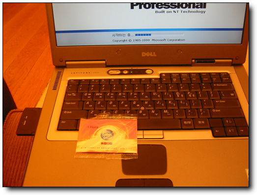
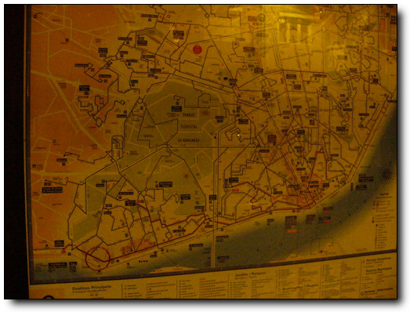
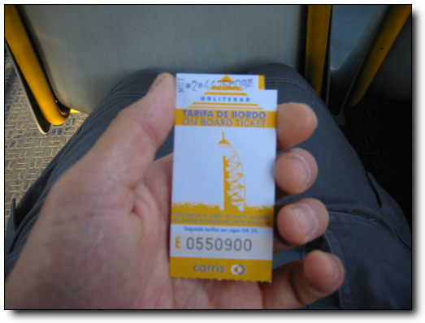
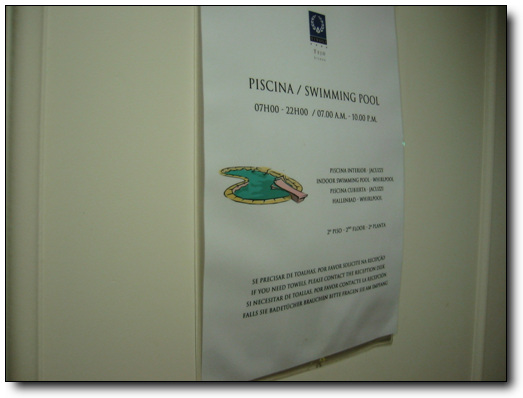
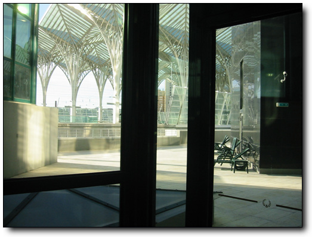
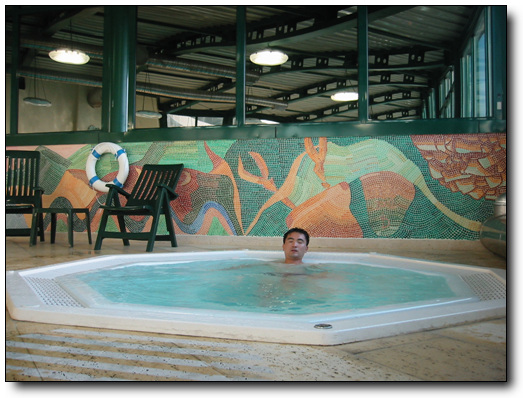
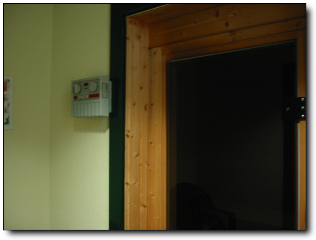

# 포르투갈을 떠나며

vodafone의 일이 다행히도 마무리되어, 포르투갈을 뜰 수 있게 되었다.

여기 띠볼리떼조 호텔에 6일을 머물렀는데, 숙박비는 우리는 92만원이 나왔다.

불편했던 점은 무엇보다도, 인터넷이다.

세계 어디에다 우리나라만큼 인터넷 환경이 좋은 곳은 없나 보다.

처음 호텔에 투숙했을 때 호텔 안내문을 보니, 호텔 로비와 레스토랑에서는 WIFI무선랜이 되며, 방에서 인터넷을 사용하기 위해서는 인터넷 커넥션이 필요하다고 씌여있었다.이 인터넷 커넥션을 RJ-45랜 케이블로 이해를 하고, 호텔 로비로 갔더니, 없다고 하면서, 호텔 앞에 있는 매장에서 구매를 하라는 거였다.가서 1m짜리를 샀다.무려 6유로인가를 주고서..

그걸 가지고,랜포트에 꽂았는데, 불이 안 들어온다.다시 리셉션 데스크로 가서,안된다고 봐 달라니까, 방에 와서 랜포트좀 보더니, “It’s so strange..”라고 한다.혹시 모뎀으로 할 수 있는 방법은 없냐니까모른댄다. 그래서 처음에는 노트북을 들고, 로비로 내려가서, 인터넷을 해야만 했었다.처음에 호텔 로비에서는 무선 인터넷 자유롭게 쓸 수 있을 줄 았었다.사실 2~3일 동안은 그랬었다.그런데 3일째인가 4일째인데, 로비에서도 무선랜이안되는 거였다.한동안 보이던 액세스 포인트가 안 잡히는 거다.그래서 데스크에다가 물었지.왜 안되냐고.. 그랬더니, 그거 유로로 WIFI 카드 구입해서 사용해야 하는 건데 라고 이상하다는 듯이 물어보았다.이제껏 썼었다 하니까 또 잘 쓰는 말. “It’s so strange”란다.이제 무료로 썼던 액세스 포인트는 호텔에서 공식적으로 운영하는 게 아닌,
근처에서 켜놓은 공유기 였던 것이었다.

그래서, wifi 카드를 샀다. 1시간에 무려 4.5유로. 7천원이나 되는 돈이다.우리나라 pc 7시간보다도 더 비싼 거다.

-이게 4.5유로짜리wifi카드.개봉하면 ID와 암호가 적혀있다.

이것도 또 우리가 잘 못 이해한 게 있었다. 1시간짜리 카드면, 전화카드처럼, 총 사용시간으로 1시간인줄 알고, 처음 산 다음, 아껴 써야지하고, 메일만 보낸 후, 얼른 끊었다.한 5분 정도 사용했나?그 다음날 메일 확인하려고 id와 암호 입력하니, 만료되었단다.이것은 무조건 처음 접속한 순간부터 딱 1시간동안만 되는 거였다.이런..5분 인터넷 하는데 7천원이나 쓴 거다.이거면 비행기 안에서 위성전화 사용한 거보다도 더 비싸게 사용한 셈이다.

나중에 다시 방에서 인터넷 접속을 시도하려고, 이번엔 컴맹이 아닌 직원에게 도움을 요청했더니, 인터넷이 되게 도와주었다.전화접속네트워크다.근데, 전화케이블을 어디다 꽂는가 했더니,랜케이블을 꼽는 그 8핀짜리 포트에다 꽂는거다.접속번호는 6717-18000, id와 암호는 공백. 암튼느리지면 방에서 메일 확인은 할 수 있게 되었다.

방에는 전기포트, 치약, 칫솔, 슬리퍼 같은 일체의 편의도구는 안 보였다.

다행히
김문호씨의 전기포트를 빌려갔기에, 전기포트로 국산 다방커피를 끓여마실 수 있었다.

그리고, 리스본의 택시기사들은 우리나라 택시들 만큼이나 불친절한 것 같다.포르투갈의 공식적인 안내책자에도 리스본의 택시기사들은 무례하고 불친절하니 조심하라고 씌여있더군.이어서 택시비도 과다하게 청구할 수 있으니, 공항에서 시내까지 보통 8.5유로가 나오니, 이보다 많이 청구하면 항의하라는 안내문까지 씌여 있었다.어딜 가나 택시기사들은 똑같나 보다.하긴 단골이 아닌 뜨내기 손님만 받는 직업이라서 그런지 말라도, 다시 또 볼 손님도 아닌데,굳이 친절하게 굴 필요가 없다고 느끼는 것 같다.처음 리스본에 가서 택시를 탔을 때도, 미터기에는 5 유로가 나왔는데, 8유로를 달라고 하더군.그래서 요금이 미터기랑 다르다 했더니, 그제서야 미터기 5유로 + 트렁크 사용료 1.5유로하여6.5 유로 제대로 말하더군.

그 외의 포르투갈 사람들은 대부분 친절했다.물어보니, 자세히 잘 가르켜 주기도 하고..

리스본에서 가장 마음에 들었던 거.대중교통 체계.특히 안내제도.

버스 정류장에는 그 버스 정류장에서 서는 전차나 버스 번호가 표시되어 있고, 지도가 붙어 있는 그 지도는 리스본 전체지도가 그려져 있고, 그리고 현재 위치가 표시되어 있었다.그래서 길을 헤매더라도 버스 정류장의 지도만 보면, 내가 어디에 있는가를 알 수 있었다.그리고, 지도의 좌표 별로 이 좌표를 들리는 버스편이 나타나 있어, 내가 어느 지역으로 가기 위해서는 몇 번 버스를 타면 되는가도 한 번에 알 수 있게 되어 있더군.

-버스 정류장에 붙어있는 지도. 좌측 하단의 빨간 점선의 원이 내가 있는 곳. 현재 벨렘지역에 있군.

-버스 안에서 직접 구매한 표. 1.1유로(우리돈1500원)이다.

버스 안에서 샀을 때는 이걸 사서,펀칭기에 찍으면 되는거다.저 오른쪽 귀퉁이 부분에.

포르투갈에서의 일이 다 끝나고 다음날 비행기 타기만을 기다리고 있는데, 여기 시간 오후 2시.한국은 이미 다들 퇴근하고 난 밤 10시.할 일이 없었다.

뭐 구경할 게 남았나 지도를 여기저기 뒤져봐도, 구경할 것은 다 구경한 것 같고, 별로 할 게 없었다.잠이나 자볼까 침대에서 이리저리 뒹굴어봐도 대낮이라 그런가 잠도 안 온다.

비장의 무기로 가져온 수영복을 쓰기로 했다.

이곳 호텔도 수영장이 있었다.

-수영장 안내문.아침 7시부터 밤 10까지 운영한다는군.

데크스에서타월을 빌린 후, 수영장을 향했다.수영장은 3층에 있더군.

이용하는 사람들도 없었다.내 전용 수영장이 되는 거다.

-3층 수영장은 저 밖에 오리엔트 기차역과 같은 높이에 있었다.

-햇살도 잘 드는 채광 조건이군.크기는 그다지 크지 않군.

-내장비만이 심각하군.배만 톡 튀어 나왔군.

-혼자서 노는 물놀이에 해맑은 표정을 지어본다.

-역시 물놀이는 피곤해.뜨듯한 물이 나오는 월풀 욕조에서 시조 한 수 읊고 있는 중..

-내 전용 사우나에서 땀도 뺀다.

[null](../6166840.html#6166840_1)

