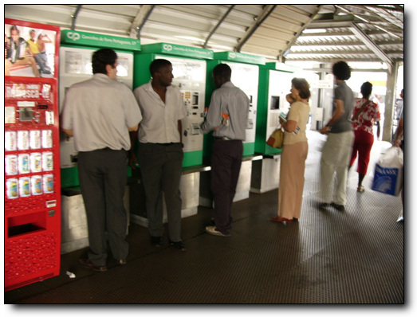
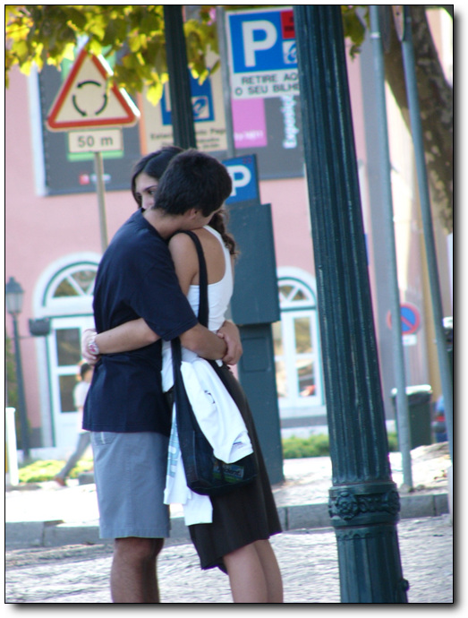
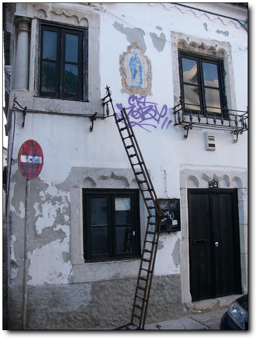

# 리스본 근교 까스까이스와 에스뜨롤리

포르투갈의 구경할 것은 다 구경했다.리스본 시내도 주요 곳은 다 가 봤고, 땅이 끝나는 곳 까보다로까도 가 봤으니, 별로 구경할 것도 없는데, 가만히 앉아있기에는 엉덩이가 들썩인다.

리스본 안내 책자를 보니, 어촌도시 까스까이스, 휴양도시 에스뜨롤리라고 설명이 되어 있다.한 번 가보자.

가는 방법은 까이스소드레 라는 역에서 기차를 타면 된다고 하더군.

-전철에 내려, 기차역으로 가는 중

-여기가 까이스소드레역

-역시 자판기에서 표를 사고.

-이게 기차표. 신트라 가는 거랑 똑같은 요금은 1.3유로 (2000원정도 됨)

-까스까이스가는기차

-기차는 떼조강이 대서양과 만나는 점을 가고 가고 있다.

-기차는 조금 특이한게, 좌석 배치가 좌우로 반대로 되어 있다는 점이다.

가다보니왠 비치가 보이는 게 아닌가?유럽의 비치는 볼 게 많다던데라고 들었던 게 생각나 급히 내렸다.

내린 곳은 에스뜨롤리.

-여기가 에스뜨롤리역.좌측에 해변가가 있고.

-우측으로는 카지노등 휴양시설이 있다.

-목적지 비치로 가기 위해 지하통로로 내려간다.

-비치다.근데 이상타.영 물이 안 좋다.

용인의 케이비안베이정도는 되꺼라 기대했었는데,..

-우리나라 해수욕장보다는 떨어진다.

-10월.휴가시즌이 아니라서 그런가?

-이것도 대서양이지.같은 대서양인데 까보다로까에서 본 대서양과 느낌이 완전히 다르다. 까보다로까에서는 황량함이었는데, 여기의 대서양은 그냥 아늑한 바다같은 느낌이다.

-낚시하는 사람도 제법 있다.

-까스까이스로가기위해, 다시 기차역으로 왔다.

-이곳이 까스까이스. 젊은애들이 많아, 제법 활기가 있다.

-모래사장은 조그맣게 이것 밖에는 없지만, 다른 위락시설이 많다.

-즐비한 상점들과 사람들.

-그리고 애정행각을 벌이는 사람도 있고.

-요트 타는 사람들도 있군.

-또다른애정행각팀 발견.

-사다리를 왜 2층 창문으로 놓았을까 이해가 안가는 집도 있고.

-아까의 애정행각팀 또 다시 만나는군.

-장소를 바꾸어 또 여기서 부둥켜 안는군.

-해가 저물기 시작하니, 사람이 떠난 모래사장은 개판이 되는군.

-제법 큰 쇼핑몰도 있길래 들어가봤다.

-설치되어 있는 이 분수가 신기하다.물이 튀지않고, 매끈하게 떨어진다.

-맨 위층에는 푸드코트가 있는데, 밖에도 테이블이 마련되어 있군.

-여기서 보니 저 멀리 있는 에스뜨롤리도 보이는군.

-바닷가 한 번 바라보고 다시 리스본으로..

[null](../6166841.html#6166841_1)

