# 포르투갈 가는길

간만의 출장이다.

3월달에 이후 처음 가는 출장이니, 무려 6개월만의 출장인 셈이다.

그래서 그런가, 조금 긴장은 되더군.

고속버스터미널에서 리무진버스를 타고 인천공항에 도착하니 시간 여유가 있다.

SK 멤버쉽 카드로 리더스클럽 라운지에서 우선 본전 뽑기.

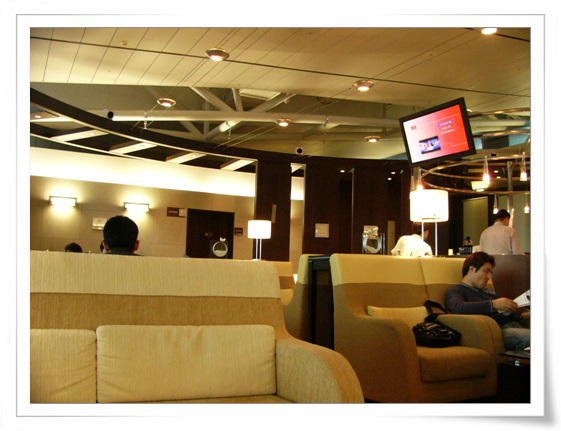

\- 라운지 내부다.

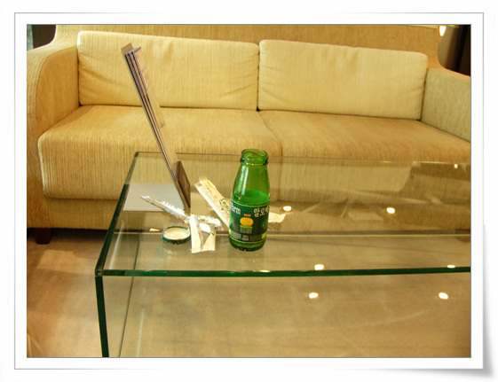

\- 지난주의 곱창으로 탈난 배로, 실력 발휘를 못했다.

이번 출장은 최병두씨와 함께 간다. 나와 동급으로 가는 출장은 처음이다. 이번에 눈치보며 새벽에 몰래 돌아다니는 일은 없겠군..

\- 같이 간 최병두씨

간만의 출장까지는 좋았는데, 지난 주 먹은 곱창이 호락호락 하지 않았다. 잠자고 있던 위염을 다시 일으켜 세운 듯 했다. 그래서 출발 전 오바이로 속을 비운 후 비행기에 탑승했다.

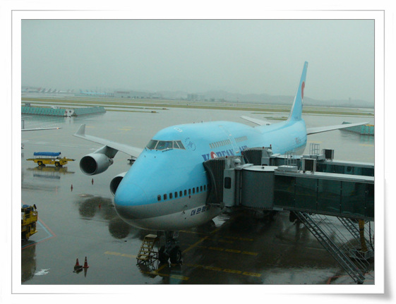

\- 에어프랑스로 티케팅했는데, 비행기는 대한항공이다. 다행이다.

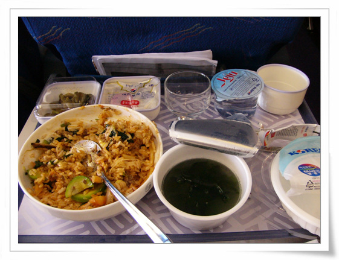

\- 기내식은 비빔밥과 소고기밥 둘 줄 선택이 가능했다. 난 비빔밥.

\- 맛있는 기내식에 행복하는 병두씨.

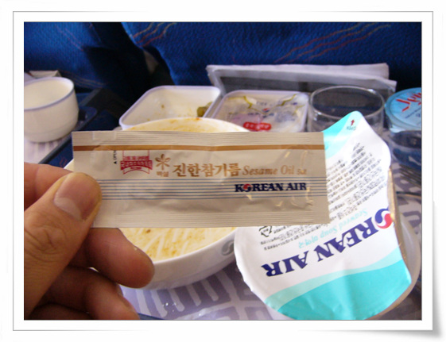

\- 다 먹고 나서 발견한 것. 왠지 먹을 때 좀 뻑뻑하다 했더니..

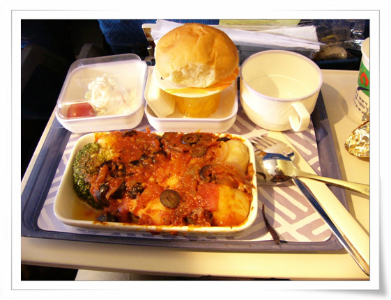

\- 두번째 기내식은 생선과 돼지고기중 택일. 난 생선.

곱창의 저주가 쉬 풀리지가 않았다. 첫번째 기내식까지는 탑승전 속을 비웠기 때문에, 더부룩한 정도였는데, 두번째 기내식을 먹은 후, 속이 뒤틀리기 시작했다.

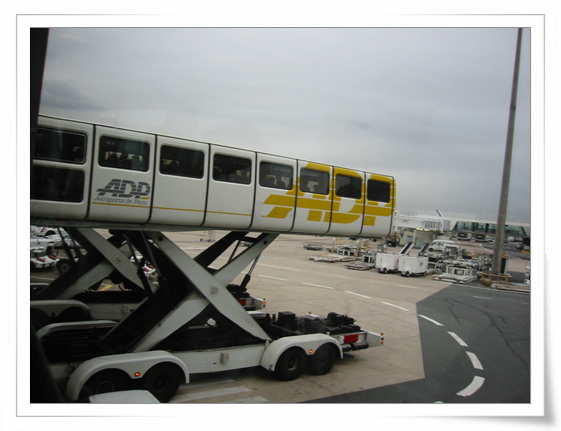

\- 환승하는 드골공항에 도착했다. 이곳은 공항내 버스가 특이하다. 저렇게 생겨가지고 들었다 놨다 한다.

드골공항에 도착한 시각, 6시 50분. 리스본으로 가는 비행기 출발 시각 7시 30분. 늦었다.

열라리 뛰었다. 다른 공항들은 환승하는 경우에는 입국심사대 통과없이 곧장 갈아 탔는데, 여기는 입국심사대를 통과후 다시 출국심사를 해야 하는 이상한 시스템이다.

비행기에 마지막으로 탔다. 우리나라 비행기는 티케팅한 경우에는 출발시간 지나도 태워주는 것 갈은데, 여기는 아닌 것 같다.

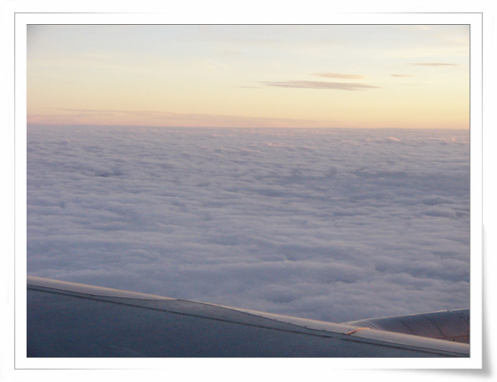

\- 서유럽의 하늘. 별 거 없다.

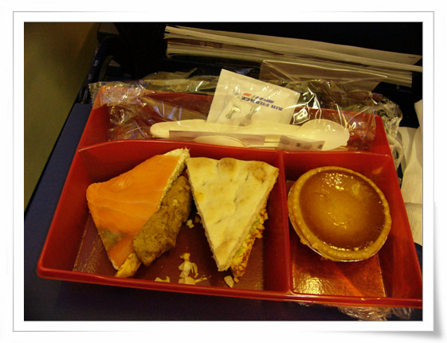

\- 리스본가는 비행기의 기내식. 내가 좋아하는 것들로 구성되어 있던데, 한 조각도 못 먹고, 아픈 배만 움켜쥐고 있었다. 내 다시는 왕십리 곱창은 안 먹는다.

파리에서 리스본까지는 1시간 반이 걸렸다.

\- 리스본 공항 내부.

이 나라도 좀 놀라웠다. 짐을 찾고 나가는데, 입국 심사대가 없는거 아닌가? 이거 이상한데 하며 계속 걸어가니, 그냥 공항 밖에 나오더군.

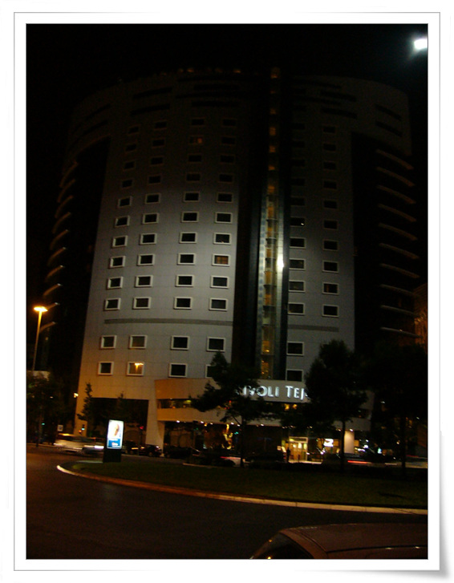

\- 우리가 일주일간 묶게 될 티볼리떼제 호텔. 별4개짜리 호텔이란다.

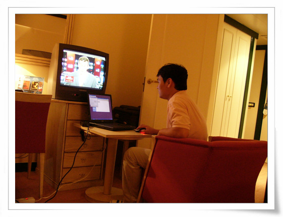

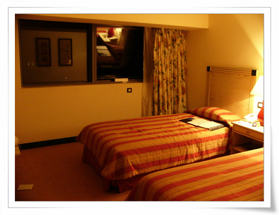

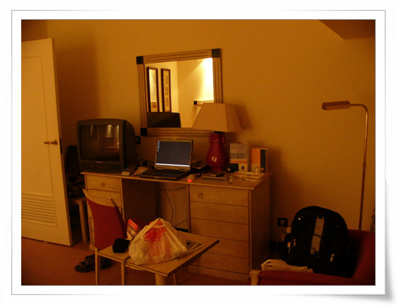

\- 이게 호텔 방 내부.

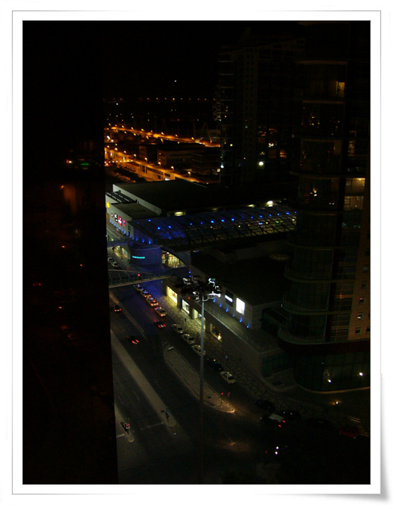

\- 방에서 본 외부

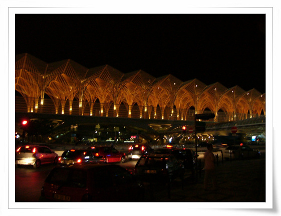

\- 호텔앞에 뭔가 다리가 있고, 장식이 있는데, 뭔지는 잘 모르겠군.

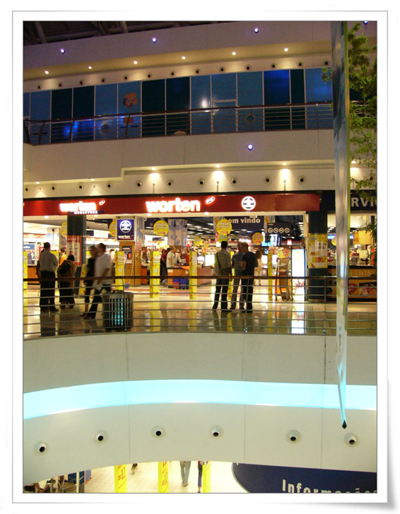

\- 리스본의 코엑스 몰. 여기서 1미터짜리 랜케이블을 무려 5유로나 주고 샀다. 결국 호텔에서 동작도 안했지만..

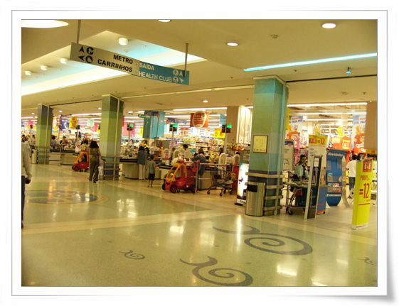

\- 다행히, 그 코엑스몰에 할인마트도 있다. 시리얼에 우유로 연명해 나갈 수 있겠다.

[null](../6166848.html#6166848_1)

