# 달라스 옆동네 칸톤 벼룩시장 구경

달라스 출장 중 가장 멀리 놀러 간 곳이 바로 Canton.

그냥 읍내정도 되는 시골이었다.

가게된 계기는 같이 일하는 고객 두명이 여자인데, 팀빌딩으로 쇼핑을 가자는 거였다.

엄청나게 큰 벼룩시장으로 온갖 것이 다 있다고 했다.

거리는 대략 100km.

한 서울에서 천안정도되는 거리다.

\- 한시간 반 정도 위 경로로 운전하고 갔다.

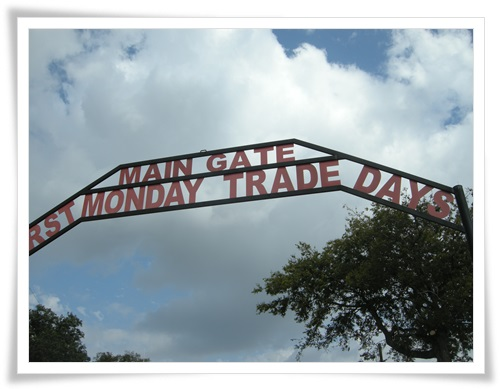

\- 정식 명칭이 First Monday Trade Days.

한달에 한번 열리는 시장이라고 한다.

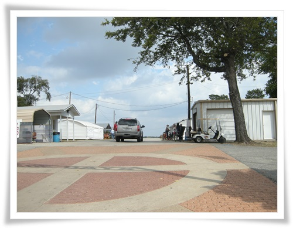

\- 주차하고 입구를 통과했다.

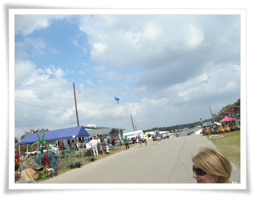

\- 들어서니 뜨거운 햇볕과 함께 광활한 시장이 펼쳐져 있다.

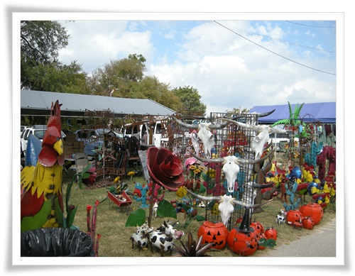

\- 여기는 야외 조형물을 주로 파는 상점.

\- 고개를 넘어가니 슬슬 사람들이 많아진다.

\- 입구에 가까이 있는 식당에 들어갔다.

\- 주력상품은 Corny Dog인 듯 해 보였다.

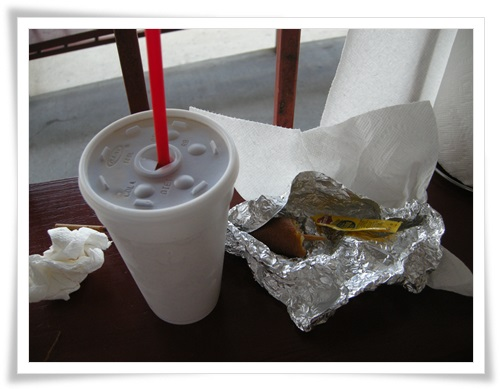

\- 이 식당에 사먹은 Corny Dog.  별로 맛은 없더군.

벼룩시장 대부분의 상점들이 신용카드는 안되고, 현금카드와 체크카드만 된다.

\- 여기는 화장실.

문 대시는 커튼으로 되어 있는 것이 특이하더군.

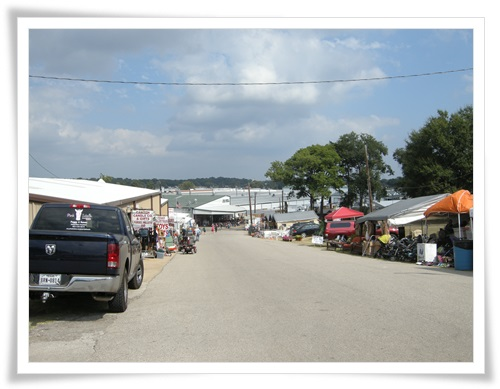

\- 눈에 보이는 저 끝까지가 전부 벼룩시장이다.

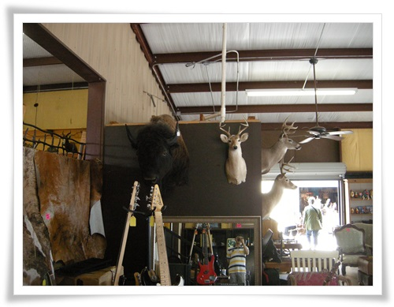

\- 여기는 박제와 가죽을 파는 곳.

\- 버터는 만드는 통도 골동품을 팔고 있다.

\- 중심으로 갈 수록 사람이 많아진다.

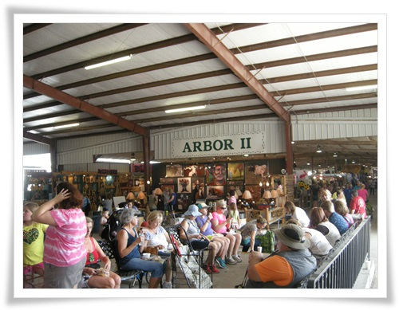

\- 더위에 실내에 훨씬 많은 사람들이 있다.

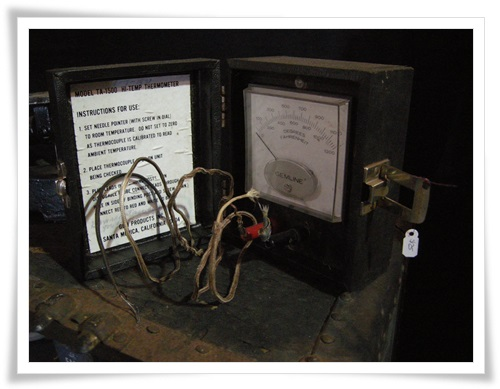

\- 골동품 테스터기도 팔고,

\- 역시 오래된 장난감.

양철로 된 장난감이니 엄청난 수작업으로 만들었겠다.

\- 투박하지만 의외로 내 맘에 드는 상자.

저 모양으로 하나 만들어 봐야 겠다.

\- 천정에 매달다 놓은 쇼파.

저런 쇼파를 판다는 것은 저걸 설치할 공간이 있다는 것인데 새삼 큰 땅덩어리가 부러워졌다.

\- 여기 온 차량을 보면 저렇게 큰 짐 트레일러를 달고 온 것이 많다.

하긴 큼직만한 것들을 사서 가지고 가려면 저게 좋긴 하겠다.

\- 요건 쇼핑객들에게 빌려주는 스쿠터.

워낙 넓은 곳이라 나중에는 저걸 타고 다니는 사람들이 부러워지더군.

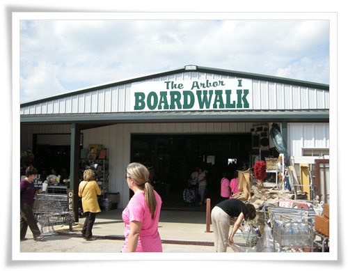

\- 각각의 건물들은 저렇게 arbor 라는 이름으로 되어 있었다.

arbor 뜻이 수목, 휴식공간이라는 뜻인데, 뭔가 매칭이 안된다.

\- 뭔가 오즈의나라에 어울릴 법한 인형들.

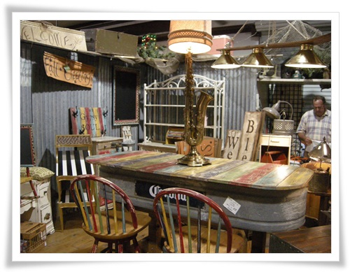

\- 오래된 바에서 뜯어온 듯한 테이블.

\- 장식용 인형도 있고..

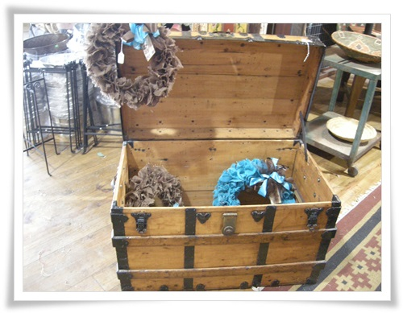

\- 오래된 미국 드라이에서 보던 보물상자도 보인다.

\- 텍사스 하면 떠오르는 양철로 된 풍차도 팔고 있다.

\- 이건 물을 토해내는 까마귀.

\- 양철로 빈티지스럽게 만든 집모양 조형물.

\- 49달러짜리 원목 상자함.

\- 26달러 짜리 독서책상.

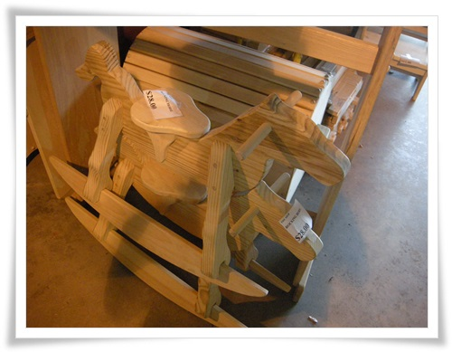

\- 28달러짜리 흔들 목마.

다들 원목인데, 어떻게 저렇게 싼 가격이 나올 수 있나 신기했다.

분명 made in china 이기는 할 것이다.

그래도 참 싸다.

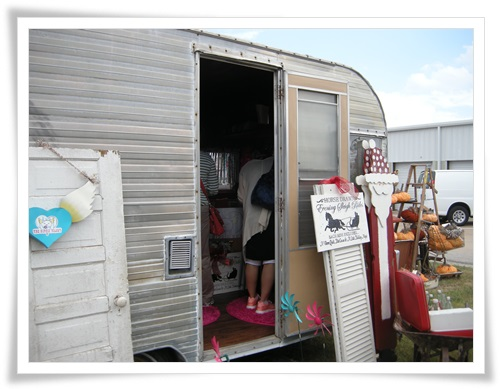

\- 한달 한 번 열리는 장이다 보니, 이렇게 카라반을 끌고 다니며 팔기도 하나 보다.

\- 카라반 내부가 매장으로 되어 있다.

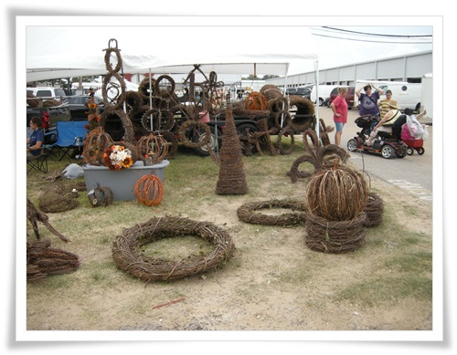

\- 장식용 덤불도 팔고 있다.

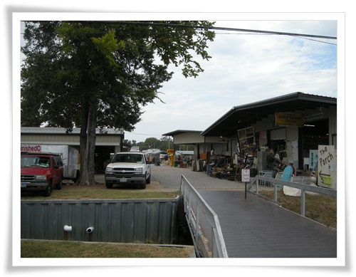

\- 걸어도 걸어도 끝이 없는 시장.

\- 투박하게 생겼는데, 한 번 만들어 보고 싶은 테이블.

\- 현금만 되니까, 곳곳이 ATM기가 설치되어 있다.

\- 저 넓은 공터도 몽땅 진열되어 있다.

\- 10월인데도 참 더운 날씨.

\- 한 가득 구입한 물건을 싣고 가는 차.

\- 2시간 정도 쇼핑하다 잠깐 쉰 장소.

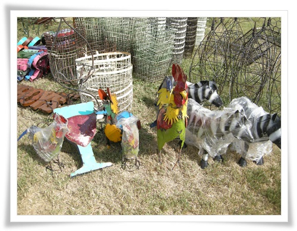

\- 꽤 미국 토속적인 양철 조각.

미국은 이렇게 양철로 만들기를 좋아 하나 보다.

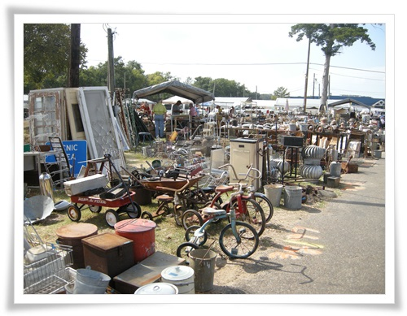

\- 이곳은 골동품을 주로 파는 곳

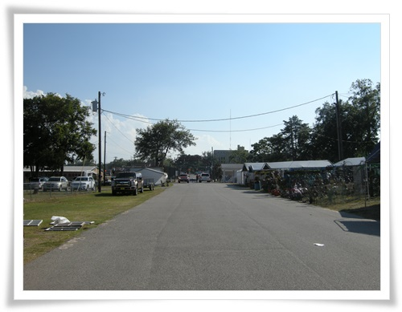

\- 4시간 가량 걸어다니며 쇼핑했지만 반도 못 보고, 이제 차가 있는 곳으로 가는 중.

\- 이날 4시간동안 쇼핑한 코스.

날씨만 안 더우면 다 돌아볼 수 있었는데 덥고 습한 날씨로 다들 지친 쇼핑이었다.

