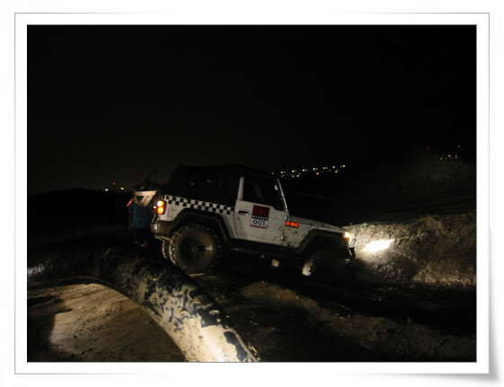
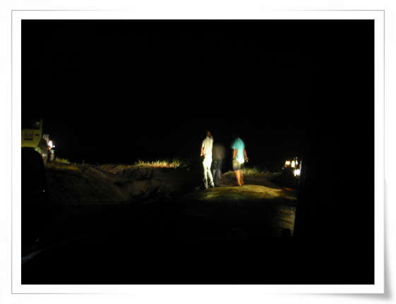

# 인천매립지 오프로드

록스타 모임은 서울경기 지역에 화수목금 이렇게 일주일에 4번 정기모임을 한다.

대단한 결속력이 아닐 수 없다.

전에 한번 금요정모에 가서, 탱크장을 따라 갔다 왔고,

이번에 화요정모로 참석했다.

부천시청 주차장이 집결지다.

인원이 모여지가 간 곳은 매립지. 인천 청도리 부근이었다.

이곳은 바다를 메운 매립지여라, 바닥은 온통 뻘밭이었다.

\- 진흙구덩이로 차를 들이밀고, 탈출 연습을 하는 차. 결국 자력으로 탈출은 실패하고 끌려나왔다.

\- 차가 진흙밭에 있을 때는 진흙이 튀기 때문에, 이렇게 멀찌감치 떨어져서 구경을 한다.

오프를 끝나고 나니, 새벽 1시. 차는 진흙 범벅.

세차장에서 세차를 하고 집에 오니 2시 반이더군.

[null](../6166851.html#6166851_1)

