# 청명한 가을하늘에 한강 산책

가을이다.

바로 몇일전의 붙별 더위가 거짓말이 아니었나 싶게 선선해졌다.

저녁시간때 늘상 하던 산책을 한강으로 나왔다.

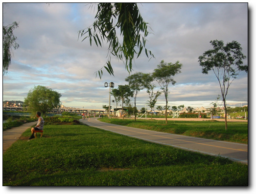

\- 한강 반포지구

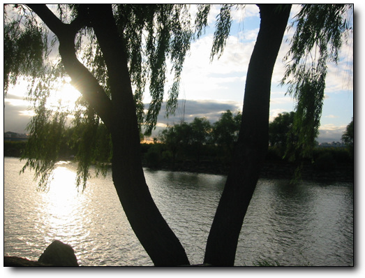

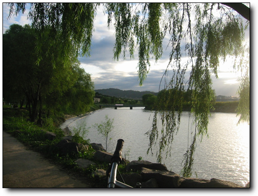

\- 대기도 맑아, 시야가 이렇게 멀었던 적이 있었던가 싶다

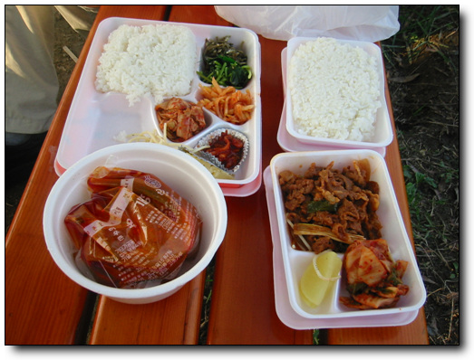

\- 저녁으로 한솥도시락에서 사온 육계장세트와 제육볶음밥.

야외에서 이렇게 먹으면 꼭 소풍온듯한 설레임이 있다.

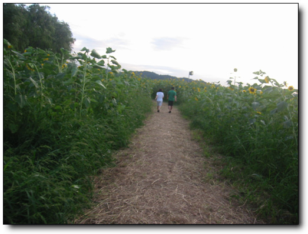

\- 서래 인공섬엔 해바라기가 쑥 자라있다.

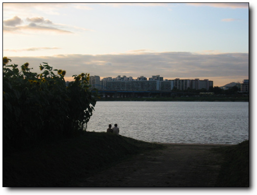

\- 석양에 강변에 앉아 있는 동네 아저씨 아줌마의 모습

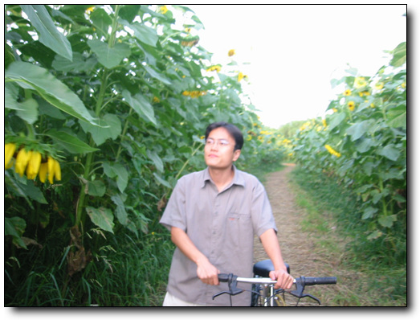

\- 같이 간 상민. 꽃밭에 있으니 인물이 훨 사는군..

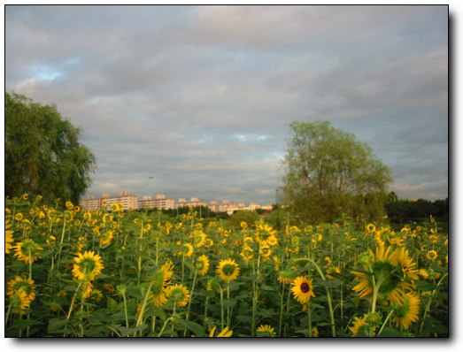

\- 해바라기가 해만 바라보는게 맞나? 해바라기꽃의 방향이 왜 해를 등지고 있지?

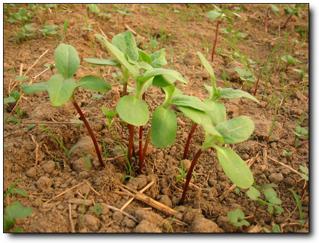

\- 지금부터 두달전인 6월달에 처음 본 풀. 처음엔 이게 과연 뭘가 했었는데,..

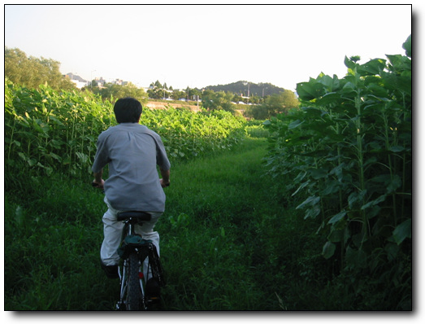

\- 한달반만에 쑥 자라나

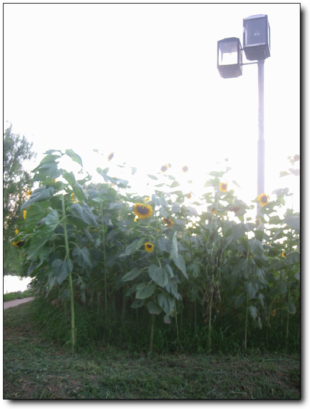

\- 이렇게 키가 3미터가 넘는 해바라기가 되었다.

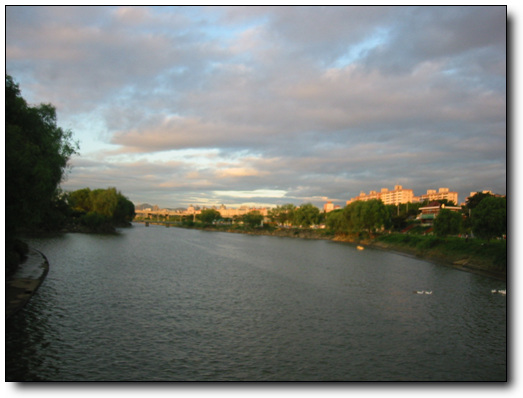

\- 인공섬을 나오면서..

[null](../6166856.html#6166856_1)

