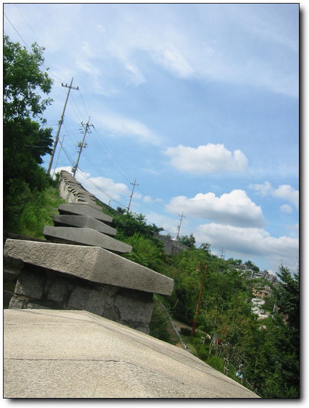
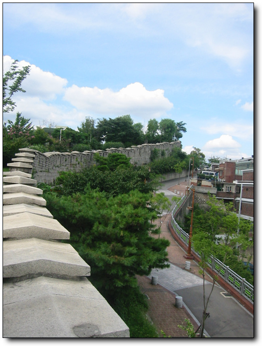
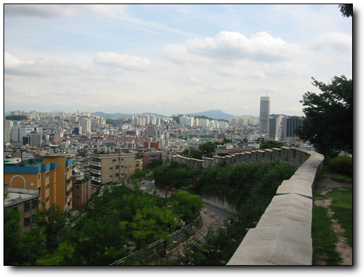

# 서울성곽

동대문에 갔다가 눈에 보이는게 서울 성곽

내가 동대문구에 무려 20여년을 살았었는데, 끊겨진 동대문의 그 성곽을 못보고 지나쳤었다.

사대문을 잇고 있던 성곽이었는데, 각각의 대문과 끊기고 없어지고 하여, 이제 이곳 동대문쪽에만 그나마 길게 남아 있는 것 같다.

1호선 동대문역에서 이대동대문병원쪽으로 올라가면 서울성곽이 나타난다.

\- 사대문안에서 성곽을 통해 바라본 사대문밖

\- 청명한 하늘로 성곽이 쭉 이어진 듯

\- 올라가다보면 아직 예전 달동네의 모습을 갖고 있는 풍경이 나타난다.

\- 예전 모습을 갖고 있는 왼편과 대조적으로 말끔하게 가꾸어진 공원이 오른편에 있다.

\- 다 올라와서 남쪽을 내려다보았다. 그 길던 성곽이 다 끊기고 요만큼 남아있는 게 안타깝다.

서울 성곽은 대학로위쪽의 낙산공원과 연결되어 있다.

[null](../6166857.html#6166857_1)

