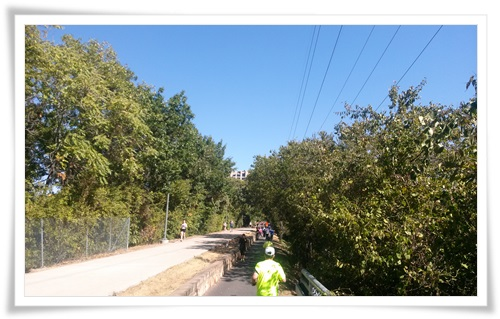

# Katy Trail in Dallas

쇼핑외에는 별로 할 게 없는 달라스.

주말 아침 같이 출장온 사람끼리 산책을 갔다.

Katy Trail이라는 산책코스가 있었다.

거리도 5.6km로 제법 긴 코스였다.

시작 위치로 Maple Ave로 가, 그 근처에 주차했다.

\- 이번 Katy Trail 산책 코스.

\- 산책을 시작한 Reverchon Park.

\- 땅덩어리가 크니, 공원도 한산하다.

\- 콘크리트만 보다가 이렇게 숲을 보니 좋기는 했다.

\- Katy Trail로 올라가는 길.

\- 이제부터 Katy Trail.

\- 여기껏 거리에서 사람 본 적이 없었는데, 달라스의 모든 걸어다니는 사람은 여기 다 모여있더군.

\- Katy Trail옆의 식당.  아침인데도 식당에 사람이 많다.

\- 햇볕을 싫어하는 한국인답게 우리는 그늘 쪽으로만 걸었다.

운동같지도 않지만, 암튼 조금 걸었기에 브런치를 먹기로 했다.

Katy Tail에 있는 맛집중의 하나라는 프랑스 브런치집에 갔다.

\- Knox Street에 있는 Toulouse Cafe. 여기서 먹었다.  주차는 발렛파킹만 되었다.  발렛파킹비 5$.

\- 여기는 좀 부유한 동네인 듯 하다.

\- 음식점에 들어가는 중.

\- 음식 기다리면서 바라보니, 여기 지나다니는 차가 다 비싼 차다.  청담동 분위기다.

-

\- 브런치로 먹은 오므라이스.

가성비 안 좋다.  난 그냥 미국시 햄버거 체질인가 보다.

