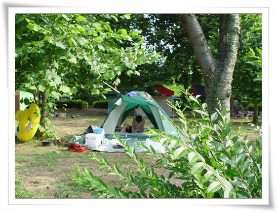
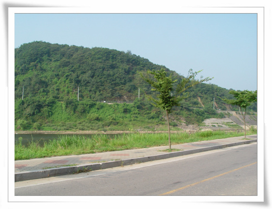

# 한탄강 유원지

여름휴가다.

별 준비도 안했다.

어디를 꼭 가고 싶다는 생각도 없었지만, 여름휴가를 내고 출발했다.

첫날 원래 예정했던 곳은 임진강 자연 발생 유원지.

지난번 혼자서 산길 따라 막 돌아다니가다 발생한 곳이었는데, 가는 길이 잘 알려져 있지 않고, 아무 표지판도 없는 곳이어서, 사람들도 별로 없고, 근처 현지 주민들이 주로 이용하는 강가다.

평일이어서 그런가 역시나 사람이 별로 없었다. 예상보다도 훨씬 적은 사람들에 오히려 휴가 분위기가 덜 나는 곳이었다. 물은 깨끗하고 좋았지만..

결정적으로 화장실등의 일체 편의시설이 존재하지 않는 지역이어서 아내의 반대에 이곳에 하룻밤 잘려는 계획을 접고, 한탄강 유원지로 갔다.

이곳은 제법 사람들이 있어, 피서 분위기가 물씬 났다. 따로 돈 내지 않는데도 야영장 밑 수돗물, 화장실을 이용할 수 있었다.

\- 한탄강 유원지에 자리잡은 내 텐트. 록스타 동호회에서 35000원주고 구입한 것인데 아주 좋다.

\- 야영장 앞의 한탄강. 너무 땡볕이라 물에서 노는 것 조차 꺼려지더군..

이 날이 바로 10년만의 최고 기온이었다는군.

아침이 되자 따가운 햇별에 텐트를 걷고, 다음 숙영지로 무작정 떠났다.

[null](../6166862.html#6166862_1)

