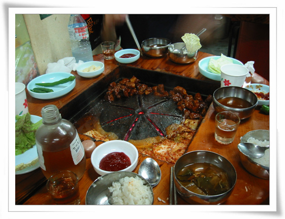

# 매운 돼지갈비집 명월관

미식가 동함이 꼬드겼다.

성심여대앞에 유명한 돼지갈비집에 있는데 거기 가자고.

\- 멤버가 구성되었다. 동함, 상민, 그리고 나.

\- 목적지 명월관

\- 여기가 유명하다는 그곳인가하면 간판을 바라보는 상민.

\- 돼지갈비와 아주 매운 김치.

\- 한증막 수준으로 땀을 빼고 있는 동함.

\- 탈수 증세로 의식이 왔다갔다하는 상민.

\- 치사량에 가까운 술과, 무더위, 그리고 연탄불의 열기, 매운 돼지갈비에도 불구하고 불굴의 정신으로 버티고 있는 나

[null](../6166864.html#6166864_1)

