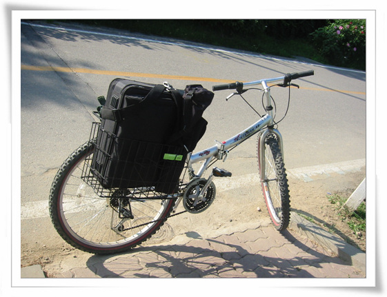
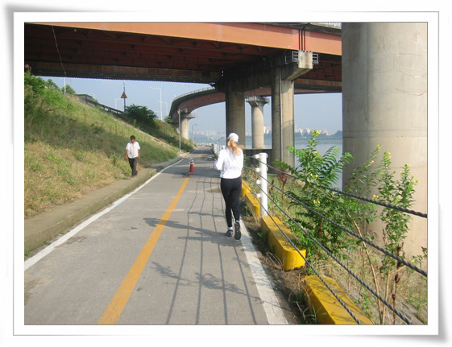
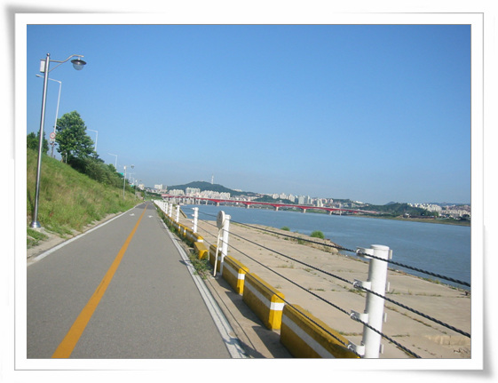
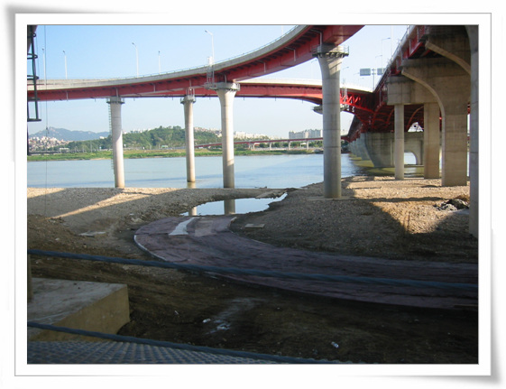
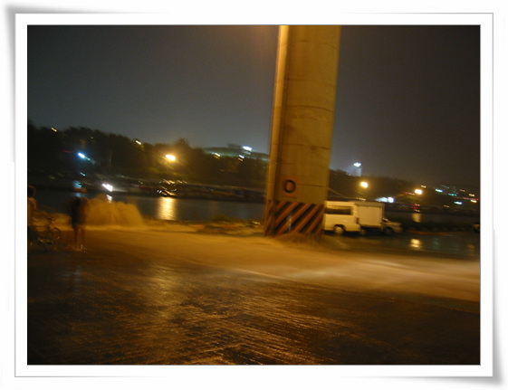
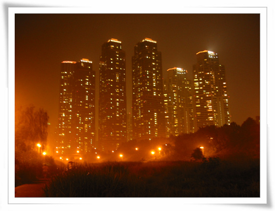

# 자전거로 출퇴근

나날이 들어가는 체중. 특히 뱃살.

원인은 운동부족.

다시 자전거로 출퇴근하기를 시도했다.

여태껏 자전거로 출퇴근해본 것은..

첫번째가 대학교 다닐 때 남산에 있는 거기까지 자전거로 등하교 해보기.

이건 세번하고 포기했다. 복잡한 도로와 여러 언덕을 넘나들어야 하는거라 힘도 들고, 오히려 건강이 더 안좋아지는 것 같았기 때문이다.

두번째는 다음다닐 때 자전거로 출퇴근. 이역시 두어번 하고 포기. 무엇보다 자전거로 이른 아침과 늦은 밤 영동대교 건너는게 쉽지 않았다.

세번째는 이 회사에 와서 해본 자전거로 출퇴근. 역시 성수대교 건너는게 쉽지 않아, 자전거로 한번 하고, 인라인으로 한번 하고 포기.

네번째는 결혼하고 나서 자전거로 출퇴근. 거리는 가까웠다. 30분이면 자전거로 출근이 가능했다. 양재역에서 강남대로쪽으로 가다가, 테헤란로를 따라 가다, 서초역에서 고속터미널쪽으로 가다 사평로 가면 되었었다. 하지만, 이 역시 서너개의 고개를 넘는게 운동효과보다는 땀만 많이 나게 하고, 수시로 차도로 들어가야 하는 점이 위험하여, 일주일하고 포기.

다섯번째가 이번이다. 이번엔 양재천->탄천->한강자전거도로 코스. 거리는 꽤 된다. 회사까지 직전으로 가지 않고, 뺑 돌아 가는 길이기 때문이다. 하지만 힘들게 페달을 밟아야 할 언덕도 없고, 차도 없어, 무난했다.

3주째 자전거로 출퇴근을 하고 있다. 출퇴근 시간은 1시간10분씩하여, 하루 총 2시간 20분. 적절한 운동이 되는 것 같다. 그리고 복잡한 차도 없어 괜찮다.

\- 자전거엔 짐을 실을 수 있는 바구니도 달았다. 노트북도 이렇게 자전거 싣고 다닌다.

\- 아침에는 양재천도 한가하다. 대신 여름의 뜨거운 햇살에 썬그러스와 모자를 쓴다.

\- 양재천에서 탄천으로 접어들었다. 역시 한가롭다.

\- 탄천에서 한강으로 바꾸어탄다.

\- 자전거로 가다 보면, 가끔 지나치는 몸짱들로 인해 시각의 즐거움도 얻을 수 있다.

\- 청평한 하늘과, 시원스런 한강의 풍경이 출근하는 마음을 가볍게 한다.

\- 성수대교 밑에는 뭔가를 만드나 보다.

\- 잠원지구쪽에 핀 벌개미취. 우리나라 자생초라 그런지 더 정이 간다.

\- 8월 4일 이날은, 집중호우가 내린 날이었다. 동호대교밑을 지날때만 막 쏟아지는 비에 온 몸이 다 젖은 채로 갔었다. 하지만 이곳 탄천에 빠른 물살에 이 자전거 도로가 막혔다.

\- 다른 사람들도 다들 이 빠른 물살을 못 건너고 있다.

결국 이날, 난 자전거를 짊어메고, 위로 올라가야만 했다.

\- 탄천에서 양재천으로 들어서고 얼마 안있으면 정면을 가득채우는 건물들이 고압적으로 나타난다. 집중호우도 가소롭다는 듯이.

[null](../6166865.html#6166865_1)

