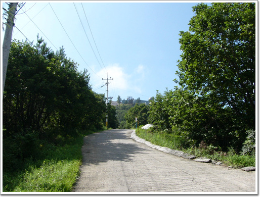

# 파평산 미타사

파평산에 있는 미타사

파주시 파평면 두포리의 파평산 정상 부근에 있다.

파평산 정산이 군사기지라 그런지, 미타사로 가는 길은 군사도로를 통해 올라간다.

올라가는 길이 꽤 가파르다.

매우 작은 절이다. 그 크기에 비해 역사는 꽤 오래되었더군.

1095년에 처음 세워졌다가, 6.25때 불타서 1960년 다시 지어진 절이라고 한다.

\- 미타산 가는 길

\- 파평산 정상 바로 밑에서 내려다 본 풍경. 아직 안개가 덜 걷혔다.

\- 파평산 정상에서 다시 조그만 계단으로 내려가야 절이 나타난다.

\- 이게 미타사의 전체다. 아담하다.

\- 특이하게, 이런 돌탑이 많이 있다.

\- 건물도 별로 없다. 아무래도 오기 힘든 오지에 있다 보니, 신도도 적고 하여 그런가 보다

\- 훈련하는지 파평산 밑에서 산길로 걸어오고 있는 병사들이 절을 통과하고 있다.

\- 이게 미타사 본당인가 보다.

\- 간만에 보는 지게다.

\- 땡볕에 고생하는 병사들이 여기서 잠시 휴식을 취하고 있군

\- 절 아래로 훤히 내려다 보이는 전경이 좋다.

\- 이곳이 스님이 주거하는 공간인가 보다.

[null](../6166866.html#6166866_1)

