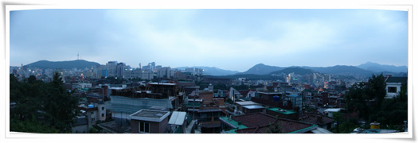
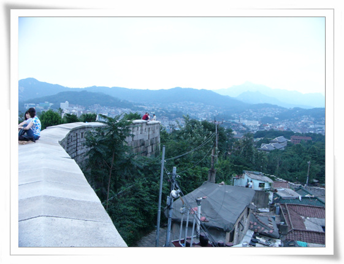
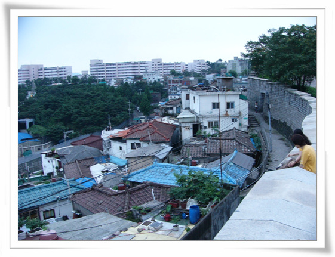
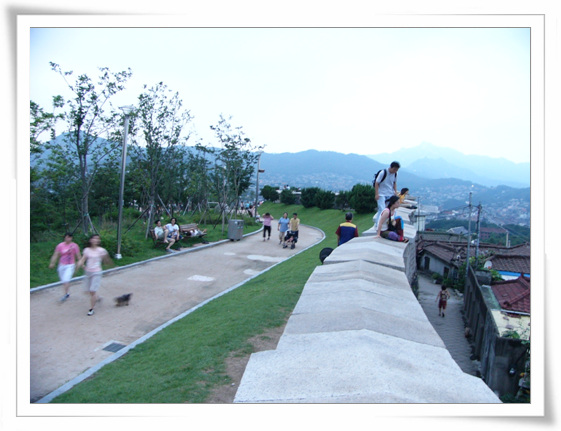
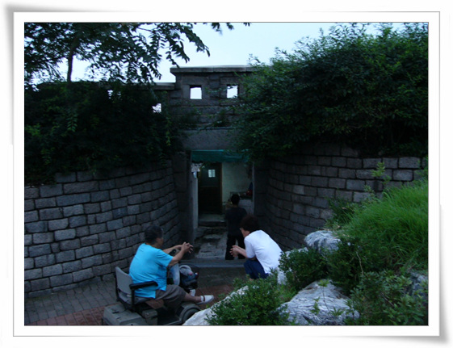
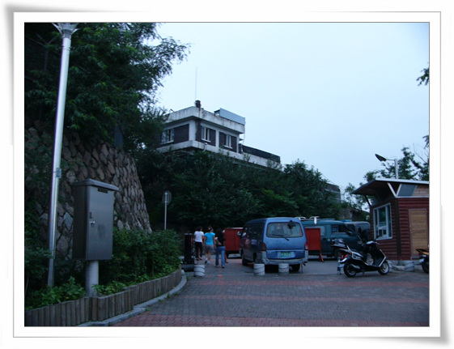
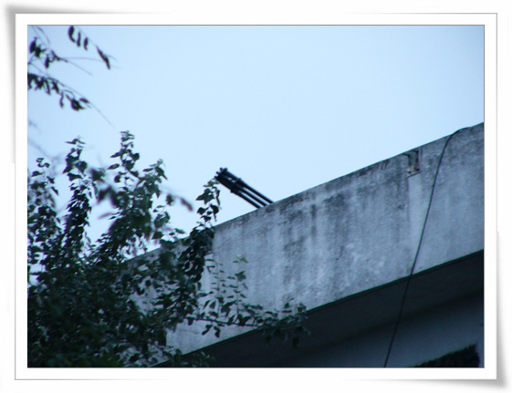
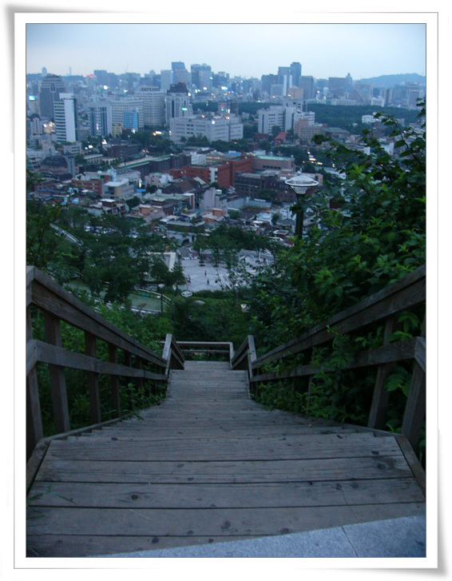
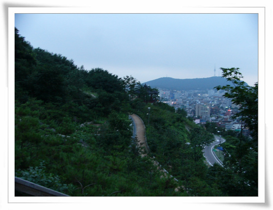

# 낙산공원

대학로에 동함과 같이 갈 일이 있었다.

볼일을 본 후, 별 다른 일이 없었던 나, 고개를 돌려보니 보이는 언덕.

여태껏 살면서 저기를 안 올라가봤구나라는 생각에 올랐다.

\- 오르니 서울이 한눈에 다 보인다

\- 옛 동대문을 잇던 성곽이 아직 남아 있어, 서울에 이런 곳이 아직 있었구나라는 생각이 새삼 든다

\- 성곽 동쪽으로는 아직 재개발이 안된 구역이 보여, 정겹다

\- 나와 같은 사람이 한 둘이 아닌지, 다들 성곽에 올라 서울 전경을 본다

\- 성곽사이에 뚫린 통로. 이게 예전부터 있는 것인지는 모르겠군..

\- 여기 낙산공원까지 올라오는 마을버스도 있다. 종점 풍경도 새삼스럽다.

\- 공원 맨 위, 가장 전망좋은 곳에 왠 집 처럼 생긴 건물이 있어 자세히 살펴보았더니,..

\- 지붕에 발칸포가 보인다. 대공부대가 있나 보다.

\- 내려가는 길. 나무로 된 계단과 그 밑의 대학로 풍경

\- 낙산공원. 나중에 알았는데, 이곳이 요즘 인기있는 파리의 연인 촬영지였다는군.. 그리고 서울의 몽마르뜨라고 불린다는군..

[null](../6166867.html#6166867_1)

