# 국립국악원 일요열린국악무대

결혼하고서 달라진 점

뱃살이 나날이 늘어간다.

원인은 활동량의 급격한 저하.

가만히 있으면 좀이 쑤시는 나, 그리고 움직이길 싫어하는 아내.

그덕에 주말에 집에 붙어있는 일이 많아졌다. 총각때에는 내가 주말에 집에 붙어있었던 적이 거의 없었던 것 같았는데 말이다. 아내 떼 놓고 나 혼자라도 싸돌아 다니겠다해도, 물귀식 작전에 붙잡혀 뱃살만 키우고 있다.

도서관에 갔다. 결혼전에는 매주마다 갔었다.

도서관이 좋은 이유. 우선 널찍하니 시원하다. 읽을 책이 많다.

내가 주로 읽는 책은 잡지들. 뭔가 새로운 기사들을 보며 세상이 이리 발전하고 있음을 느끼며 아울러 나도 열심히 살아야겠다는 경각심도 갖을 수 있었다. 요즘 그걸 소홀히 하다보니 자연스레 삶도 느슨해져버렸다.

도서관을 나오면서 발견한 것. '일요 열린 국악 무대'라는 팜플릿. 날짜는 오늘이었다.

집에가서 아내에게 같이 가자고 하니 일언지하에 거절.

혼자 갔다. 원래 내가 혼자서 공연보는 것도 잘 한다.

매달 세번째 일요일에 하는 야외음악회다.

내가 좋아하는 음악회가 야외음악회다.

닫힌 공간을 싫어한다. 폐쇄공포증까지는 아니더라도, 꽉 막혀 있는 곳에 있으면 답답함을 느낀다.

그래서 공연시간동안 꼼짝않고 있어야 하는 콘서트홀도 그다지 안 좋아하고, 영화관 가는 것도 같은 이유로 그리 즐기지는 않는다.

예전에도 열린음악회는 자주 갔었다.

국립극장에서 여름기간동안 했었던 토요야외음악회, 예술의 전당에서 했던 야외음악회를 자주 찾아다녔다. 특히 국립극장의 야외음악회가 기억이 남는다. 분수대앞에 설치된 무대를 그 앞 계단에 앉아 구경하는 것이었는데, 오른편에 있는 남산과 남산에서 불어오는 바람, 그리고 광장에서 떠들어대는 아이들의 재잘거리는 소리들이 음악소리와 잘 어울렸다.

오늘의 공연 제목은 '타악과 몸짓'이라는 국악공연이다.

장소는 국립국악원 별맞이터.

간만에 온 야외음악회라 자리에 앉으니 묘한 설레임이 있었다.

장마끝의 상쾌한 하늘과 우면산에서 불어오는 바람과 수풀 냄새가 기분을 상승시켰다.

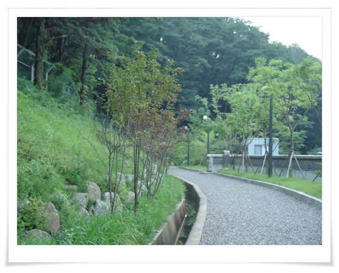

\- 우면산 자락에 있는 국립국악원

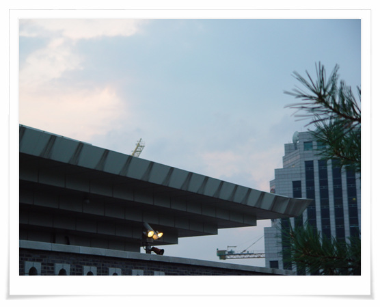

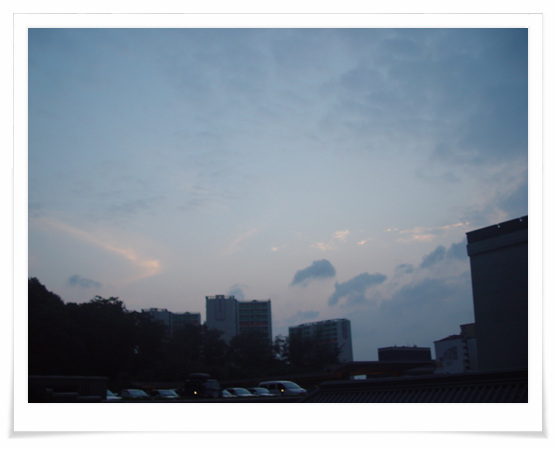

\- 장마 끝에 보는 맑은 하늘이라 그런가, 더욱 상쾌해 보인다.

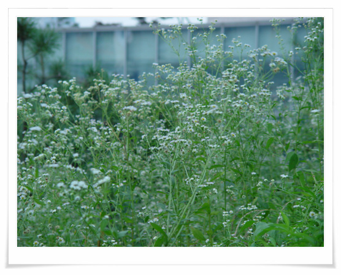

\- 국악원에 뒷편에 핀 꽃. 아직 이 꽃이 무슨 꽃인지 알아내지 못했다.

장마 종료에 많은 사람들이 모였다.

8시가 되자 공연은 시작되었다.

시작은 타악그룹 들소리가 하는 바다이야기

특히나 국악은 야외에서 해야한다. 원래가 국악이 실내가 아닌 열린 공간 마당에서 하는 음악이라 닫힌 공간에 들으면 그 맛이 떨어진다.

뻥 뚫린 하늘을 보며 듣는 북소리가 상큼했다.

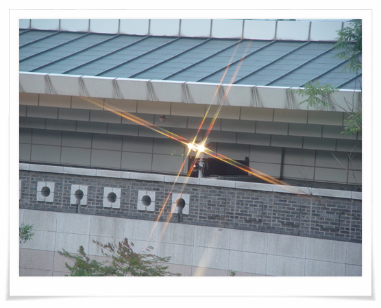

\- 저녁이 되자 조명이 켜지고,

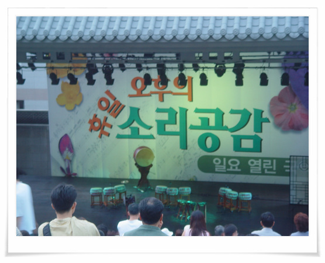

\- 공연 시작을 기다리는 사람들

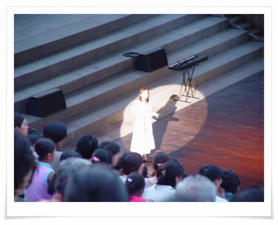

\- 진행은 국악방송 '우리마음 우리음악'을 진행하는 최영미가 했다.

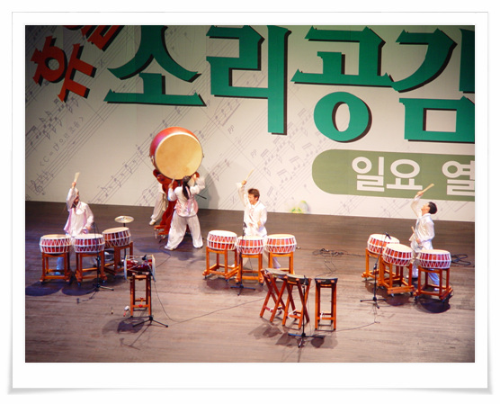

\- 힘찬 소리를 들려주는 들소리

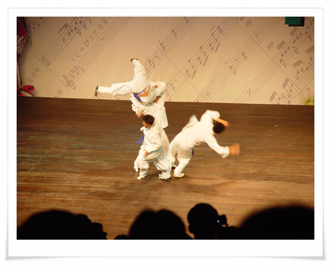

\- 소리에 맞춰 춤사위치럼 택견을 하는 백의선인. 예전에 배웠던 기억이 난다.

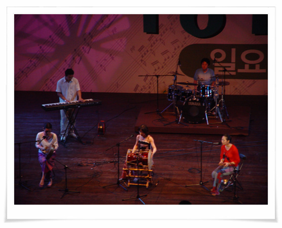

\- 국악의 퓨전화 리타의 공연

\- 그 큰 객석이 꽉 찼다.

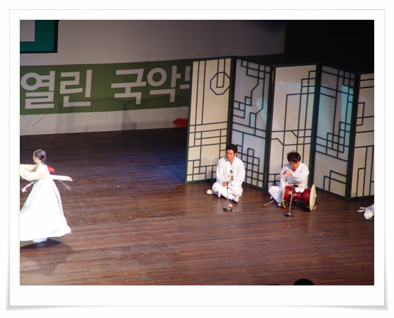

\- 마지막 무대, 태평소 시나위 사물 그리고 즉흥무

\- 객석에서 보이는 밤 하늘도 멋있다.

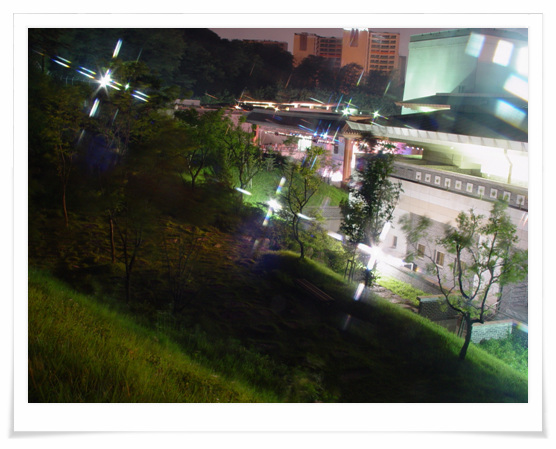

\- 국립국악원, 저 왼쪽편이 야외무대

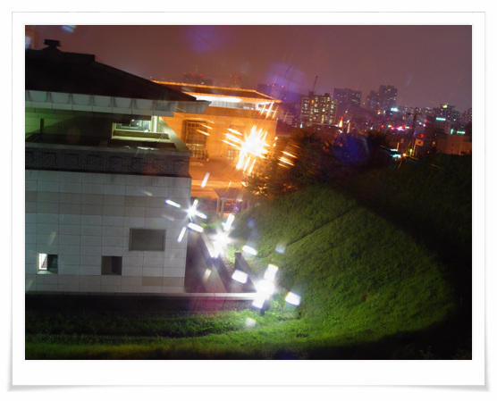

\- 뒷길은 우면산 산책로에 연결되어 있다.

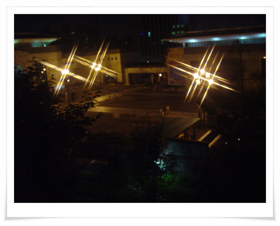

\- 국악원 광장. 아직 열대야가 시작되지는 않았지만, 그럭저럭 사람들이 있다.

[null](../6166868.html#6166868_1)

