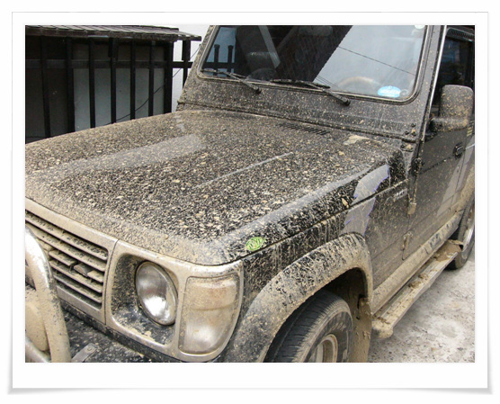

# RPM 정모 탱크장을 가다

RPM(Rocsta Power Manina) 금요일 정기 모임에 갔다.

가입한지 3년만에 처음 나가보는 모임이다.

원래 내가 모임같은 게 나가는 걸 안좋아하여, 보통 나 혼자 돌아다녔는데, 그러다보니, 혼자서 탈출 못할 같은 것은 상황에도 몇번 빠지곤 하여, 같이 가보고 싶어졌다.

모임은 한강이촌지구 거북선 나룻터 앞 20시 30분.

시간에 맞추어 갔는데, 역시 여기도 한국시간개념 적용이었다. 9시 반쯤에야 모이더군.

이곳의 특이한 점은, 사람들이 모이면서 각기 연장을 꺼내 차를 고치기 시작하는거다.

온갖 공구, 연장이 다 나오더군. 도끼까지 등장하더군.

\- 망치대신, 도끼로 범퍼 지지대 펴고 있는 모습

차 손질 끝난 시간은 11시 반쯤, 세부류로 나뉘었다. 집에 돌아갈 사람, 술 마시러 갈 사람, 그리고 오프갈 사람. 오프로드 장소는 파주에 있는 탱크훈련장, 여기서는 탱크장이라 부른다.

\- 자유로를 타고 1시간 가량 가서 도착한 탱크장.

비 온 뒤라, 길은 진흙밭이었다.

그곳을 가는데, 스릴이 있더군. 차를 좍좍 미끄러지고, 곳곳에 물웅덩이 있고, 옆으로 미끌어지면, 계곡으로 떨어지겠고..

산 중턱부터는 튜닝한 차만 올라가는 길로 가자고 하여, 내 차는 버리고 튜닝한 차에 동승을 하고 올라갔다. 진짜 오프로드(길이 아닌 것)이 나오더군. 무슨 바위덩어리 굴러다니는 계곡으로 들어가는 것이다. 이 맛때문에 튜닝을 하고 오프로드는 하는구나하는 생각이 들더군.

\- 정상까지 가는 계곡.

튜닝한 차들도 바닥을 긁으면서 가는 것은 피하질 못하더군. 올라가는 도중 먼저 계곡을 가고 있던 갤로퍼 팀들이 빠져, 구난하고 있어 그 길로 못하고 옆길 좀 수월한 길로 올라가 재미가 좀 떨어지긴 했다.

내려오는 길. 뒤에 따르던 차 한대 뒷바퀴 스프링이 빠졌다.

\- 쇽업쇼버와 스프링코일이 빠져버린 차. 그런데 오프하다보면 빈번히 발생하는 일이라며 연장과 부품을 꺼내더만 20여분 만에 복구를 해 내더군..

오프로드를 마치고 집에 돌아오니 아침 5시. 날이 밝고 있더군.

\- 영광의 흔적. 창문 밑으로 보니 지나가는 사람들마다 다 내 차를 보며 감탄을 하더군.

[null](../6166871.html#6166871_1)

