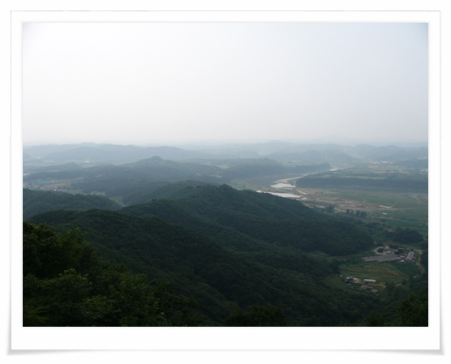
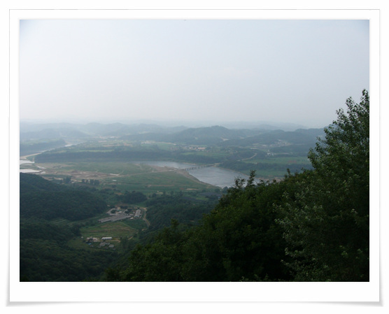
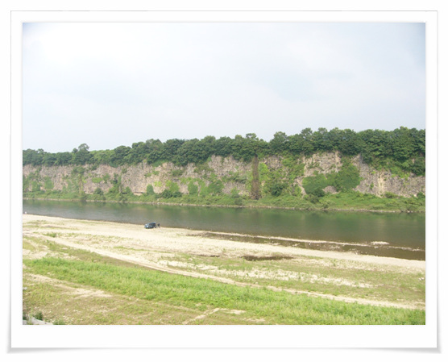
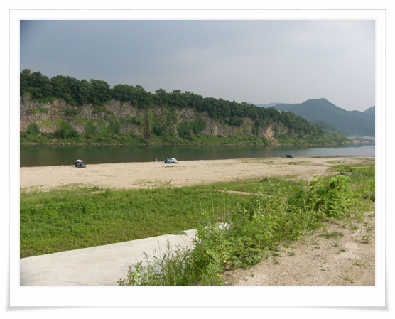
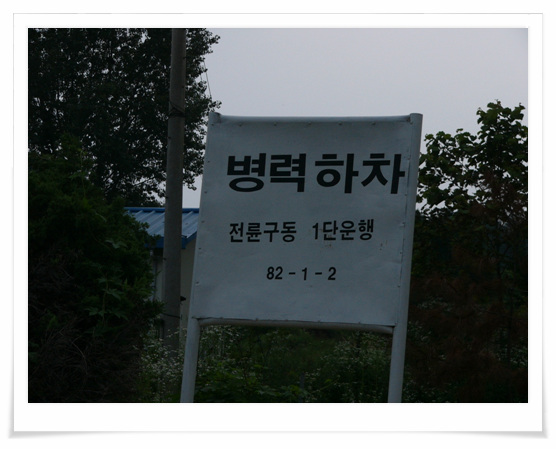
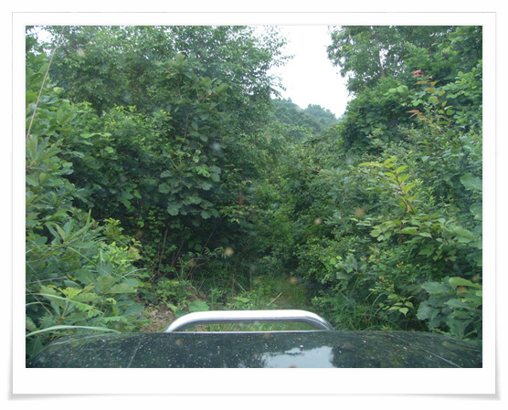

# 한탄강 임진강

그냥 아무 생각없이 못 보던 산길이 나오면 우선 들어가 본다.

그러다보다 길이 막혀 있을 때도 있고, 산길이 끊겨 있을 때도 있고,

그러다가 임진강이 나오고, 한탄강이 나온다.

\- 저 강 줄기가 아마 임진강인가 보다.

\- 적성면의 인근 야산에 올라가서 보니, 임진강이 더 잘 보이는군.

\- 한탄강인지 임진강인지 햇갈린다. 깎아지르는 절벽 사이로 흐르는 강이 꽤 멋있다.

\- 어떻게 이곳에 왔는지 잘 모르겠다. 길을 오프로드 따라 막 가다 보니 이곳이 나왔다.

\- 오는 길이 찾기 힘들게 되어 있고, 도로도 제대로 연결안되어 있어, 이 곳은 동네 사람들만이 피서로 오는 곳인 것 같다.

\- 내가 좋아하는 표지판. 이런 문구가 나오면, 꽤 스릴있는 길이라는 증거다.

\- 이렇게 우거진 수풀로 뒤덮인 길을 가는 것도 꽤 재미있다. 연천에 있는 군자산 자락이다.

[null](../6166876.html#6166876_1)

