# 명성산 오프로드

토요일

태풍이 올라온다는 뉴스가 들렸다. 날이 덥지 않다는 좋은 소식이다.

요즘 기분도 처지고, 무기력해져 뭔가 활력소가 필요했다.

나에겐 활력이 되는 게 보통은 여행이다. 산천을 싸돌아다녀야 기분이 풀린다.

목적지는 산정호수로 정했다. 구성원은 동함과 상민.

차가 막히는 토요일이기에 일찍 출발하려고, 5시에 알람을 맞춰놓고 잤는데, 5시에 울리지 않았다.

알고 보니, 알람은 월요일부터 금요일까지만 울리게 했던 것이다.

그래서 일어난 시각. 6시.

허겁지겁 일어나 씻고 가방을 들고 나와, 상민을 태우고, 그 다음 동함을 태우고 북쪽으로 향했다.

동부간선도로를 타고 의정부까지 가서, 포천쪽 도로로 들어섰다.

그 때 시각 7시 반쯤. 그 시간에서 외곽으로 가는 길은 막혔다.

의정부에서 포천까지는 가는 길 내내 가다 서다를 반복하는 정체였다.

좀 더 일찍 나왔어야 했다.

산정호수는 원래 입장료와 주차료가 있다. 3명이 가니 그리 적은 액수는 아닐 것이다.

돈도 안내고 즐거움도 배가시킬겸 산정호수 뒷쪽길로 들어갔다. 오프로드 도로다.

포천군과 철원군의 경계지역인 자일리에서 들어가는 군사도로를 타고 갈 수 있다.

처음 그 입구를 찾느라 헤매기는 했는데, 길을 찾아 군사도로로 들어섰다.

역시 오프로드에 들어서니 기분이 좋아지더군.

이 재미를 나 혼자만 즐기기 미안하여, 요 며칠전 운전면허를 딴 상민에게도 운전대를 맡겼다.

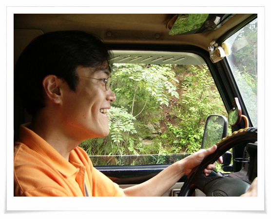

\- 오프로드에 신나하는 상민. 자기 차 아니라고 내 명차를 아주 막 몰더군.

상민은 나와 동함에서 스릴감도 안겨주더군. 초보의 용맹함을 유감없이 보여, 거의 물구덩이로 돌진하더군.

산정호수는 태풍이 올라온다는 소문에 주말인데도 사람들은 별로 없었다. 물론 이에는 아침 일찍 온 이유도 있긴 하다. 9시에 도착하였으니..

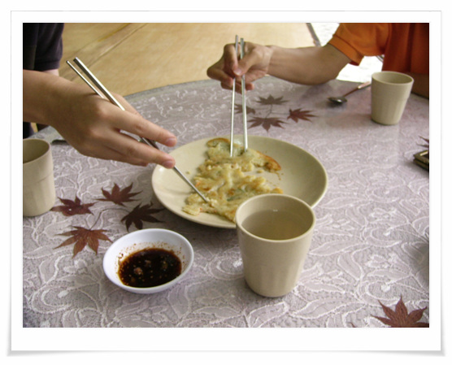

\- 남자 셋. 역시 감자전 하나에서 치열함이 있다.

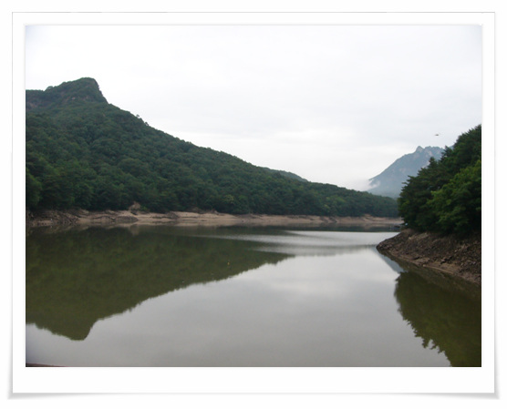

\- 산정호수다.

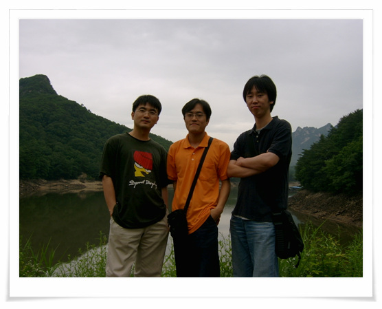

\- 리모콘이 되는 상민이 디카 V3로 셋이 찍어본다

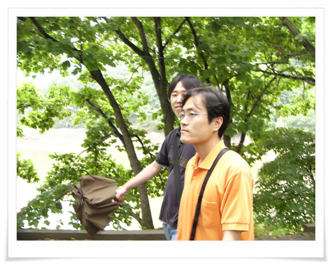

\- 동함의 내장비만이 심각하군. 볼록튀어나온 배가 여지없이 렌즈에 잡히는군.

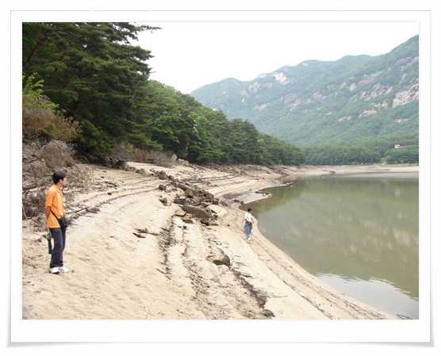

\- 장마철을 앞두고 일부로 물을 뺀 것인지, 호수인데 물이 거의 없이 그리 좋은 경치는 아니다

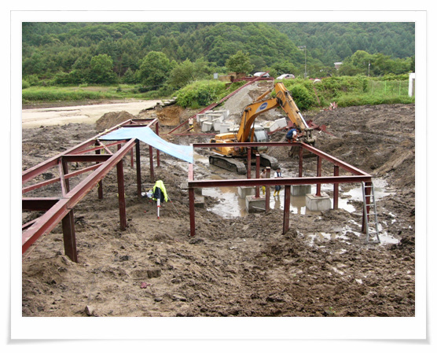

\- 물 없는 사이, 뭘 짓는지 한창 공사를 하고 있군.

\- 산정호수를 뒤로 하고 춘천을 향해 가는 길. 재미를 위해 다시 명성산 오프로드길을 택했다.

하지만 올라가던 길 재미를 위해 다른 군사도로로 간 게 화근이었다.

정상 옆으로 나 있는 내리막길로 내려갔다가 올라오질 못하는 것이다.

비온 뒤 젖어 있던 진흙길에 바퀴가 헛도는 것이다.

무려 한시간동안이나 사투했다.

높은 속도로 올라채기 위해 밑에서 시속 60km로 돌진을 해도 올라가는 도중 진흙에 속도가 현격이 줄면서 마의 커브을 못 넘는 것이었다.

마지막 수단으로 취한게, 군인들이 설치해 놓은 적사.

그걸 만드느라 뺑이 친 군인들에게 매우 미안함을 느낀다.

하지만 나 살기 위하다 보니 도리가 없었다.

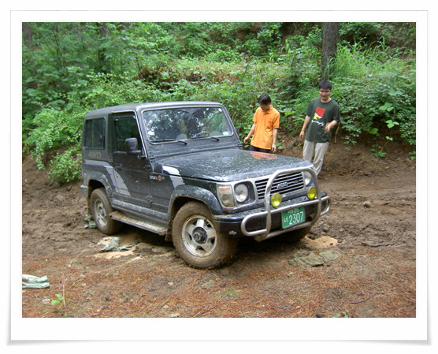

\- 고속으로 돌진하다 멈춘 이 곳에 모래를 뿌리고, 모래주머니도 받히고 하면서 탈출시도를 하고 있다.

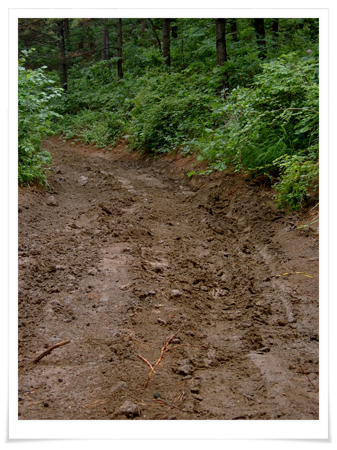

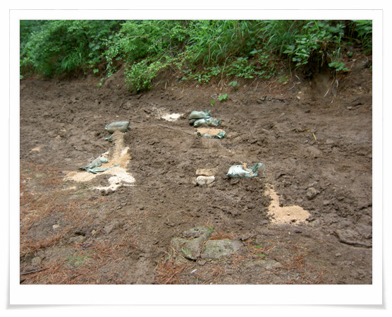

\- 결국 탈출에 성공했다. 다시 한번 모래주머니 만드느라 뺑이 친 군인아저씨들께 죄송하다.

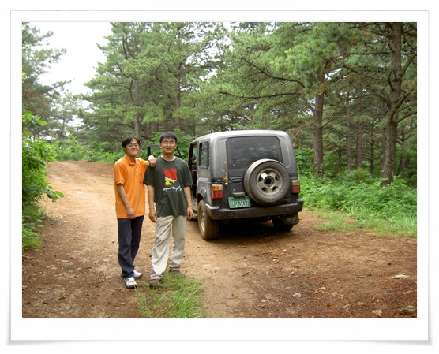

\- 탈출 기념 사진 촬영

위기에서 벗어난 기쁨에 춘천으로 곧장 가 춘천닭갈비를 먹었다.

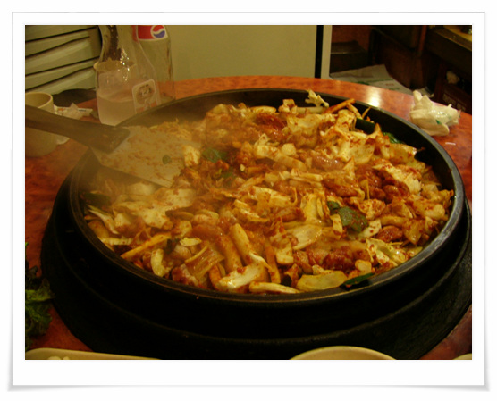

\- 닭갈비 3인분. 무지 양 많더군. 맛도 있고..

하지만 많은 양에 결국 남겼다.

[null](../6166880.html#6166880_1)

