# 7년만의 달라스 출장, 숙소 Marriot Inn, 그리고 동네 탐험

2주간의 미국 출장을 갔다 왔다.

장소는 달라스.

7년전 갔었던 곳이다.

출국할 때는 토요일, 귀국할 때는 일요일 하여, 출장으로는 최악인 주말을 그대로 회사에 반납한 일정인 셈이었다.

게다가 주중 휴일도 두개가 끼어 있는, 아주 안 좋은 조건.

달라스행 대한항공은 오전 11시에 출발하는 거라, 아침에 7시에 집에서 나왔다.

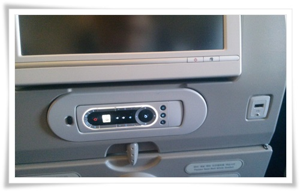

\- 2년만에 비행기를 타보니, 이제 좌석에 usb 충전 포트도 생겼더군.  좋아졌다.

달라스 도착하니, 현지시각 토요일 10시.  13시간 정도 비행기에서 앉아 있었다.

간만에 타는 장거리 비행기인데도, 역시나 힘들다.

이번 숙소는 Residence Inn By Marriott 14975 Quorum Drive Dallas, TX 75254.

그리고 처음으로 묵어 보는 2인 1실.

그나마 다행인 것은 그래도 스위트룸이라 침실은 따로 있다는 것.

\- 공항에서 숙소인 Marriot Inn으로 간 경로.

뭔가 익숙한 길일 줄 알았는데, 7년만의 달라스는 역시나 좀 생소했다.

\- Quorum Drive에 있는 숙소 Resident Inn Marriot.

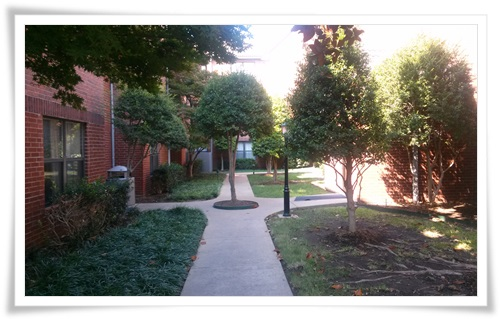

\- 프런트에 객실로 가는 길.

건물이 달라 이렇게 외부 길로 간다.

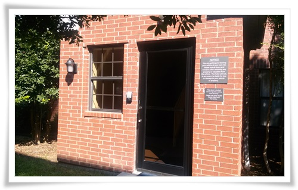

\- 내 숙소 213호가 있는 건물 입구.

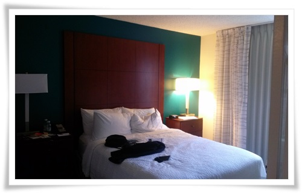

\- 내 침실.

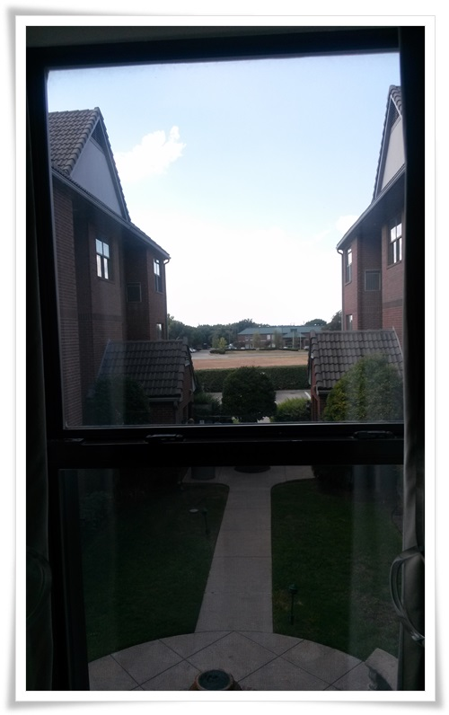

\- 침실 창문에서 바라본 풍경.

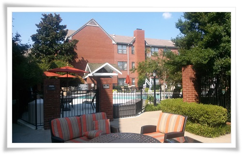

\- 여기도 수영장은 있다.

수영복을 챙겨올 껄 하는 후회가 들었다.

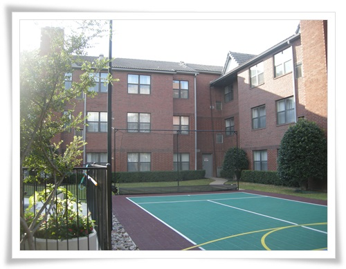

\- 농구장도 있기는 하나, 공놀이를 싫어하는 내게는 별 의미없는 시설.

\- 도착하여, 행아웃으로 영상통화기 전 찍어본 셀카.

살 좀 빼야겠다.

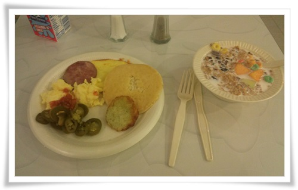

\- Resident Inn에서는 아침을 부페식으로 제공하고, 저녁도 월요일부터 목요일까지는 제공했다.

이게 평상시 내 아침식사.

새로운 동네에 왔으니, 동네 탐험을 해 봤다.

동네 탐험은 도보로.  숙소 주변 탐험.

\- 위와 같은 경로로 한시간 반 가량 걸었다.

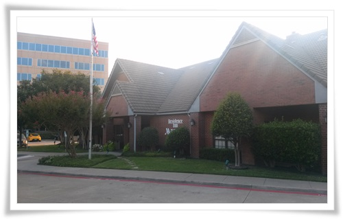

\- 먼저 Resident Inn 본관.

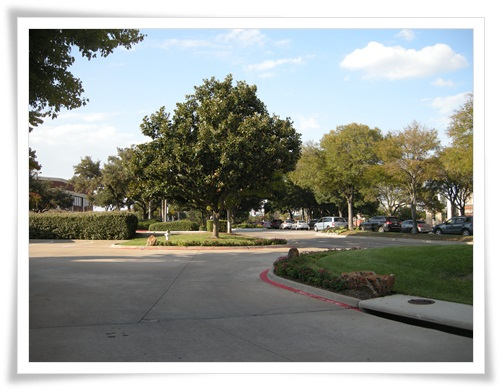

\- 북쪽을 향해 걷기 시작.

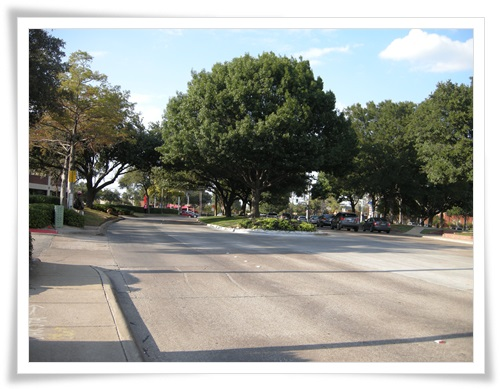

\- 이 길 이름이 Quorum Drive.

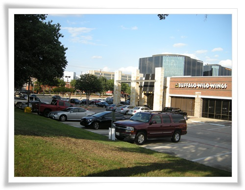

\- Quorum Drive와 연결된 Belt Line Road에 있는 큰 식당.

매 번 이 앞을 지나쳤지만 들어가 본 적은 없다.

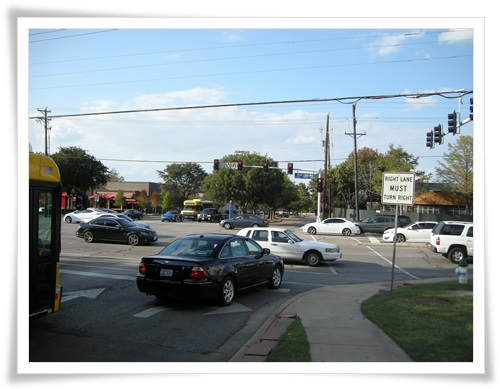

\- Belt Line Road 사거리를 건너기 위해 기다리는 중.

횡단보드가 우리랑 다르게 생겼다.

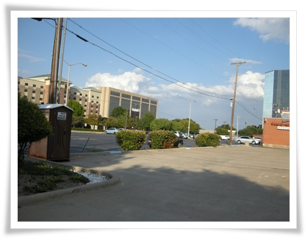

\- 걍 걸어가는 중.  걸어다니는 사람은 나 밖에 없다.

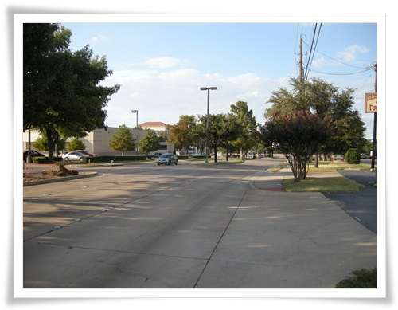

\- 한가한 도로.

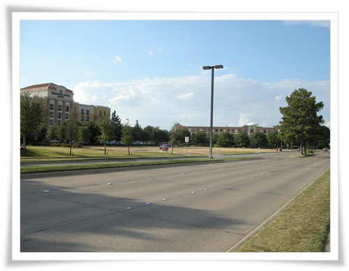

\- 역시나 한가한 도로.  거리에 있는 사람은 나 혼자.

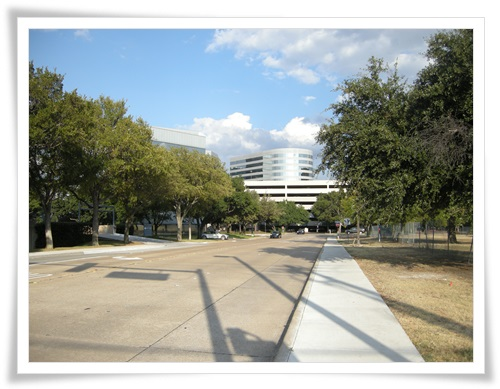

\- 동쪽으로 방향을 틀어봤다.  역시나 거리엔 나 혼자.

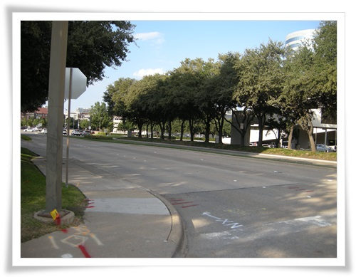

\- 걍 걸어가 본다.

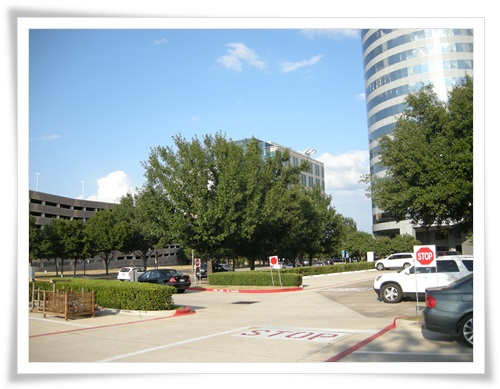

\- 무슨 큰 건물도 보이고,..

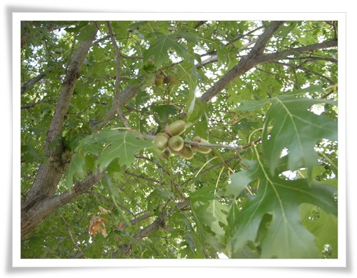

\- 가로수는 도토리가 열려 있는데, 아무도 따는 사람이 없어, 나무 밑에 열매가 수북했다.

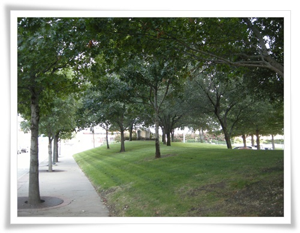

\- 가로수가 있는 도로를 쭉 걷는 중.

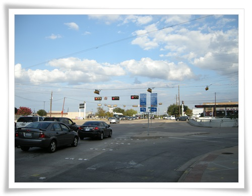

\- 월마트가 있는 쪽으로 가 본다.

줄에 매달려 있는 신호등는 좀 특이하다.

강한 바람에 안전하려고 저렇게 한 것일까?

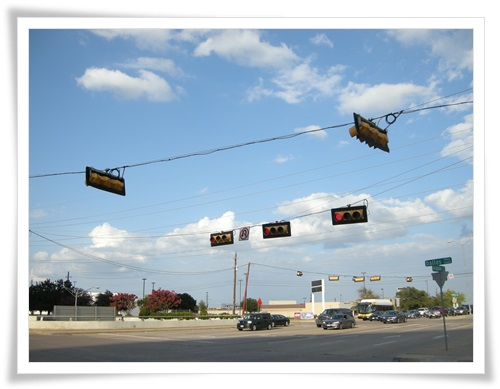

\- 암튼 줄에 매달려 있는 신호등이 그나마 볼 거리였다.

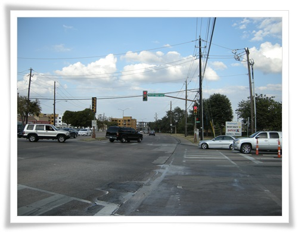

\- 월마트 근처 사거리.

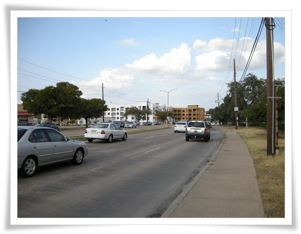

\- 여전히 혼자 걷는 중.

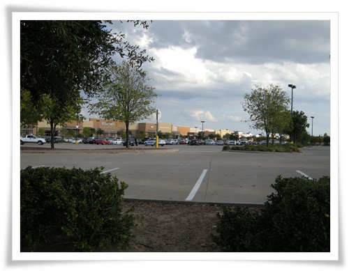

\- 월마트 부지에 당도.  이 때까지 40여분 걷는 동안 거리에서 마주친 행인은 없었다.

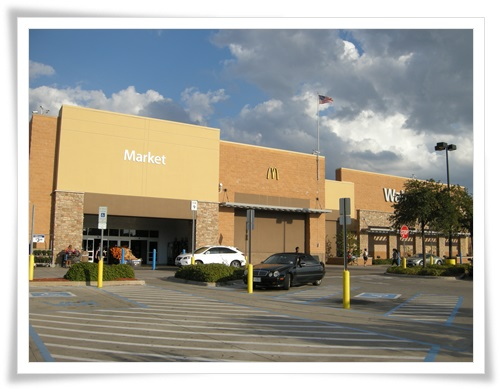

\- 월마트 들어가서 잠깐 구경해 본다.

7년전 있었던 달라스 거리를 가보고 싶었다.

그 때 숙소와 사무실.

숙소는 공항근처에 있는 Marriot TownPlace였고, 사무실은 기억이 안난다.

그 때 숙소로 가 봤다.

\- 꽤나 먼 거리다.  Mcarther Blvd. 에는 숙소까지 한 30여분 운전해 갔다.

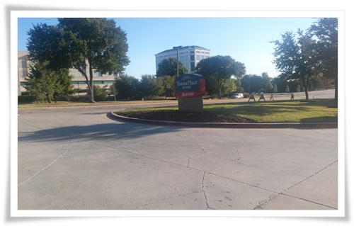

\- 이게 7년전 묵었던 숙소.

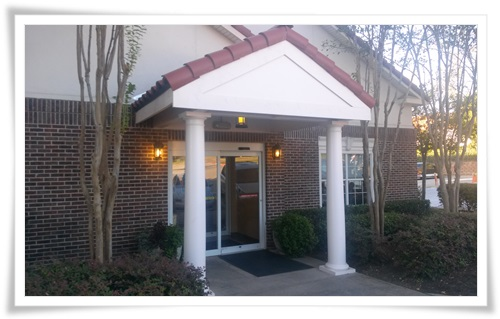

\- 숙소 정문.  그때랑 똑같더군.

