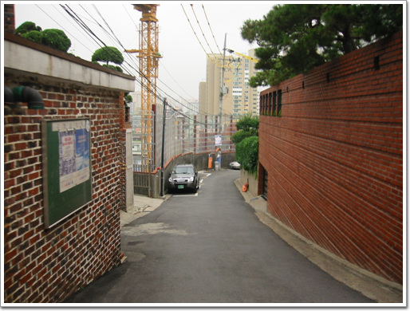
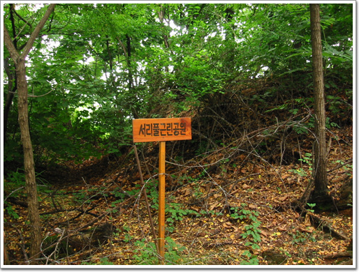

# 서리풀근린공원

회사 근처 동네 탐험

이번엔 회사 뒤쪽이다.

회사가 있는 곳은 반포동. 부동산 투기 뉴스가 나오면 항상 나오는 아파트가 있는 지역이다.

뒷쪽은 방배힐스. 비벌리힐스를 본따서 지은 것인지 방배힐스라 불린다.

고급주택가이지.

\- 회사 바로 옆. 이 고급 주택가쪽으로 올라간다

\- 실제보다 사진이 덜 고급스럽게 나왔군.

\- 고급 주택가라서 초소들이 곳곳에 있다.

\- 아직 건물 안 들어선 땅도 보이고..

\- 한창 건설중인 아파트도 있군.

\- 함지박 사거리. 왜 지명이 함지박인지는 모르겠다.

\- 고급스러움을 강조하는 롯데캐슬 아파트도 여기 있군.

\- 근처에 뭐가 있는 주변을 보니, 별 다른 것은 없군.

\- 저 앞이 오늘의 목적지 서리풀공원

\- 입구에 자전거를 주차하고

\- 오르기 시작. 꽤 잘 가꾸어진 숲이군.

\- 계단도 나무로 되어 있어, 숲과 잘 어울린다.

\- 여기가 정상이다. 뒤가 경찰서 있는 곳이라 출입금지구역이다.

\- 출입및 사진촬영을 금한다는 경고판도 있고.

\- 초소에 경계서는 경찰도 있군.

\- 다시 하산길. 방배중학교 쪽으로 내려갔다.

\- 여기서 보니, 국립중앙도서관이 보이는군.

\- 도서관과 저 멀리 메리어츠 호텔도 보이는군.

\- 다시 회사로.. 회사 옆에 반배본동가압장이란게 있군. 실제 쓰는 시설인가?

\- 회사 바로 뒷 집. 정원이 멋있군.

[null](../6166881.html#6166881_1)

