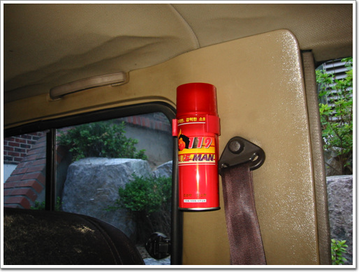

# 록스타에 소화기 달다

나의 명차 록스타에 소화기를 장착했다.

그럼으로써 명차의 격조가 한 단계 더 높아졌다.

소화기를 사야겠다는 생각은 예전부터 했는데, 그 놈의 돈 때문에 쉽게 지르지 못했었다.

그러다 2주전쯤 주말 차를 몰고 가는데, 차 안에서 왠 고무 타는 냄새가 나더니, 발 밑에서 불이 활활 타는게 아니던가.

순간 9시 뉴스에 "오늘 오후 5시경 사평로에서 주행하던 록스타에서 화재가 나 차량이 전소되고, 이 일대 교통에 마비되는 사고 있었습니다. 이 사고는 소화기만 있었으면 충분히 초기 진화될 수 있었는데, 결국 차량전소까지 이르고 말았습니다. 화재 차량 운전자 박모씨의 말을 들어보겠습니다...." 라고 나올 수도 있겠구나 하는 생각까지 들었다.

이를 어떻게 꺼야 하나 당황하다가, 온몸을 던져, 손으로 불을 쳐서, 끌 수 있었다.

원인은 노후된 전선의 합선. 이로 인해 퓨즈박스의 전선들이 탔다. 다행히 운행은 되는 상태라서 집까지 끌고 가서, 전깃줄로 다시 배선을 한 후 소화기 주문. 2개 1세트 2만원.

집안에 하나 두고, 차한에 하나 뒀다. 이제 안심이다. 명차에 품격에 어울린다.

[null](../6166884.html#6166884_1)

