# 공은 역시나 나를 싫어했다

내가 싫어하는 운동 =\> 공놀이

축구,농구,배구,야구,족구,당구 할 것 없이 다 싫어한다.

공은 나하고 친하기를 거부하는 듯 했다.

그렇게 공놀이 싫어하던 내가 어쩔 수 없이 축구를 해야만 했던 시기. 군대시절.

나의 생존비결. 축구할 때 공을 차지 않고, 상대편에서 제일 잘 차는 사람을 차는 거였다.

그렇게 해서 군북무를 무사히 마칠 수 있었다. 그렇다고 '개발'이라는 말마저 안 듣고 산 것은 아니지만.

회사에 볼링동호회가 생겼다. 동호회명 B300. Bowling 300점이 되겠다는 뜻인가 보다. 볼링 만점이 300점인지 이 때 알았다.

가입을 했다. 골농이 싫어하는 내가 왜? 공짜니까. 동호회에 속해서 치면 회사에서 지원해준다니까. 공짜라면 양재물도 마시는 나 아닌가.

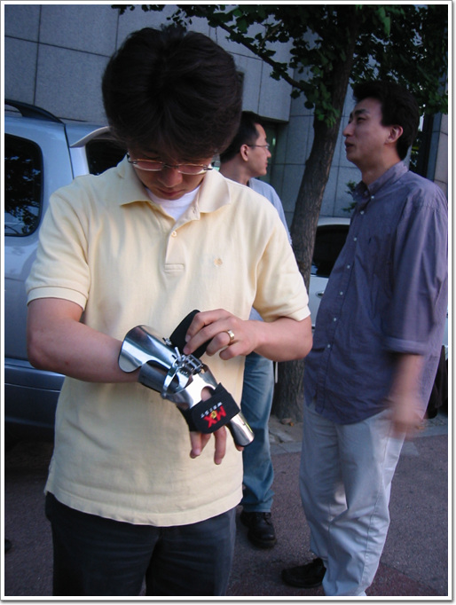

\- 모든 일에 과도한 성의를 보이를 보이는 최영태씨. 출발도 하기 전에 벌써 장비 착용이다

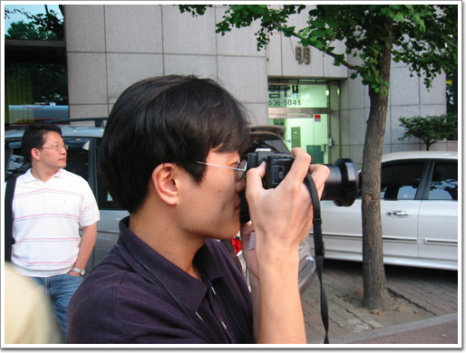

\- 버스 기다리는 동안 상민은 다른 사람 카메라에 관심을 보이고 있군.

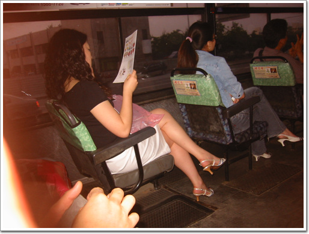

\- 이승우씨가 내 디카로 버스안의 아녀자를 도촬했다.

내 작품은 절대 아니다.

예전에 다른 여자 사진 찍었다가 마눌님한테 들켜 혼난 후로 난 더 이상 이런 짓 안 한다.

\- 내린 곳은 교대근처. 편의점에서 우선 음료수를 산 후 횡단보도 신호 바뀌길 기다리는 중

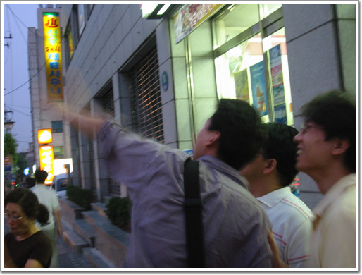

\- 볼링장에 다 온것에 마냥 즐거워하는 최영태씨

이재형씨의 손가락은 바로 앞의 롯데캐슬아파트를 가리키고 있다.

꽤 비싸게 지은 것 같다고 하면서.

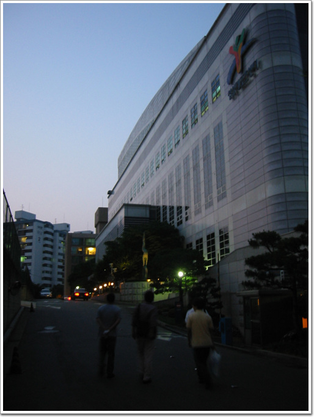

\- 목적지 삼성레포츠센터라는 곳이다.

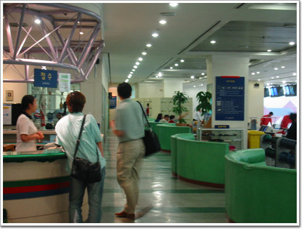

\- 데스크에서 레인 지정을 받고

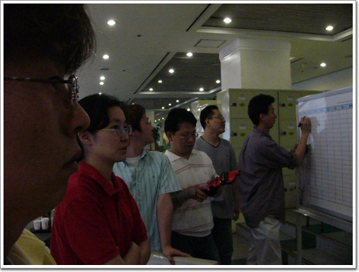

\- 시작에 앞서 회장의 훈시를 듣고

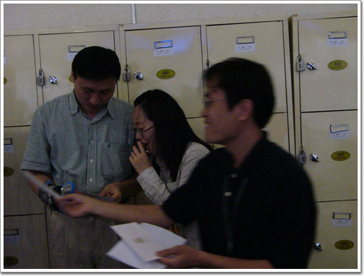

\- 지난주 포상시간이란다.

\- 수상자. 하드웨어팀 최지선씨다.

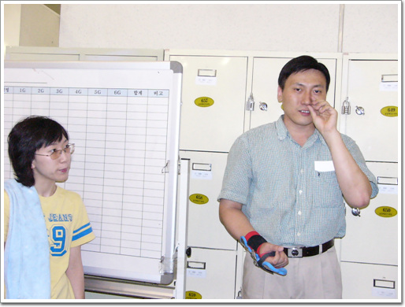

\- 시작에 앞서 회장은 코 한번 후비고.

후비고 난 후 저 손가락의 행방은 어디일까를 유심히 살피는 최지선씨.

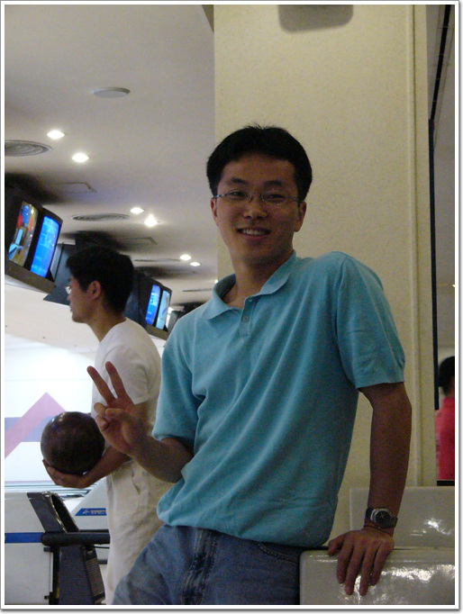

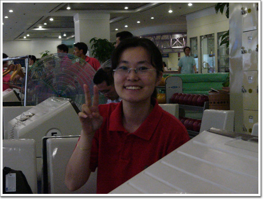

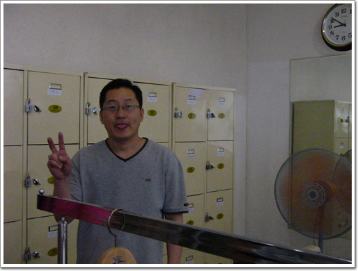

\- 다들 승리의 V 자를 한번씩 지으며, 필승을 다지는군.

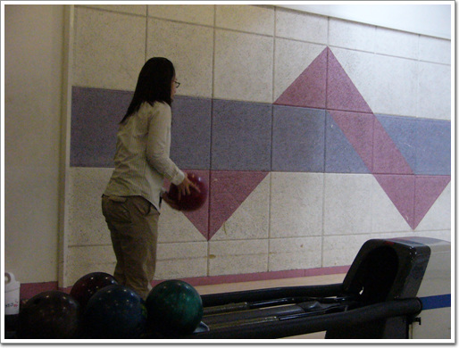

\- 자 이제 공을 들고서..

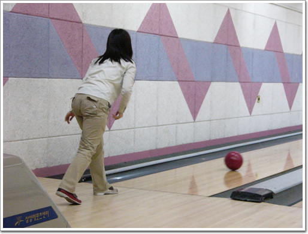

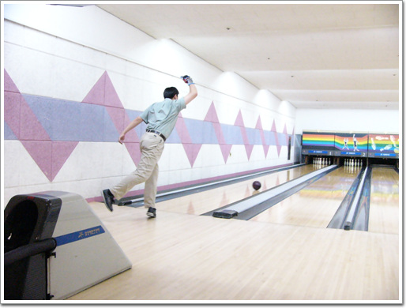

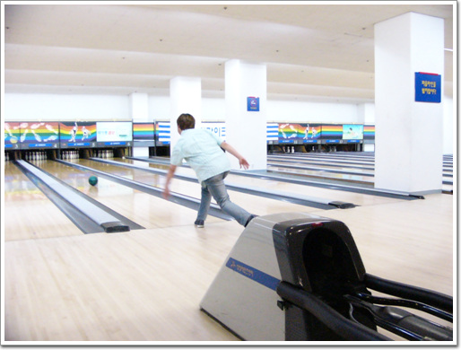

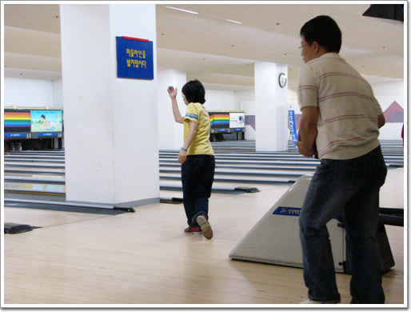

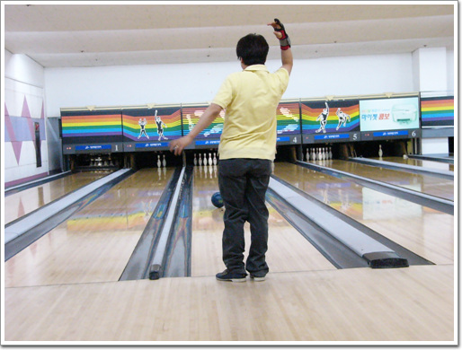

\- 각자 자기 폼으로 공을 굴린다.

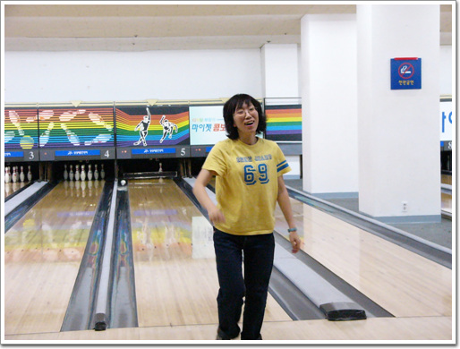

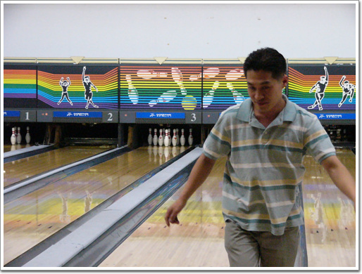

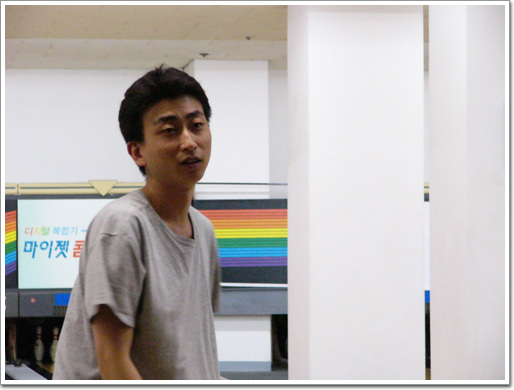

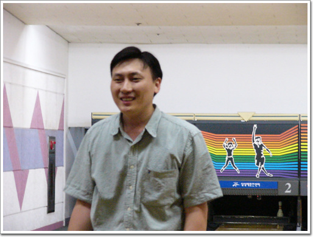

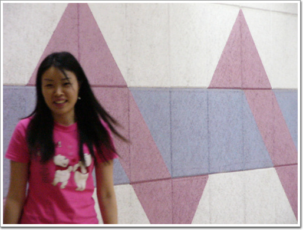

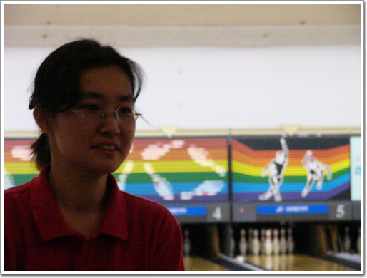

\- 치고 난 후 돌아선 모습으로 잘 쳤는지 못 쳤는지 표정이 나온다.

[null](../6166888.html#6166888_1)

