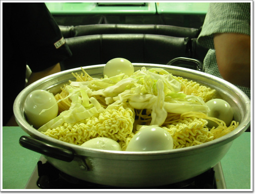

# 애플 하우스

회사 근처에 있는 즉석 떡볶기집이다.

2년전 동네 탐험을 하다가 발굴해 낸 식당이지.

뭐 신당동 떡볶기에 비할 바는 아니지만, 싸고 양 많고 하여 가끔 이용하는 식당이다.

주 이용고객은 우리와 같은 회사원이 아닌 옆에 있는 세화중고 학생들이지.

\- 주문하고 있는 최재호씨. 전면의 오동통한 손은 포레스트꺼

자리에 앉으면 주인아저씨가 이 주문표를 가져온다. 그러면 이렇게 시키려는 것에 표시를 하면 된다.

\- 주문을 제대로 하고 있는지 감시하는 임영준씨.

\- 폴도 주문하는 걸 감시하고 있군.

\- 주문한 즉석떡볶기 2인분. 달걀5개, 라면사리, 쫄면사리가 나왔다.

\- 반찬은 노란단문지가 전부. 단무지를 얼핏보면 파인애플통조림 비슷하게 생겼다. 그래서 군대에 있을 때 내가 있던 부대에서는 단무지를 파인애플이라고 부르면서 먹었던 기억이 나는군.

\- 중고생의 눈높이에 맞춘 내부 인테리어. 빤짝이등.

\- 즉석떡볶기 익는 동안, 순대볶음을 먼저 먹고..

\- 다 조리됐다. 이제 개시

\- 포레스트의 놀라운 속도의 손놀림 끝에 어느새 바닥을 비우고..

\- 마지막 계산. 1인당 3천원씩 걷으니 저녁식사 끝.

[null](../6166889.html#6166889_1)

