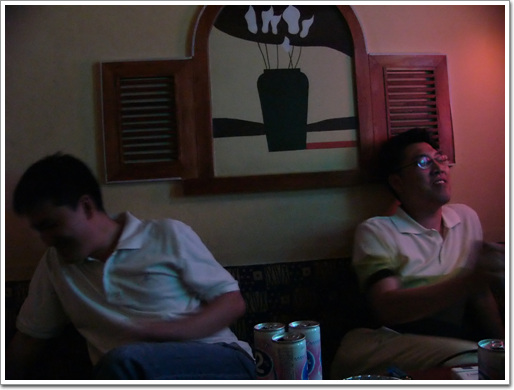
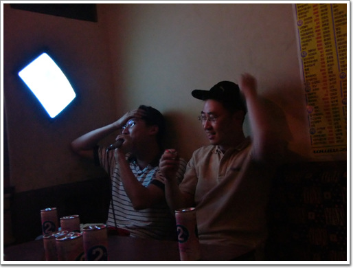

# 피비친구들과 노래방

노래방

내가 싫어하는 장소중의 하나다.

싫어하는 이유.

첫째. 막혀있는 폐쇄적인 공간이다. 폐쇄공포증은 아니더라도, 갇힌 공간에선 무지 답답함을 느낀다.

둘째. 시끄럽다. 귀가 그리 튼튼하지 못해서인 그다지 큰 소리를 좋아하지 않는다. 그래서 워크맨같은 것들도 거의 이용을 않고 있다.

셋째. 노래부르는 것을 좋아하지 않고, 그리고 아는 노래도 별로 없다. 내가 아는 노래는 댄스 여자가수 밖엔 없다. 내가 원래는 취향이 이렇지는 않았는데, 군대에 있으면서 취향이 확 바뀌었다. 그 중에 비비의 '비련'이란 노래가 절대적인 기여를 했다.

암튼, 6월 5일 토요일 피비친구들 모임이 있었다. 난 다른 일이 있었기에 그 시간에 참석을 못하다가, 밤 10시쯤에 강남에 들렀다. 여느때 같았으면 2차 시기때쯤 됐었을 텐데, 이 날은 벌써 3차 노래방에 있었다. 갈까 말까 하다가 갔다. 장소는 종로빈대떡 앞 록스타란 노래방이더군. 내 명차 이름과 같은 이름이라서 그 점 하나는 마음에 들더군.

남아있는 사람은 성환, 미정, 인영, 경석, [용익](http://minihp.cyworld.nate.com/pims/main/pims_main4.asp?tid=20244656&domain=&cast=&dpop=&productseq=&gift_preview=&thema=&codi=&preview_effect=&preview_effect_cd=&seq=&urlstr=&urlstrsub=&send_seq=&back=&item_seq=&act=&Nyearmon=&board_no=&choco=&product_type=&mana_type=).

\- 노래방에 맥주가 아닌 음료수가 있는 풍경은 오래간 만에 본다.

\- 근래 노래방을 잘 못갔는지, 뽕을 뽑는듯한 열창.

노래방은 장사가 별로 안되는지, 15분 추가를 무려 5번에 걸쳐 하더군.

