# 공주 정산면에서 밤 줍기 체험

밤으로 유명한 공주로 밤 줍기 체험을 하러 갔다.

총 4가족.  딸내미 초등학교 1학년 때 형성된 여행 멤버다.

정안에 있는 금정농원이 유명하다고 하여 목적지를 그쪽하여 출발했다.

도착해보니, 전세버스 10여대에 주차장도 승용차들로 가득했다.

이 정도 분위기는 밤보다는 사람 구경하겠다 싶었다.

다른 밤농장으로 가기로 했다.

다행히 같이 간 준경이 아버지가 공주쪽 아는 분이 있어 그 분 산으로 밤 주우러 가기로 했다.

그 전 점심부터 먹기로 하기로 그 동네 유명한 중국집으로 갔다.

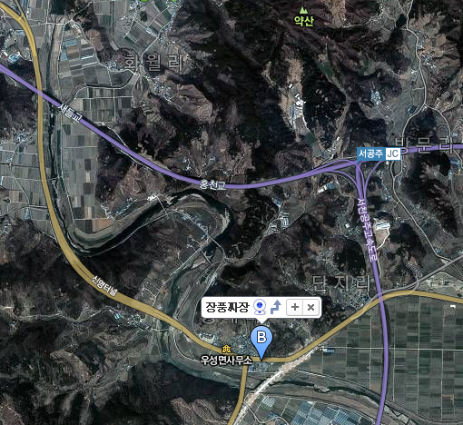

\- 우성면사무소 근처에 있는 장풍짜장.

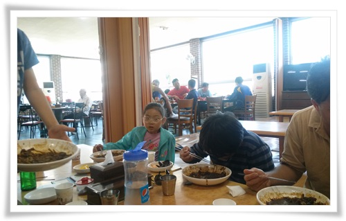

\- 중국집에서 짜장면과 탕수육을 먹었다.

조그마한 면소재지에 비해 홀이 꽤 컸다.

어떻게 이런 큰 홀이 유지할 수 있을까 궁금했는데, 탕수육을 먹어 보고 이 정도면 유지될 만 하다고 느꼈다.  탕수육이 꽤 맛있었다.

숙소로 잡은 남천리 산촌 마을에 짐을 풀고, 밤 주우러 향했다.

\- 화살표가 위치한 곳이 이번 밤 주운 장소.

주인이 밤 나무를 몇 년전 심기는 했으나, 관리를 안 한 상태라고 했다.

그래서 농약도 안 친 상태라고 했다.

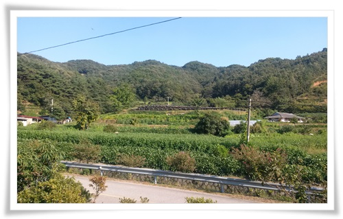

\- 정산면 해남리에 있는 밤농장 주인집 앞 풍경.

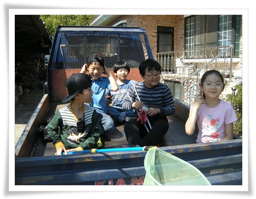

\- 4륜구동 트럭에 올라탔다.

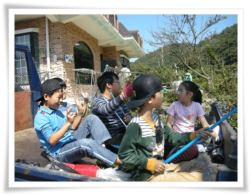

\- 출발준비

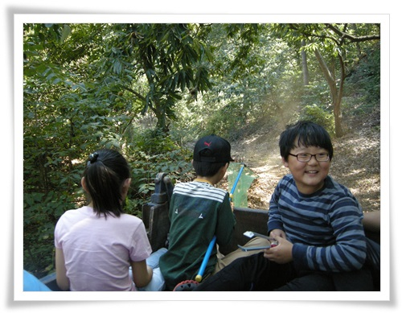

\- 임도를 따라 오프로드로 올라간다.

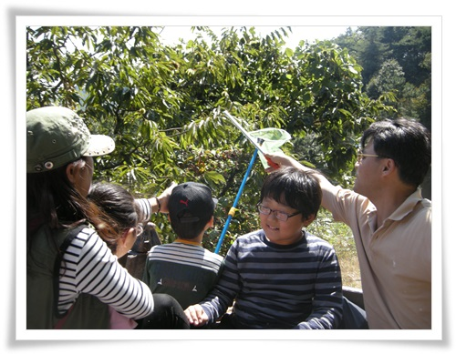

\- 줄지어 있는 밤나무들

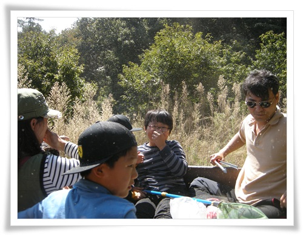

-도착.  마른 풀씨들이 날리는 곳에 도착했다.

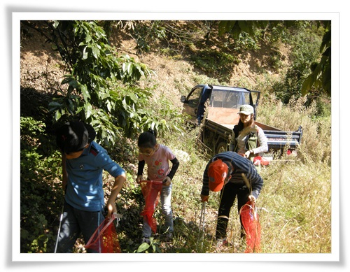

\- 차에서 내리자마다 밤 줍기 시작.

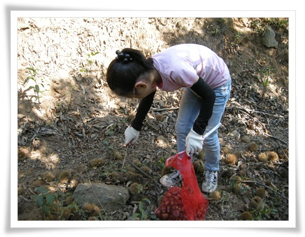

\- 이렇게 망태기 들고, 집게로 밤을 줍는 중.

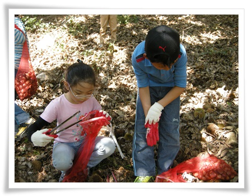

\- 온 사방 밤이라, 금방 망태기를 채워나간다.

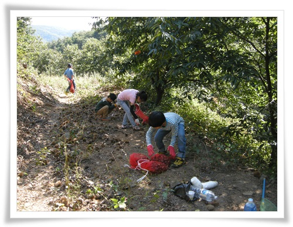

\- 길을 따라 가면서 밤을 줍고 있다.

\- 한 두시간정도 밤을 주은 결과.

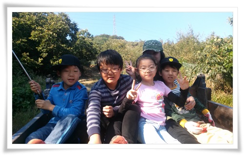

\- 다시 산을 내려가기 위해 트럭에 올라탔다.

나도 이렇게 밤을 줍는 작업은 처음해봤다.

운동화를 신고 간게 좀 실수였다.

밤송이 가시는 운동화를 아주 쉽게 통과하여 발을 찔렀다.

그래서, 여러변 운동화와 양말을 벗고, 발에 박히 가시를 빼내고 그랬었다.

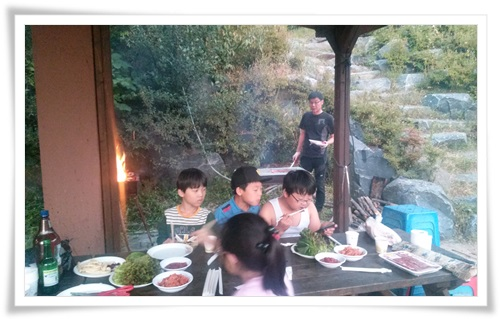

\- 저녁은 남천리산촌마을 펜션에서 고기로..

\- 역시 불장난을 좋아하는 애들.

