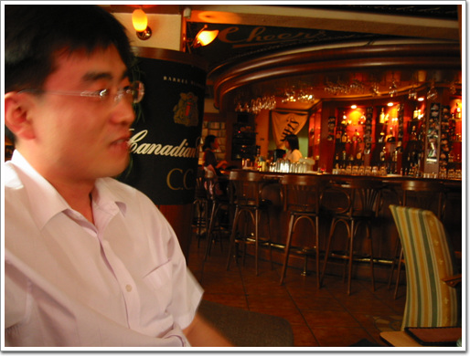
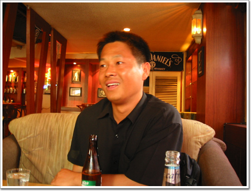

# 원병호중위와 오진석상사

오진석 상사에게 전화가 왔다.

서울에 올라왔는데, 시간되면 보자고.

같이 근무했던 때가 97년부터 98년. 한 1년 반정도 같이 근무를 했구나.

못본지도 6년이 되었었다. 한번 봐야지하면서도 보질 못하다가, 이렇게 기회가 됐다.

같이 만나는 김에 내 사수 원병호중위에게도 전화를 걸었다. 때마침 시간이 잘 맞았다.

남부터미널 근처에서 만났다.

이렇게 셋이 만난 것도 7년만에 처음 같다.

그러고보니 시간이 참 많이 흘렀다.

\- 내 사수 원병호중위.

나에게 인수인계를 하고 제대를 해서, 지금은 예술의 전당 앞에 있는 한국전력에서 근무를 하지.

가까운 곳에 있는데도 자주 만나지는 못했다.

\- 오진석상사. 그 때는 중사였지. 직책 통신행정보급관.

처음 만난 그 때는 둘이 참으로 많이 삐그덕거렸다.

당연한 거겠지.

그 때 나이, 나 소위를 갓 달은 스물네살. 오진석 중사 스물일곱살.

차츰 익숙해지면서, 재미도 있었다.

감히 따라 할 수 없는 오중사의 능력은 대단했다.

특히 민간인과 관련된 모든 일은 건빵으로 다 해결하는 모습을 신비스럽기까지 했다.

우리나라군대란게 상급부대같은 경우야 돈과 물자가 여유가 좀 있지만, 말단 대대는 부족한 상태에서 해야 하는 거다.

무에서 유를 창조해내는 거지.

5/4톤 가설차에 건빵 몇박스를 싣고가서는 민간인에게 전화선도 협조해오고, 전기도 끌어오고 하는 게 대단해 보였다.

그 넉살좋음은 감히 따라할 수 없어보였다.

지금은 항공작전사령부예하 강습대대에서 통신선임하사를 하고 있다하면서, 훈련때마다 헬기탄다고 자랑을 한다.

간만에 만나 이야기를 나누면서 여러 소식을 다 들을 수 있었다.

진급에 사력을 다했던 대대장 박건주 중령은 계속 출세가도를 달려 육군본부, 연합사를 거쳐 지금은 군단 참모를 하고 있다고 하고, 날 못살게 굴었던 작전과장 김상진 소령은 파견대장을 하고 있다고 하고, 여단통신대장 선민수대위는 소령진급하여 통신학교에 있고, 그전 통신대장 변희원 대위도 다른 곳에 있다 한다.

\- 디카로 함 찍어봤다. 오상사와 민간인 원병호

갑자기 예전 듣던 사람들과 용어들이 나오니, 감회가 새롭더군.

331관측대대, 김대섭하사, 정귀일중사, 곽오동중사, 독수리훈련, P-999K, P-950K, ADU-95, ARF-95...

그때가 회상되다 보니, 안재형대위를 한번 만나보고 싶었다.

그 때 본부포대장이었지.

내 직속상관이라 할 수 있다.

중대장을 잘 만나는게 소위들에게는 가장 큰 복이란 말이 있었는데, 그 때 정말 좋은 포대장을 만났었지.

65사 포대장을 마치고 전역했다는데 지금은 어디에 계신지 모르겠군..

내가 처음 부임하고, 첫 일석점호를 하는데, 갑자기 복무신조 세번째가 기억이 안 나서 당황했던 게 생각나는군..

