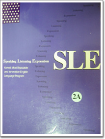

# 아침형 인간으로 복귀

지난 달 쉬었던 학원을 다시 끊었다.

학원은 파고다 학원.

과목은 SLE2A.

내가 학원을 다니기 시작했던 때가 99년 7월부터였던 것 같다.

그 때는 토익 듣다가, 취직하면서부터는 회화를 들었지.

그러다, 외국인회화(SLE)는 2000년 겨울부터엔가 들었었다.

2A에서 시작해서, 3A까지 들었었다.

그러다 좀 시들하여, 청취반도 들어보고 하다가,

회사에서 중국출장갈 일이 있길래 중국어과정 한 10달 다니다,

다시 SLE를 끊었다.

반 배정을 받기 위해 인터뷰를 했는데, 파고다학원은 인터뷰하는 데도 돈을 내야 하더군.

2000원이나 들었다. 결과는 2B. 생각보다 낮은 등급이더군.

다시 5시 반에 일어나 학원에 가서, 교재를 꺼내 보니, 내 교재만 색깔이 다른 거다.

그새 교재 색깔을 바꾸었구나 했는데, 내용도 많이 다르다. 이거 어쩌나? 또 사야하나 말아야 하나? 그냥 이걸로 하련다.

총 10명의 사람들.

수강생 남자 네명, 여자 여섯명.

강사 오스트리아 남자다.

이제 다시 아침형인간으로 복귀를 했다.

[null](../6166894.html#6166894_1)

