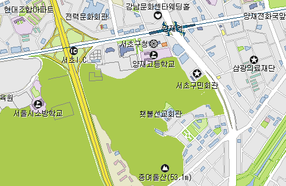
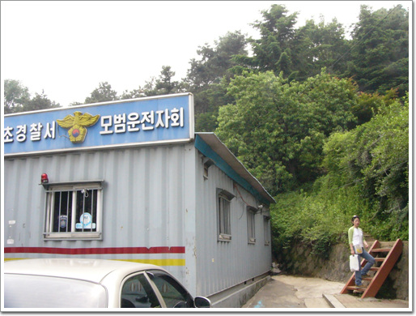
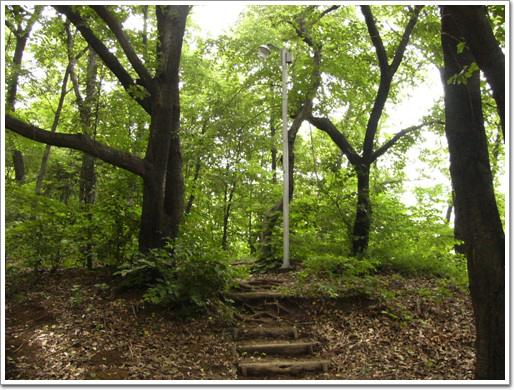

# 말죽거리공원 정상

동네 탐험.

집 주위를 탐험해보기로 했다.

일요일 오후, 점심을 먹은 후, 서쪽으로 향했다.

바로 여기 서초구민회관 뒷편 언덕을 가 보기로 했다.

원래 우면산 자락인데, 경부고속도로가 허리를 댕강 자르는 바람에, 지금은 그냥 언덕일 뿐이다.

\- 올라가는 곳은 여러곳이 있지만, 구민회관 뒷편으로 이런 길이 있어, 이 길을 통해 올라갔다.

\- 올라가는 길

\- 조금 올라가니, 양재역에 있는 Yes24 와 실외골프연습장이 한눈에 보이는군..

\- 조그마한 언덕치고는 나무도 많고, 쉴 곳도 제법 많다.

\- 이정표도 제법 잘 만들어놨군. 돈 많은 서초구다운 걸..

우면산이 없으니 정상이 말죽거리공원 정상이로군.

\- 이곳이 이 언덕의 최고봉 말죽거리공원 정상이다.

\- 정상임을 표시하는 표석

\- 며느리밑씻개라는 식물이다. 요즘 읽고 있는 "야생초편지"라는 책에 설명에 되어 있어 알아볼 수 있었다. 나중에 이것도 한번 캐다가 길러봐야겠다.

[null](../6166897.html#6166897_1)

