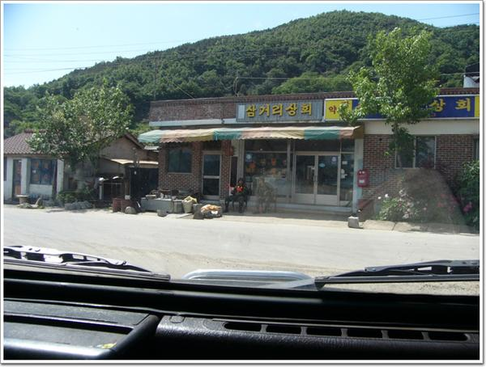
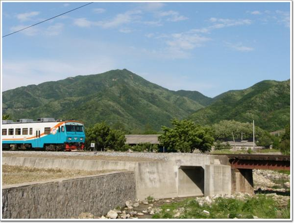

# 26사단 222포병대대

99년에 제대를 했으니, 군대 제대한지 5년이 됐다.

살아오면서 가장 기억에 남는 시기가 언제였나 한다면 내게는 군시절이다.

물론 육체적으로나 정신적으로나 힘든 시기이기는 하다.

추억이란게 어떤 기억이라도 뽀샤시효과를 주어 아름답게 만들어버려 그런지로 모르겠다.

날라오는 재떨이를 차마 피하지 못하고 몸에 접근하는 순간까지 바라보고 있어야 했던 순간이라던가 혹한기 훈련중 1시간동안 작전과장에게 정강이 걷어차이며 맞던 기억마저도 재밌던 추억거리가 된다는게 신기하기도 하다.

암튼 그 기간이 내게는 나를 바꾸게 한 좋은 기간이었다.

군대를 통해 유유부단한 성격도 어느정도 고쳐졌고, 낯을 가리던 것도, 싫은 소리 잘 못하는 것도 고쳐졌다. 그리고 옆에 있던 사람이 한순간 찌그러져 한낱 고깃덩어리 바뀌는 것을 통해 사람이 살아있다는 게 참 별게 아니구나하는 것도 느낄 수 있었다.

군대에서 탔던 1/4톤 K-111 짚차에 반해 록스타를 사서 오프로드로 달려보곤 한다.

5월. 놀기 좋은 달이다. 록스타를 몰고 내가 예전 훈련했던 그 곳을 달려보고 싶었다.

인수에게 전화를 하여 같이 가자고 하였다. 물론 꼬실때는 그냥 연천에 놀러가자는 말로 꼬셨다.

\- 인수다. 초등학교, 중학교, 그리고 고등학교 동창이지.

\- 연천의 60진지. 민간인 출입금지구역인 군 훈련장이다. 불법을 저지른것이지..

\- 훈련도중 쉬를 할 때 주로 이 풍경을 보며 쉬를 했지.

\- 이곳이 예전 혹서기 훈련할 때 텐트친 곳이지, 교환기 세운 곳이지, 하며 기억을 되살려보고 있다.

\- 토요일인데도 훈련하는 부대가 있었나 보다. 도로안전요원이 배치되어 있군.

\- 원조 록스타가 지나가는군.

\- 진상리OP에 올라보니, 임진강 줄기가 훤이 보이는군.

\- 호에는 사격방향이 그려져 있군.

\- 임진강에는 놀러온 사람들이 여럿 있었다. 그 때에는 이 사람들이 꽤나 부러웠었다.

\- 화이트교가 있던 자리. 제작년까지만 해도 있었는데, 없어졌다.

\- 내가 있었던 부대. 버스는 이 곳에서 타고 내렸었다.

\- 간 김에 태풍전망대로 들렀다.

내가 있던 부대 근처에 있었는데, 한번도 가보질 못하다가 이번에는 가 봤다.

민통선에서 신분증을 맡기고 올라가는 길이다.

도로 양 옆으로는 지뢰 경고판이 붙어 있었다.

\- 사진촬영이 허가되는 마지막 지점. 저 초소 너머에 북한이 있다.

\- 신탄리에서 의정부까지 운행하는 통일호 열차. 휴가를 갈 때면 저 기차를 탔었다.

의정부발 매시 20분에 출발하는 저 기차를 타고 다시 부대로 복귀했었고..

[null](../6166900.html#6166900_1)

