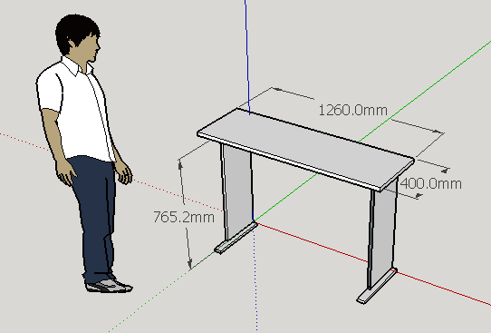
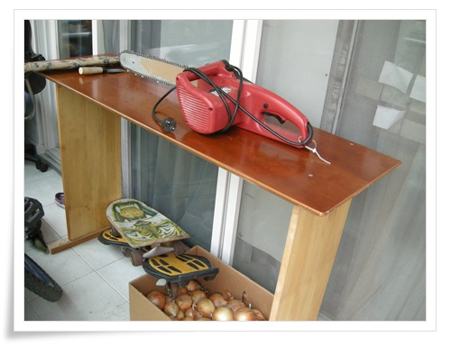

# 전기체인톱 지른 기념 작업대 만들어 보다

전동공구에 대한 끝없이 욕망.

체인톱에 대한 욕구를 못 참고 질렀다.

엔진톱과 전동톱중에서 오랜 기간 고민하다.

전동톱으로 골랐다.

엔진톱은 장소의 제약이 없기는 하나, 사용안할 때 연료 다 빼주고, 카브레다 청소등 관리를 잘 주어야 하는 문제도 있고, 무엇보다 전동톱보다 비싸다.

중고로 6만5천원주고 샀다.

중국산이고,  스펙은 아래와 같다.

- Place of Origin:Zhejiang, China (Mainland)
- Brand Name:ULITE
- Model Number:7501U
- Power Source:Electricity
- Saw Type:Chain Saw
- Application:Wood Saw
- Rated Voltage:220-240V
- Rated Input Power:50/60Hz
- No-Load Speed:400r/min
- Frequency:1600W
- Blade Diameter:405mm
- Max. Cutting Width:405mm
- Max. Cutting Depth:405mm
- Weight:5.4KGS
- Chain saw:red

샀으니, 한번 써봐야 겠다.

뭘 잘라볼까 하다, 이걸로 나무 잘라 책상이나 만들어보기로 했다.

스케치업으로 간단히 스케치를 해 본다.

\- 대충 이런 모습으로 하기로 하고, 잘랐다.

생각보다 쉽지는 않았다.

벌목하는 장면에서 보듯이 나무가 쑥 잘라지지는 않고, 이것도 제법 시간이 걸렸다.

그리고 정밀도 면에 떨어지기만 했다.

\- 완성된 허접한 작업대와 그 작업대를 만든 체인톱.

체인톱을 사니, 이제 원형톱도 사고 싶어진다.

