# 한강으로 산책가는 길

엠파스의 용량 제한이 3M밖에 안되는군..

사진을 올리다보니, 용량 제한에 걸려버리는군..

암튼, 이어서..

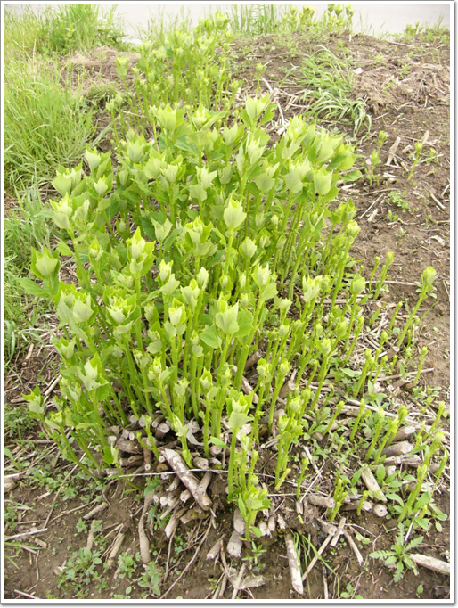

\- 무슨 나무인지는 잘 모르겠는데, 이렇게 잘렸는데도 왕성하게 새 싹을 피우는군.

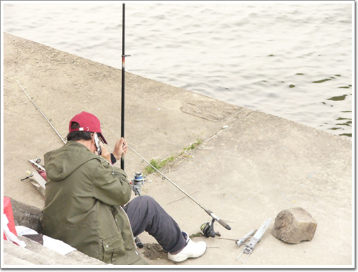

\- 낚시하는 아저씨. 여기서 잡은 고기를 설마 먹을 생각인가?

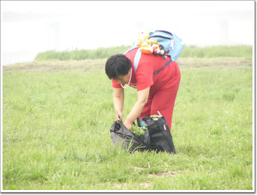

\- 쑥 뜯는 아줌마

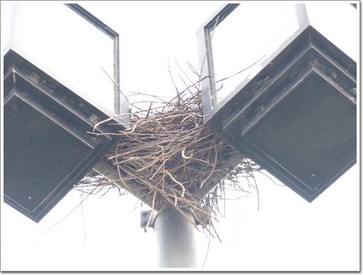

\- 인공섬 가로등 위에 새 집이 자리잡고 있군.

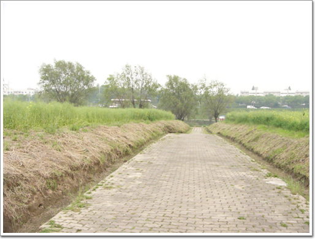

\- 유채꽃의 그 노란빛깔이 거의 다 사라지고 이제 초록색이다.

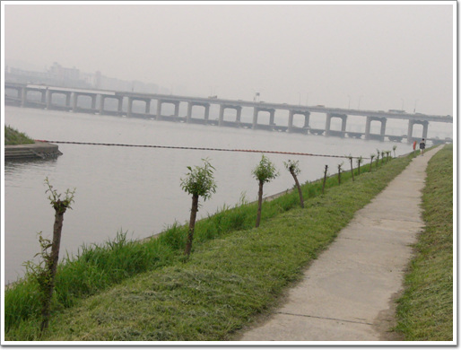

\- 아마 올해 식목일에 심어진 나무 같은데,.. 이 나무도 자라면 꽤 훌륭한 그늘을 만들어 주겠군.

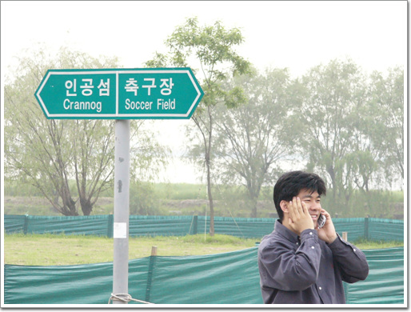

\- 반포지구 한 바퀴 돌고, 돌아가는 길

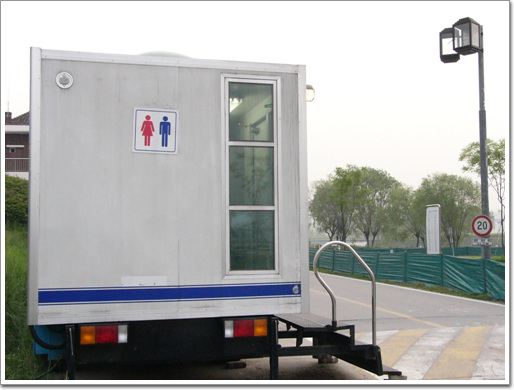

\- 이동식 공중화장실. 지금은 옆면에 유리창으로 바꾸어 놓았다. 아마도 저 안에서 금품갈취나 본드 흡입같은 것들이 많이 발생해서 그런가?

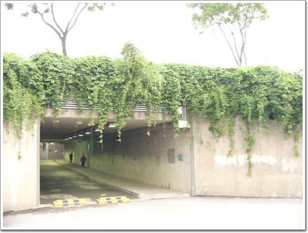

\- 이번에 통과할 토끼굴.

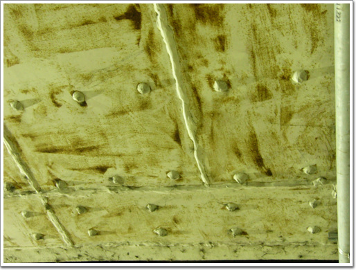

\- 여기 토끼굴은 천장 무늬가 심상치 않다. 꼭 인디아나존스에 못이 박힌채 바닥으로 내려오는 천장같다.

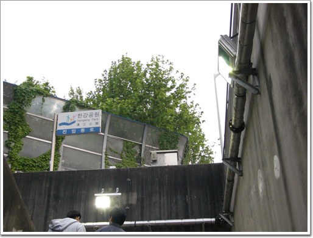

\- 다시 아파트단지로 들어간다.

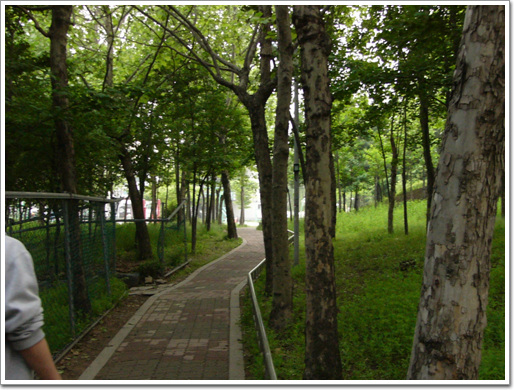

\- 이곳이 반포지구 공식 출입로이다.

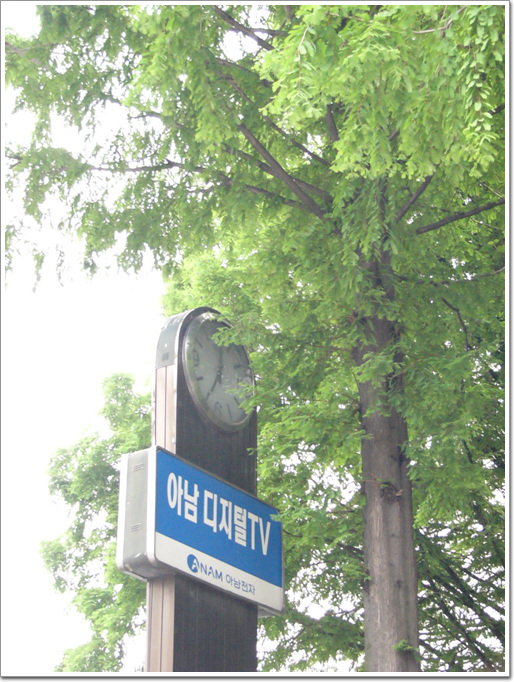

\- 시계를 보니, 7시군. 나온 시간이 6시 20분쯤이니까 딱 40분 걸렸군.

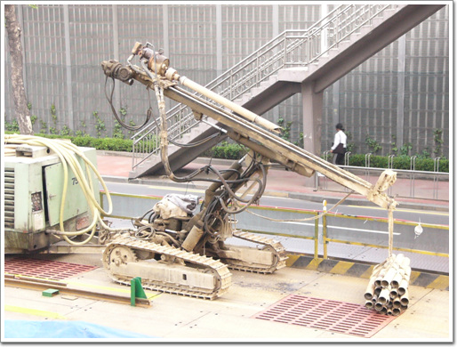

\- 9호선 공사중. 저 장비는 특이하다. 터미네이터에서 등장하던 로보트같은데..

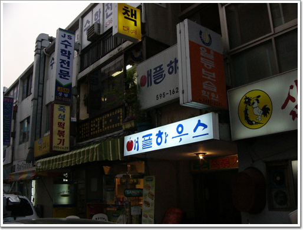

\- 가끔 가서 먹는 즉석떡볶기 집. 애플하우스

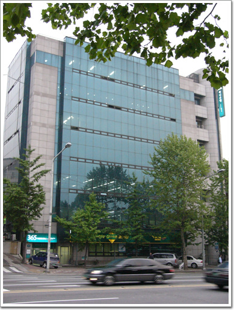

\- 회사에 도착했다. 오늘의 산책 끝.

[null](../6166903.html#6166903_1)

