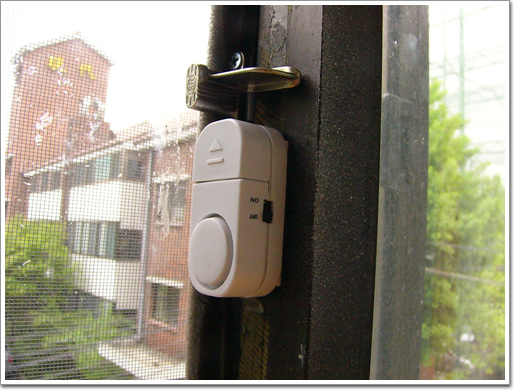
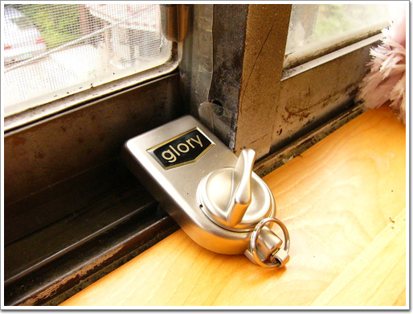

# 도둑맞곤 못살아

자전거를 도둑맞은 후 보안의식이 강화되어, 집안의 다른 헛점은 없는가 살펴보았다.

연립주택이다보니, 자연 도둑들기 쉬어 보였다.

창문이 제일 안전하지 못해보였다.

드라이버로 창문사이를 벌이면 그대로 열릴 수 있는 구조였다. 물론 집이 2층이어서 조금 위험이 적긴 하지만..

그래도 이 취약한 곳을 보안하기로 했다.

옥션에서 산 경보기와 창문안전 잠금 장치를 설치했다.

그리고, 오래되어 삭아있는 문고리도 다시 사서 달았다.

\- 다시 단 문고리와 경보기. 켜진상태로 창문이 열릴 경우, 자동차도난 방지장치에서 나는 정도는 요란한 소리가 난다.

\- 무려 한개에 만오천이나 하는 안점 잠근 장치다. 저걸 문틈에 꽂고 돌려 잠그면, 창문을 깨지 않는 한 열 수 없다.

이렇게 하고 보니, 꼭 영화 "도둑 맞고 못살아"의 박상면이 생각나는군.. ㅋㅋ

[null](../6166905.html#6166905_1)

