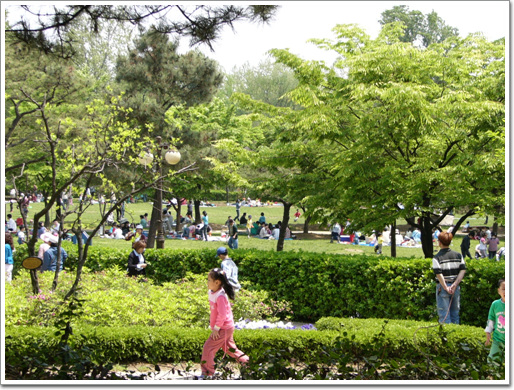
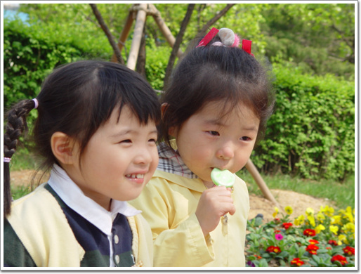

# 용산 시민공원

어린이날 식구들과 함께 용산시민공원으로 놀러갔다.

어린이야 조카인 못난이 자매 2명 뿐이고, 그냥 어른들 놀러가는 셈이지.

한 5년전쯤 와보고, 그 후로 처음 와보는 거다. 많은 사람들이 있었다.

그래도 놀이기구 같은 것이 없어서, 다른 놀이공원과 같은 번잡스러움은 없어 괜찮았다.

\- 많은 사람들에 불구하고 평온한 모습이다.

\- 조카 세인과 세진. 세인인 울다가 막 그쳐서 아직 얼굴이 안 풀렸다.

5년전 왔을 때에 비해 공원은 꽤 작아졌다. 그 동안 공원의 반이 국립중앙박물관 용지로 바뀌어서 그랬다.

아직 미군 헬기착륙장은 그대로 있어, 시끄러움은 있었다. 거의 20분에 한대씩 이착륙을 하는 듯 해 보였다.

[null](../6166908.html#6166908_1)

