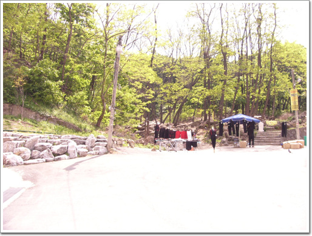
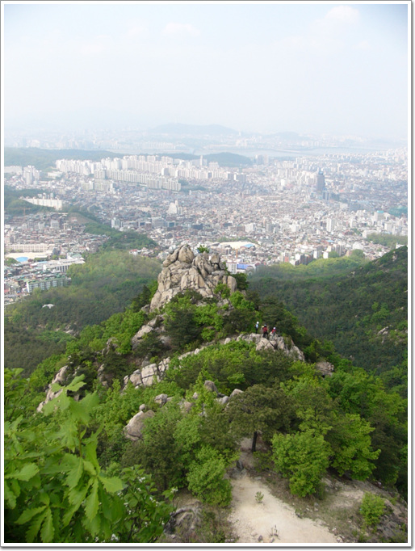
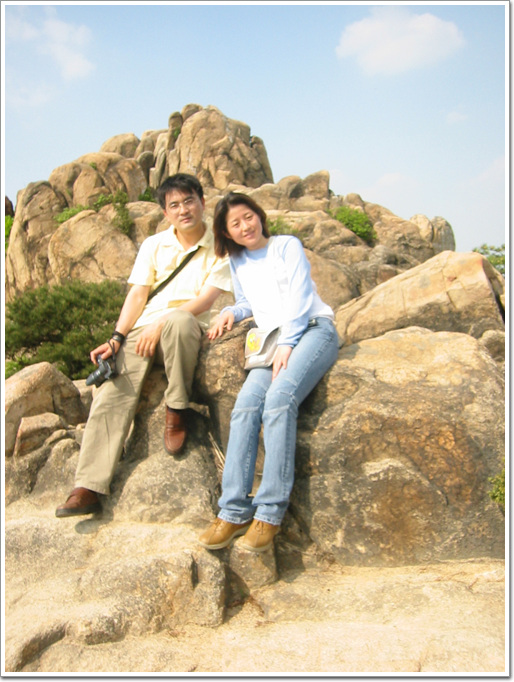
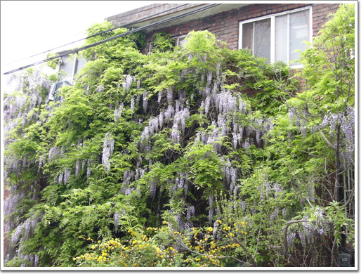

# 처음 올라가 본 관악산

5월 1일 노동절. 노는 날인데, 안타깝게도 토요일이라 노는 날의 의미를 충분히 못살리는 안타까운 날이지요. 주중에 끼어 있으면, 한주에 3일을 놀 수 있는 좋은 기회일텐데..

아내랑 관악산에 오르기로 했다. 산에 가자고, 아침부터 깨우고, 성화를 부려댔는데도, 결국 문 밖을 나선 시간은 오후 1시. 참 늦게 출발했지요.

대중교통 검색을 해 보니, 집앞에 서는 92-2 번 버스가 사당역으로 가길래, 사당에서 올라가는 코스로 정하고, 버스를 타고 사당역에서 내려 올라갔지요.

한 20여분 올라가는 드디어 관악산 입구가 나오더군요.

\- 사당에서 올라가는 관악산 입구. 산 입구답지 않고 옷을 팔고 있군. 아직 새 카메라에 익숙치 않았다. 찍고 보니 노출과다다.

'악'자가 붙은 산 치고는 완만했다. 하긴 서울에 있어, 산의 거의 중턱까지 아파트가 있으니 그럴만 하겠다. 꼭대기까지 올라가는데는 한 시간 정도 걸린 것 같다.

\- 역시 정상에서 보는 풍경이 좋다.

\- 정상에서 아내랑 찍은 사진.

\- 내려오는 길에 보인, 등나무로 덮인 연립주택. 나도 집을 이렇게 무성한 나무과 풀로 덮히게 하고 싶다. 멋있어 보인다. 저 정도 큰 걸 보면, 이 집도 15년은 기본으로 넘었겠군..

[null](../6166909.html#6166909_1)

