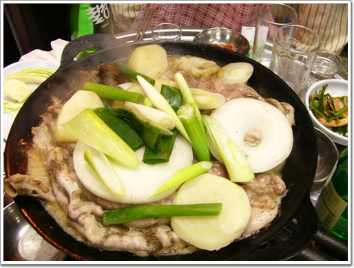
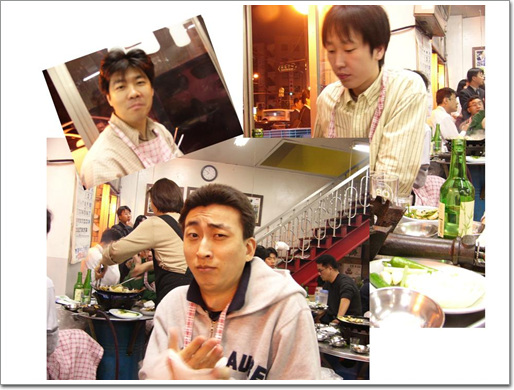

# 교대에서 곱창을 먹다

회사사람들과 교대에 있는 거북곱창으로 갔다.

곱창집이니까 물론 곱창을 먹으러 간거지.

지금 우리 회사 근처에서 유명한 곱창집이 있다.

이름은 서래양곱창이라고 하는데, 꽤나 비싸고, 사람도 항상 만원이다.

비싸서 그 서래양곱창에서는 세번인가밖에 못 먹었봤다.

회사앞에서 마을버스 9번을 타고 갔다.

대기하는 사람들이 있어, 우리도 한 10분 밖에서 기다린 후에야 들어갔다.

\- 처음 시킨 곱창모듬 3인분.

\- 같이 간 회사 사람들. 가운데가 이재형씨, 왼쪽이 김경률씨, 오른쪽이 동함이다. 심상민은 나중에 왔다.

곱창같은 음식이 기름기가 무지 많아, 다이어트에 치명적이라 하여, 조금만 먹을려 애를 썼는데, 먹다보니 많이 먹어, 5명이서 곱창 6인분에 소주 3병을 먹어치웠다.

[null](../6166911.html#6166911_1)

