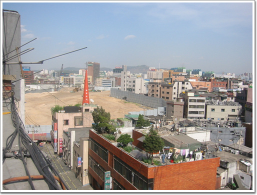
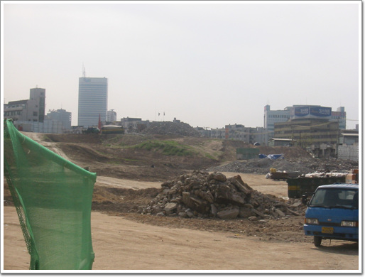
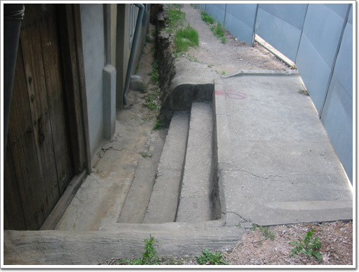

# 사라져버린 삼일아파트 뒤편의 언덕

청계천 복원 공사가 한창인 이 때 청계천으로 갔다.

목적지는 황학동. 벼룩시장이 있는 삼일아파트 뒤에 초록이 우거진 밭이 있는 언덕을 보기 위해서.

가면서도, 내심 제발 아직 철거되지 않고 그대로 있기를 바랬다.

회사도 강남, 거주지도 강남으로 옮기면서 강북으로 올 기회가 별로 없었다.

방송에서 개발의 뒷면을 보여줄때 주로 비춰주던 곳이 바로 삼일아파트 뒷편이다. 조그마한 기와지붕의 집이 있고, 언덕에 밭이 있으면서, 그 앞에 큰 삼일아파트가 있는 그 장면. 그 장면을 다시 보고 싶었다. 없어지기 전에.

삼일아파트에 올라갔다. 이 삼일아파트도 조만간 없어지겠군.

\- 앗! 늦었다. 이미 다 철거되고 난 후다. 그 푸르디 푸른 밭은 없어지고, 황토만이 있다.

\- 저 앞에 풀들이 아직 조금 남아 있는 걸로 봐서, 공사시작한지 채 한달이 안되어보였다. 안타깝다. 조금만 더 일찍 왔었다면..

\- 매정하게 계단을 막아버린 공사장 담벼락. 이 계단을 따라 도시속의 들녁이 펼쳐졌을텐데..

내 게으름이 원망스러웠다. 없어질 것을 알고 있었으면서도 왜 제때 오지 못했나 하는..

[null](../6166912.html#6166912_1)

