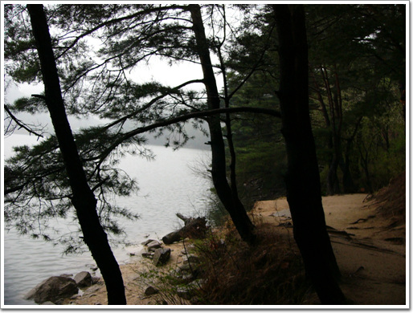
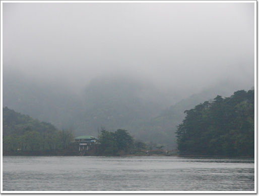
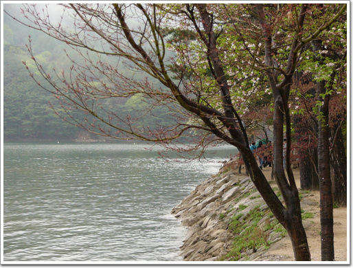

# 비오는 날의 산정호수

포천에 있는 산정호수에 갔다.

가까이 있고, 여러번 지나치기도 했는데, 직접 가본 것이 이번이 처음이었다.

월요일 아침에 갔었기 때문에, 한가했고, 때마침 전날밤부터 비가 내리고 있어, 더욱 더 한가로이 여유있는 곳이었다.

1925년에 농업용으로 만든 저수지인데, 자연경관이 좋아 국민관광지로 지정되었고, 많은 사람들이 놀러 오는 곳이라 한다. 정말 자연경관은 훌륭했다. 산속에 있는 호수라 독특한 멋이 있었다. 하지만, 사람들 많이 오는 주말에 온다고 하면 글쎄 별로일 것 같다는 생각이 든다.

멋있는 자연경관과 산정호수라는 고요한 이미지와 어울리지 않게, 조그만한 빈틈 곳곳에 위락시설이 즐비하고 있어, 이 위락시설들이 풀가동하는 주말이면, 오히려 아쉬움만 더 가지고 떠나지 않을까 싶었다.

[null](../6166913.html#6166913_1)

