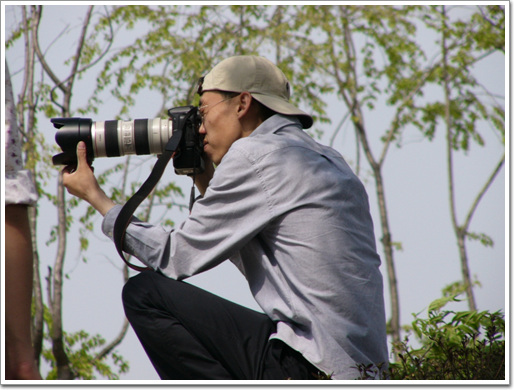
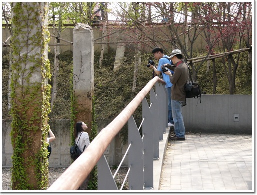
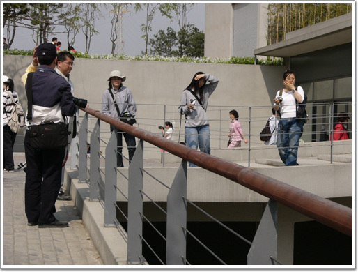
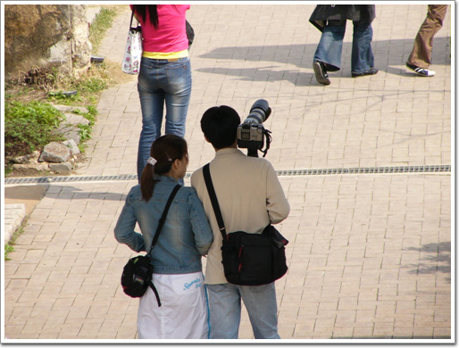

# 디카 전시장 선유도

디카 FZ1을 산 후, 제대로 성능 발휘를 못해본 탓에, 성능을 제대로 내보고 싶어 근질근질하던 차에, 투표를 마친후, 친구 동함과 출사를 나갔다.

장소는 상암동 하늘공원과 한강 선유도.

초여름의 맑은 날씨라 꽤 많은 사람들이 있었다.

그리고 그 많은 사람들 대부분이 한 손에 디카를 들고 여기저기 찍게 바빴다.

뽐뿌질이라는 용어가 딱 맞게, 뽀대가 나는 큼직한 카메라와 대포(망원렌)를 들고 다니는 선유도는 최고급 디카 전시장이라 착각하게끔 하였다.

\- 무릅의탁 앉아 쏴 자세

\- 디카 동호회에서 단체로 출사 나왔나?

\- 피사체를 찾고 있는 사람들

\- 모델과 사진사

[null](../6166915.html#6166915_1)

