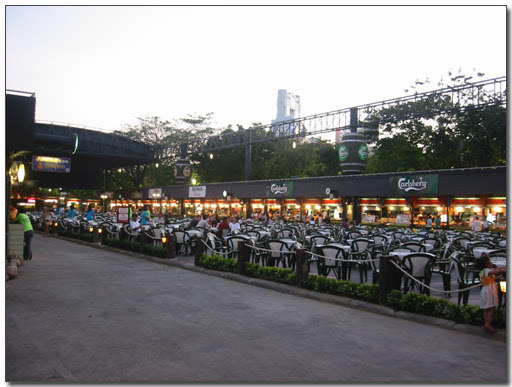
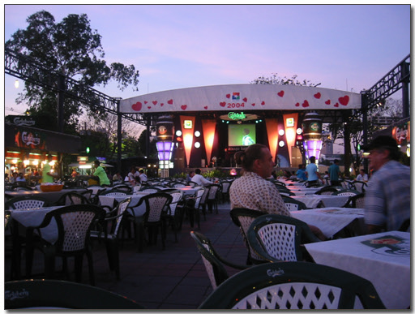
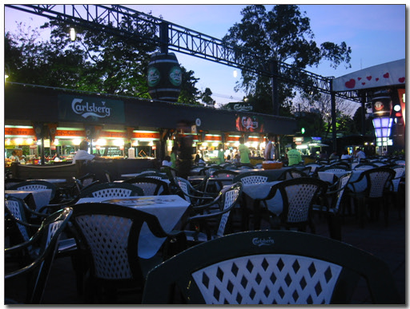
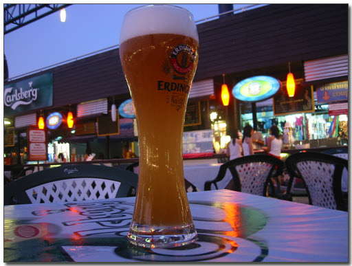
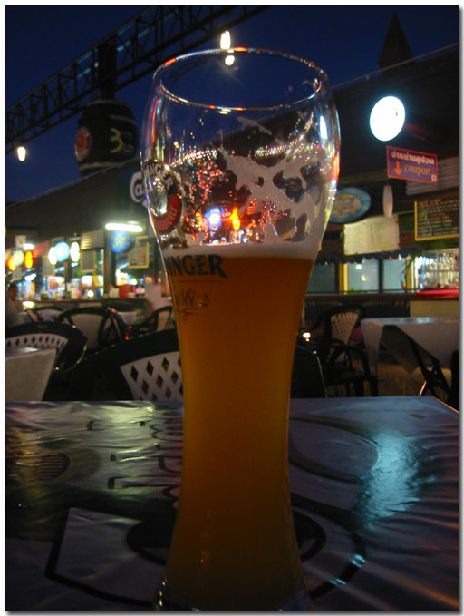

# 술 마시고 싶어지다

긴 출장이었다. 원래 4일간의 출장 계획으로 와서 그런지도 모르겠다.

4번의 귀국 일정 연기 후에 드디어 방콕에서 뜰 수 있게 됐다.

수안룸나이트바자의 푸드코트에서 맥주를 먹었다. 무려 500cc를.

하늘이 보이는 공간이다. 꽤나 넓은 공간이다. 앞에서 라이브로 노래도 불러주고..

\- 푸드코트다. 꽤나 넓다.

\- 정면의 대형 스크린과 함께, 노래하는 아마추어 밴드

\- 왼편으로는 푸드코트답게 다양한 음식들이 있다.

\- 이게 내가 시킨 맥주다. 미쳤다. 500cc나 시키다니..

탁 트인 하늘이 보인 공간이어서 좋았다.

왠지 꽉 막힌 건물 내부에서는 오히려 더 답답함이 가중될 것 같은 생각이었다.

야외 공간에서 술을 먹다보니 field라는 단어가 떠오르더군. 여기도 field이지.

야외 음악회(field conert, 사실은 open conert겠지만..)를 좋아한다.

자유로운 분위기가 좋아서이다.

field(산과 들을 벗하며)에서 어린 시절을 보냈다.

field(야전)에서 군 생활의 반을 보냈다.

영내에서 먹고 잔 날보다 야전에서 텐트에서 자며 반합에 밥을 먹은 날이 더 많았다.

군대에서 FM(Field Manual-야전교범)이란 소리도 들었던 적이 있었다.

이 회사에 와서 매달 field test를 나갔다.

field와 내가 좀 친한가 보다.

\- 만취상태에 도달한 때. 무리했다. 그냥 아는게 500cc라서 500cc 골랐는데, 역시나 무리였다.

[null](../6166924.html#6166924_1)

