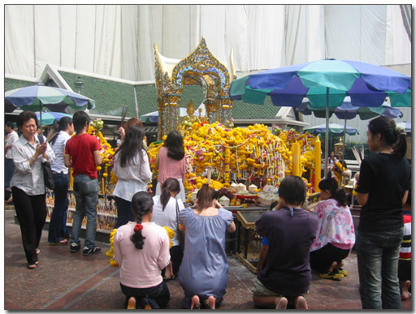
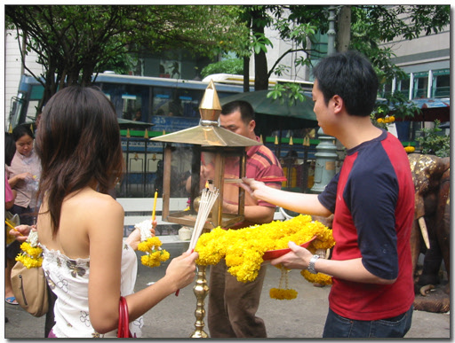
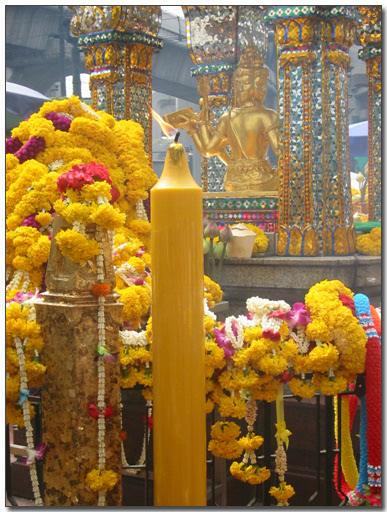
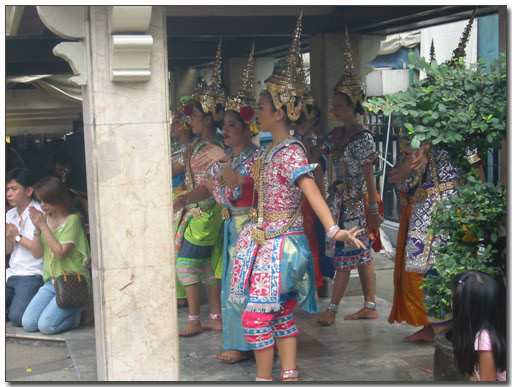
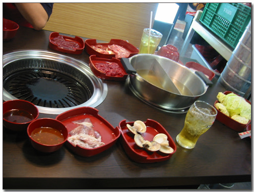
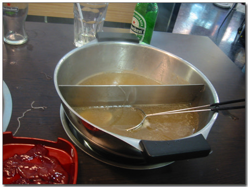

# 켈빈과 함께 있던 방콕

\- 켈빈이다.

Skyworks 홍콩 엔지니어 켈빈과 5일을 같이 있었다.

호텔은 같은 호텔이 아니었기에, 일할 때는 메신저로 하고,

점심 저녁 때 만나 같이 밥 먹으러 다녔다.

지난 일요일에는 겔빈이 에라완 사당에 가자고 하였다.

따라 나섰다.

소원을 잘 이루어주는 사원이라고 한다.

\- 기도를 드리는 사람들.

\- 켈빈은 이곳에 소원을 빌기 위해 왔기에, 300바트(6000원)어치 꽃과 향, 초를 샀다.

\- 놓은 초중에서 제일 큰 초. 높이기 한 1미터 50정도 되어 보인다. 한 1년은 탈려나?

생각보다는 작았다. 60여평 되는 공간이 다였다.

힌두사원으로 소원 성취를 감사하는 의미로 신에게 춤을 추어 헌납하기도 한다.

\- 춤으로 신에게 헌납하는 무용수

같이 여러 비싼 군데를 돌아다닌 끝에, 결국 내 입에도 맞는 데를 갔다.

마분크롱쇼핑몰 4층에 있는 오이시바베큐&수키 라는 곳이다.

바베큐라는 우리의 삼겹살 구워먹는 식으로 생각하면 되고,

수키는 샤브샤브로 보면 된다. 199바트(6000원)에 마음껏 먹는 뷔페식이다.

\- 삼겹살 구울 수 있는 불판과 샤브사브

\- 다 먹은 후, 참으로 오래간에 맛있게 배부르게 먹은 저녁이다. 왼쪽의 간은 맛이 없어 남겼다.

시원한 국물이었다. 고향의 맛이었다.

[null](../6166925.html#6166925_1)

