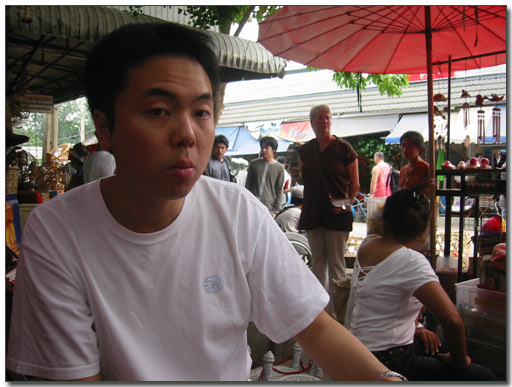
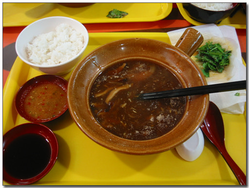
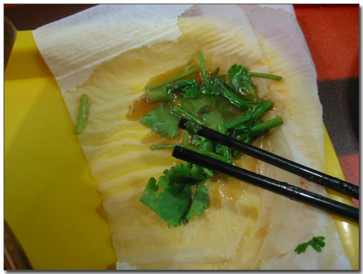
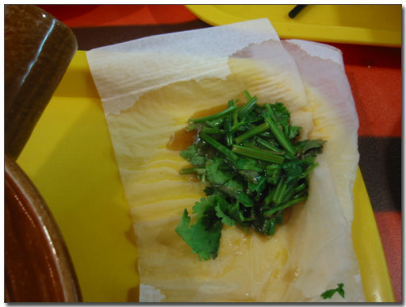
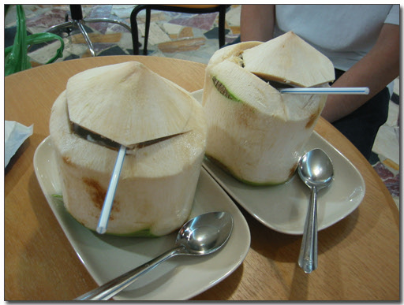

# 김치가 먹고 싶어지다.

큰 일 났다.

세상에 김치가 먹고 싶어진 것이다. 지난 1년 반동안, 반은 출장다니느라 외국에 있었건만,

김치가 먹고 싶어진 적이 없었는데, 김치가 먹고 싶어졌다. 이 사태를 어찌할꼬..

홍콩에서 온 skyworks 엔지니어 켈빈과 같이 있으면서, 출장비 거덜나는 속도가 빨라졌다.

켈빈은 밥 먹은 것 영수증 청구하면 회사에서 주기 때문에, 굳이 싼 걸 먹을 필요가 없었고,

그나마 물가 싼 태국에서 좋은 것을 먹고자 하였기 때문이다.

그 덕에 황새쫒아가다 뱁새 다리 찢어진다는 것처럼 두달후에나 나올 출장비도 이미 미리 거덜이 나고 있다.

\- 켈빈이다. 괜찮은 사람이다.

오늘은 저녁을 먹으로 마빈크롱 건물로 갔다.

오늘 먹은 음식은 샥핀. 상어지느러미 요리다. 다행이 마빈크롱의 푸드코드는 그다지 저렴했다. 샥핀수프 하나에 150마트(4500원).

\- 샥핀(상어지느러미) 수프. 이게 홍콩에서 10만원정도 한다고 한다.

지금 팍치 걷어내고 있는 중이다.

이렇게 많은 팍치(향채-향기나는풀, 먹으면 비누맛이 나는 한국사람 거의가 못 먹는 풀임)가 듬뿍 있었다.

건져낸다고 건져냈지만, 이미 팍치는 국물에 푹 우려나 있는 상황이었다.

\- 걷어 내고 있는 팍치

\- 이 만큼이나 많은 팍치가 들어있었다.

그걸 먹다보니, 아직 고국에 복귀못하고 있는 신세가 한탄스러워지면서, 김치생각이 간절이 나는 것이다.

어떻게 다 먹어치고 나서, 쥬스를 먹었다. 코코넛에다가 빨대만 꽂은 쥬스.

\- 코코넛. TV로 볼 때는 참 맛있어보였는데..

지난 번 태국왔을 때 한번 먹었었는데, 혹시나 하여 다시 한번 시도해봤다.

역시나 그 비린맛에 맛을 느끼지 않도록 빨리 쑥 마셔버렸다.

[null](../6166928.html#6166928_1)

