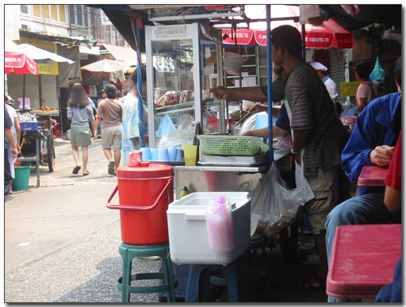
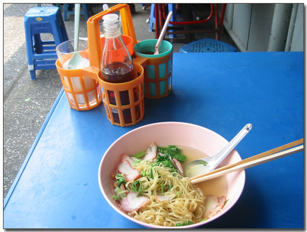
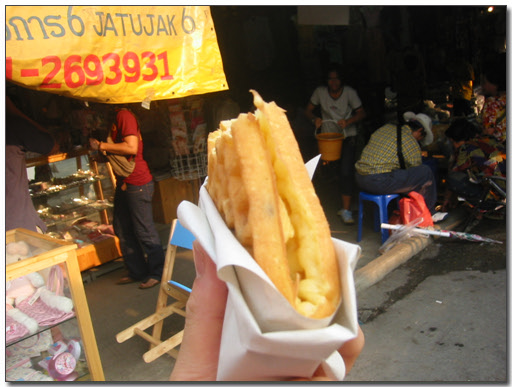
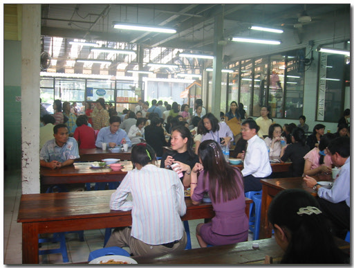
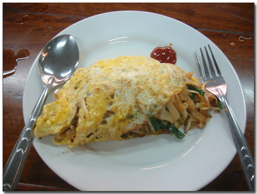

# 방콕에서는 뭘 먹나?

태국에서 제일 유명한 음식, 똠양꿍.

매운맛에다가 팍치(향채)가 팍팍들어가 절묘한 맛을 내는 음식이다.

하지만 내 스타일은 아니다.

방콕에 온지 5일째. 벌써 5일째군.

그동안 매일아침은 호텔비에 포함되어 있으니, 꼬박꼬박 먹었고,

점심, 저녁 다 합쳐 밖에서 사 먹은 적은 두번이다.

방콕의 길거리엔 포장마차가 상당히 많다.

어딜 가는지 안 보이는 곳이 없다.

주요리는 국수나 밥 값은 끼니음식인 듯하다.

\- 포장마차. 태국인들은 이렇게 밖에서 많이 먹나 보다.

어설픈 식당에서 먹느니, 현지인들이 먹는 그 음식을 먹고자, 포장마차에 앉았다.

음식종류를 모르니, 그냥 재료들하고 다른 사람들 먹는 것 보고, beef noodle 달라고 했다.

금방 만들어주더군.

단촐하다. 한그릇에 25바트(800원)이다. 맛은 그럭저럭.

베트남갔을 때 먹은 쌀국수가 입맛을 너무 높여놔서, 어지간한 국수엔 성이 차지 않는 것 같다.

\- 이것도 길거리에 사먹은 것. 갑자기 이름이 생각이 안나는군.. 암튼 맛있다.

오늘은 호텔 옆에 있는 푸드코트로 갔다. 거기서 사 먹은 것은 맥이 추천한 팟타이.

\- 주문하고 기다리는 중. 한 3분 정도후에 요리가 다 됐다.

\- 기다리는 사이 주위를 둘러보니, 근처 직장인들 다 모여서 점심식사중이군..

\- 나왔다. 팟타이.

생긴모양은 볶음밥하고 비슷하게 생겼는데, 안에 들어있는 것은 볶음면. 맛은 괜찮았다.

국물이 없는게 조금 안타깝긴 하지만..

그러고 보니 나만 이렇게 하나 먹고 있었다.

다른 사람들은 옆에 쥬스하나씩 놓고 같이 먹고 있군. 이런 음식에 따끈한 계란국이 딱인데..

[null](../6166933.html#6166933_1)

