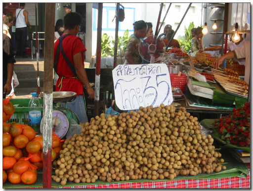
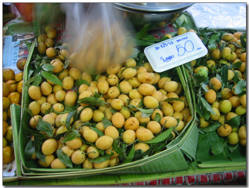
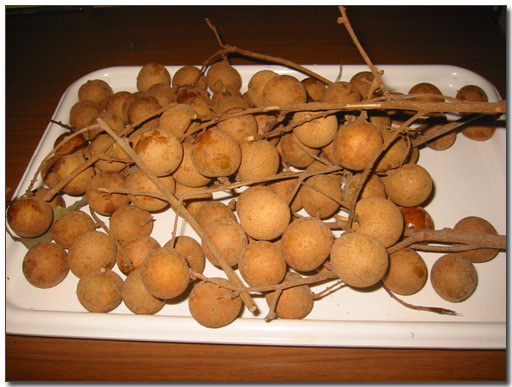
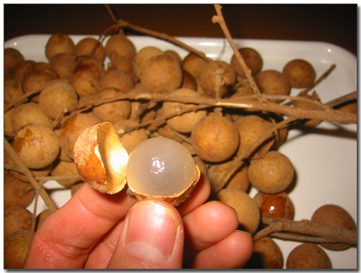
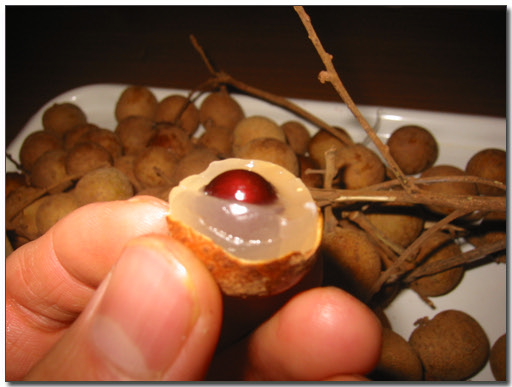
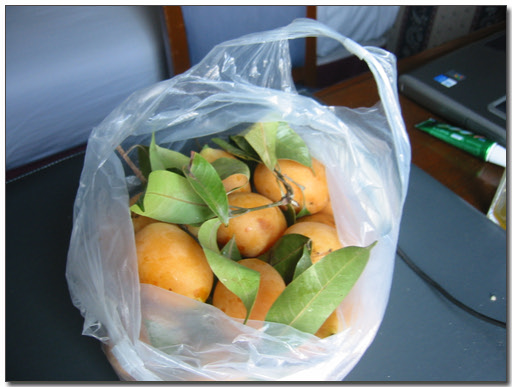
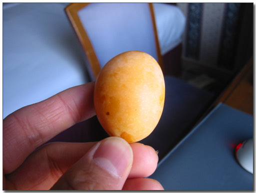
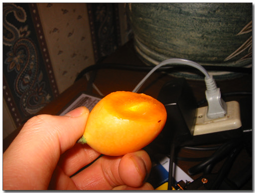

# 중국집에서 먹었던 그 린치

먹이를 찾아 산기슭을 어슬렁거리는 하이에나처럼, 오늘도 람부탄과 망고스틴을 찾아 헤맸다.

안 보인다.

하지만 또 다른 먹이감 발견.

린치를 발견한 것이다. 중국집에서 이것 먹어보셨나요? 저가 중국집말고 중급이상 되는 중국집에서 후식으로 주는 후식. 저는 이걸 삼성동에 있는 외래향이라는 중국집에서 처음 먹어 봤지요. 이 린치의 껍질 까기 전 모습이 어떻게 생겼는지는 예전 대만 출장갔을 때, 같이 테스트를 했던 대만분이 알려줬지요. 린치밭을 지나갈때 바로 저게 린치나무라고 하면서.. 그때 잘 봐두었건 이때 효력을 발휘하는군요. 그걸 몰랐다면 저거 뭘까 하머 어쩌 지나칠 수도 있었는데..

린치 1Kg에 35바트(1100원). 1Kg을 샀지요. 사는 김에 왼쪽에 있는 오렌지도 사고..

그리고 또 린치와 함께 오늘 산 먹이감. 이름은 잘 모름. 이름 뭐냐고 물어봐서 듣긴 들었는데, 흉내내기 어려운 발음이었음. 누구 아는 사람 갈켜줘요..

지금이 철인지는 모르겠는데, 길거리에 많이 보이더군요. 애는 1Kg에 50바트.

오늘의 열대과일 파티.

자 린츠부터..

\- 쟁반위에 쏟아놓고..

\- 껍질을 벗기니, 중국집에서 하나만 나와 항상 아쉬움 남겼던 그 린치다.

\- 반만 깨물어보니, 안에 큼직만하게 들어있는 씨앗. 그래서 실제 먹는 부분은 조금밖에 없다

자, 이제 다음차례는 정체불명의 열대과일.

\- 린치보다 비싼 거니까, 더 맛있을려나?

\- 요놈을 어떻게 먹어야 하나? 고민중..

\- 칼로 살짝 잘라 먹었다. 좀 시군.. 자두맛하고도 약간은 비슷한데, 더 맛있다. 이것도 안에 큼직막한 씨가 있어, 은근히 먹기 불편하군..

[null](../6166934.html#6166934_1)

