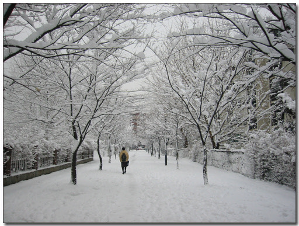
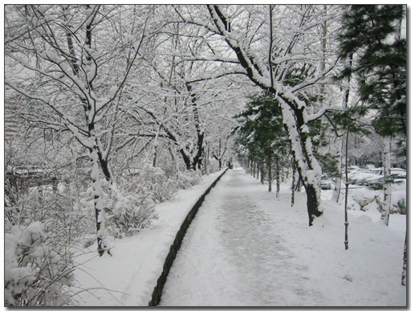
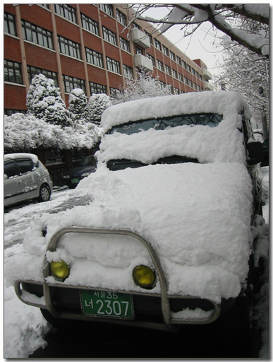

# 폭설 다음날 회사 출근길

100년만에 폭설이 내렸고, 그 폭설이 따뜻한 날씨로 거의 다 녹아가는 이 때,

지난 주 찍었던 사진을 보니, 이게 과연 지난 주 일이었나 싶네요.

회사출근 하는 길이 고속터미널에서 반포아파트로 쭉 걸어가는 길인데,

이 길이 꽤나 운치가 있습니다. 나무가 많이 심어져 있거든요.

[null](../6166936.html#6166936_1)

