# 버스타고 휴전선 넘어 이북으로

버스타고 휴전선 넘어 이북으로

조선민주주의 인민공화국. 영어로 DPRK. Democratic People's Republic Korea. 북한의 공식 명칭이다. 여기는 가는 거다. 내가 실향민도 아니고, 북에 가족도 있는 것도 아니고, 그렇다고 6.25 내전을 경험을 세대로 아닌 내게 북한에 대해서 가지고 있는 생각이란, 어렸을 적부터 받아온 반공교육. 그리고 그 반공교육이 다 독재를 하고 자신들의 친일, 반민족 행위를 덮고 일신의 안락을 위해 주입해 온 교육이라는 것을 대학가서야 깨달았고, 군대 복무하면서, 주적이 북한 괴뢰군인지라, 북쪽을 향해 항상 포를 겨누고 있는 포병부대에 있는 날들. 휴전선과 5Km 정도밖에 떨어져 있지 않던 부대였던지라, 밤이면 흘러나오면 대남선전방송 그 간드러지는 노랫소리가 생각이 난다.

이 금강산관광이 내게는 금강산 일만 이천 봉 그 자체보다는 금기의 땅이었던 북한에 가 본다는 것이 더 설렜었다.

\- 최북단 통일 전망대를 감시하는 헬기가 돌아다니더군.

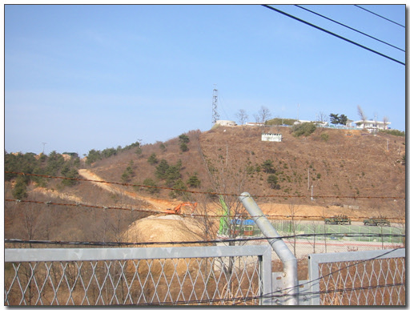

\- 한 시간 가량을 이 철조망 밖에서 기다렸다.

통일 전망대에서 출국하기 위해 기다리는 한 시간은 꽤나 지겹더군. 별다른 위락시설이 있는 것도 아니고, 철조망과 군인들만이 많이 보였다.

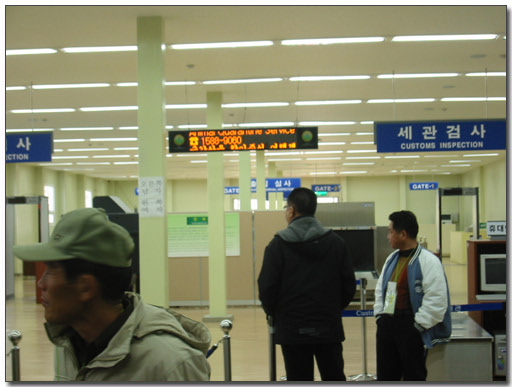

\- 출국 심사대 모습

출국하기 위한 출국 심사대는 남자와 여자가 서로 따로 들어가게 되어 있더군. 여자 왼쪽, 남자 오른쪽으로. 출국 심사대를 지나니, 북으로 갈 버스가 기다리고 있었다. 번호판은 금강산2374라 적혀 있는 34인승 버스.

우리들의 일반적인 버스가 보통 80인승인가 되는데, 좀 작은 버스다. 들리는 말로는 북한의 길이 그리 넓지 않아, 이 34인승 버스로 했다고 한다. 그래서 그런지, 실내도 좀 비좁은 느낌이었다.

\- 2박 3일간 타고다닌 금강산 버스.

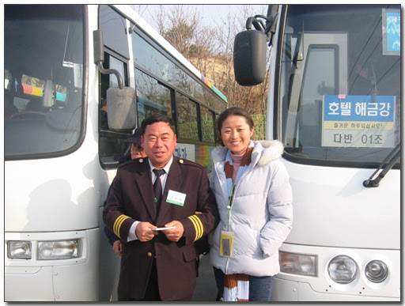

\- 운전하시는 조선족 아저씨. 3년계약이라고 한다. 옆의 아녀자가 제 아내.

버스를 타고 이동하면서부터 사진 촬영이 금지되어 있다. 뭐 안 들키고 몰래 찍으려면 찍을 수야 있겠지만, 굳이 그렇게 까지 하고 싶진 않더군. 괜히 이 때문에, 앞으로의 금강산 관광에 또 다른 제약 사양을 집어넣을 수도 있을 것 같기도 해서. 비수기라서, 이번에 출발하는 사람들은 총 382명. 총 14대의 버스로 이동을 했다. 버스 앞에 붙은 명찰도 해금강 다-1호차. 조장은 안주선이라는 가이드였다. 각 차량에는 한명씩 가이드가 타는데, 이를 조장이라고 부른다. 운전하는 아저씨는 조선족 아저씨.

버스는 오후 4시 10분 출발했다.

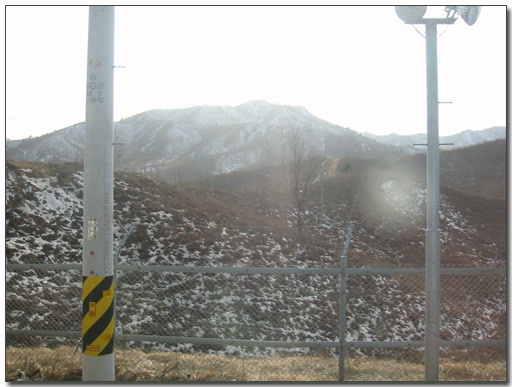

\- 출발하기 직전 찍은 사진. 이후 호텔 도착전까지는 사진 촬영 금지다

비무장지대로 향하는 길에는 갈대밭이 넓게 펼쳐져 있었다. 영화 JSA에서 보던 그 갈대밭 같은 느낌이다. 가는 동안 안주선 조장이 여러 설명을 해 주면서 갔다. 현대에서 금강산 30년 독점 개발권을 계약하려고 할 때, 일본에서 현대에서 제시한 금액에 무조건 3배를 줄 테니, 자기에서 독점 개발권을 주라고 요구했다고 하는데, 김정일이 같은 민족인 현대에 계약을 했다 한다. 대북불법송금 어쩌니 하면서, 특검까지 가고 그랬었는데, 심히 안타까운 일이다. 누가 우리의 설악산 30년 독점 개발권을 50억에 달라하면 과연 줄까 의구심이 든다. 독점 개발권에 대한 비용을 북에 지불한 것인데, 범법행위로 몰아간 숭미극우세력들이 밉다. 버스에 타고 가는 동안, 현대에 대한 생각이 많이 들더군. 정주영. 물론 재벌로서 노동자 탄압도 많이 했고, 안좋은 일도 많이 자행했다. 하지만 정부도 미국 눈치 보느라 못한 이 대북 사업을 한 것을 마땅히 칭찬받아야 하고, 정부도 미국 눈치좀 그만 보고, 북한과 잘 해 나갔으면 하는 바람이 든다.

내가 출발한 2월 16일. 이 날이 김정일 생일이라고 한다. 북한의 두 번째 큰 명절이라고 한다. 제일 큰 명절이 김일성 생일. 뭐 큰 명절이면 관광객에게도 떡 하나 올 줄 기대했는데, 일절 그런 것은 없었다.

남측 통문을 지날 때까지는 남한 군 차량이 호위를 해 주었다. 통문을 지나니, 이곳부터 말로만 듣던 바로 그 비무장 지대. 한창, 동해북부선 건설과 육로 포장 공사를 하고 있는 중이었다. 남측 통문에서 북측 통문까지의 거리는 약 3km. 한 10여분 정도 갔다. 아직은 비포장도로라서 천천히 갔으니. 중간쯤엔 녹슨 군사분계선 표지도 있더군.

북측 통문을 지나니, 인민군 두 명이 차에 타서 인원 점검을 했다. 계급은 우리나라의 소령급과 대위급 정도 되는 장교라고 한다. 옷은 꾀죄죄하여 열악한 환경을 금세 느낄 수 있었다. 보통 부대마크 다는 자리에 "경무관"이란 마크가 달려있더군. 군인을 아무 말 없이 힘 잔뜩 준 눈으로만 살펴보고 내렸다. 열을 맞춰 걸어가는 폼은 우리나라와 달라 좀 생소해 보였다. TV에서만 보던 그 손을 양 앞으로 저으며 걷는 폼이다.

검문이 끝나고 다시 버스는 달렸다. 이때부터 북한군 지프차가 우리를 호위했다. 북쪽에서 공사 중인 철도와 육로는 별 진척이 없어 보였다. 자재와 장비는 남에서 제공을 하고, 인력을 북에서 하는 거라고 한다. 그래서 그런지 현대오일뱅크 표시가 붙어있는 유류고도 보이더군. 작업하기 위한 임시 주유소라고 한다.

금강산에서 구룡연과 삼일포,해금강 코스를 현대에서 쓰고 있는데, 여기에 설치해 놓은 철망 같은 것 들이 자꾸 없어진다고 조장이 말해주는데, 북에서 그런 철 자재로 훔쳐가는 것 같다고 한다. 그래서 없어진 다음 물어보면, "바람에 날라갔나?"라고 시치미를 뗀다고들 한다.

한창 공사중인 곳의 바위산에 눈을 뗄 수가 없었다. 사진을 못 찍는게 아쉽긴 한데, 그 큼직큼직한 바위와, 주변의 경관이 우리나라의 산하가 아닌, 다른 곳 같았다. 가는 곳곳에 군대 막사도 보였다. 생김새가 우리나라 군대 막사와는 전혀 다르게, 초가집으로 지어져 있더군. 그래서, 주위의 경관과 잘 어울려 보였다.

조금 더 가니, 오른편에 민가가 나타났다. 자전거를 타고 가고 있는 사람들의 모습도 멀리 보였다. 저 사람들이 바로 북한 사람이구나. 이 마을의 자전거도 현대아산에서 기증한 자전거들이라고 한다. 그리고 이 마을들이 북한에서 부촌에 속한 마을이라고 한다. 고성평야라고 하여, 평야와 바다를 같이 가지고 있어 옛날부터 잘 사는 지방이었다 한다. 왼쪽 편에 금촌리라고 하는 마을도 있었는데, 이는 길 바로 왼편에 있어, 가장 가까운데서 볼 수 있는 마을이었다. 도로변에 높은 담을 쌓아 잘 볼 수는 없었지만, 일어서서 보니, 마을안 농구대에서 농구하는 아이들의 모습도 볼 수 있었다.

이어, 양정리, 온정리 마을도 보였다. 양정리에 금강산 샘물공장이라는 남북합작 공장도 보이고, 온정리에는 아파트도 있었는데, 3층짜리 아파트였다. 북한말로는 다층살림집이라고 한다고 한다. 아파트였지만, 난방은 장작으로 하기 때문에, 장작 쌓여 있는 것과 굴뚝에 연기 피어오르는 것도 볼 수 있었다. 금강산관광전용길 옆에는 평양까지 이어지는 고속도로라는게 있었는데, 다니는 차는 없고, 다들 걸어다녔고, 드문드문 자전거가 보였다. 운 좋겠고 노상 방뇨하는 북한 아저씨도 보이더군. 이 광경은 같이 버스에 타고 있은 아줌마들이 엄청 좋아하더군. 그 모습을 보려고 다들 창가로 몰려가는 게..

가는 길은 금강산관광 전용도로라 하여, 북측주민들은 출입할 수 없는 길이었고, 길 가장자리로는 철조망이 쭉 쳐져 있었다. 이 철조망이 북쪽 지역으로 가지 말고 친 것인지, 북한 주민보고 이 도로에 들어오지 말라는 것인지는 잘 모르겠다. 그리고 500여 미터마다 빨간 깃발을 들고 서 있는 인민군들이 있는데, 사진 촬영하는 게 발각되면 빨간 깃발이 올라가면서, 모든 차는 정지되고, 사진기가 압수된다고 한다.

이윽고 도착한 숙소. 먼저 금강 빌리지가 보였는데, 이건 컨테이너 박스였다. 내부는 잘 해 놨다고 설명을 하는데, 겉모습으로 봐서는 관광객용으로 영 안 어울려보였다. 호텔해금강은 육지에 있는 호텔이 아니고, 바지선에 있는 호텔이었다. 아마도 북에다 호텔 짓기에 잘 안되는지, 아마 남한 조선소에서 만들어가서고 이곳 북으로 끌고 온 듯 해 보인다. 외향은 그리 고급스러워 보이지는 않았다.

\- 이곳이 호텔 해금강. 6층짜리 선상 호텔이다.

버스가 정차한 곳은 해금강호텔 바로 앞에 있는 북한출입사무소. 번호대로 줄을 서서 들어갔다. 10배줌 이상 카메라는 반입이 안 되는 거라 카메라는 일일이 손에 들고 통과를 했다.

호텔에 짐을 두자마자 간 곳은 금강산온천. 아까 지나쳐 온 온정리 마을 근처에 있었다. 1회에 10불인데, 2회를 끊으면 15불이었다. 2회짜리 끊고서 온천에 들어갔다. 좋더군. 잘 만들었다. 생각보다도 훨씬 좋았다. 규모도 꽤 컸다. 노천탕이 특히 죽여줬다. 비로봉을 바라보며 온천 손에 있는데 정말 신선이 따로 없더군. 무색무미무취 이게 금강산 온천의 특징이다. 너무 맑았다. 혀로 맛도 살짝 보았다. 그냥 생수맛 보다 더 좋더군. 남탕과 여탕이 따로 분리되어 있으며, 주기적으로 남탕과 여탕을 바꾼다고 한다. 이유인 즉슨, 양기와 음기를 적당히 섞기 위해서라고 한다.

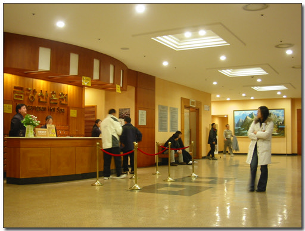

\- 금강산 온천 내부. 직원 들 대부분은 조선족 동포들이었다.

\- 8인용, 15인용 개발욕실도 있다.

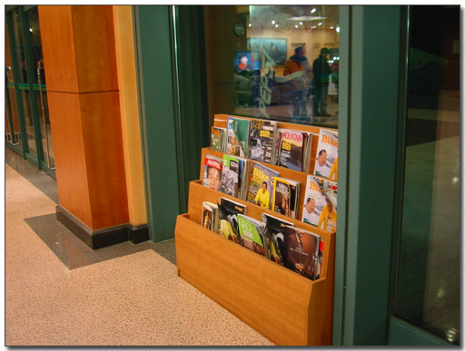

\- 잡지들도 비치되어 있었는데, 쪼잔하게 2002년, 2003년 등 철지난 잡지들만 비치되어 있더군.

1시간 동안 금강산 정기를 받으며, 냉탕,온탕,열탕,노천탕,한증막 등을 다 돌고 나오니, 온 몸에 힘이 불끈 솟더군. 온천은 2층짜리 건물인데, 2층에서는 북한미술가 작품 전시회를 하고 있었다. 한 가지 놀라운 것은 사회주의국가인데 예수초상화와 최후의 만찬 그림이 있었다는 점이다.

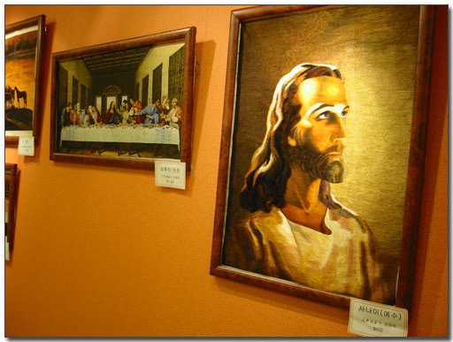

\- 북한 화가들이 그린 그림. 미술가에 급수가 있는데, 인민미술가>공훈미술가>1급미술가>2,3,4,5급 미술가 순이다.

\- 온천에서 온정까지 걸어갈 수 있는 길

온천에서 저녁식사를 하는 온정각까지는 걸어 다닐 수 있었다. 한 500여미터정도되는 거리. 온정각은 한식 뷔페인데, 신선한 야채로 주로 이루어져 있었다. 1인당 10달러. 비싼 편인 것 같기도 하고, 뷔페라 하면 적당한 가격인 듯도 해 보인다. 맛은 꽤 괜찮은 편이었다. 이 온정각에 현대아산에서 운영하는 상점과 면세점들이 위치해 있었다. 북한 토속물품들이 있는데, 주로 북한 술과 농작물류였다. 구매 욕구를 당기는 것들은 없더군. 사회주의국가라 구매욕을 불러일으키는 물건을 만들 필요도 없었겠지만..

\- 저녁식사. 신선한 풀로 먹었다. 꽤 맛있다.

\- 밥 먹고 있는 다른 사람들.

\- 온정각 전경

핸드폰을 시계대용으로 썼었는데, 핸드폰은 반입이 안 되어서, 시간 모르는 게 좀 답답했다. 저녁 식사 후, 호텔로 들어갔다. 536호. 그래도 신혼이라고, 일반실보다 한 단계 높은 Executive Suite를 주었다. 즉 침실과 별도의 방이 있었다. 전망도 좋더군. 창 밖으로 금강산이 병풍처럼 둘려 쌓여 있는 게... 그리고 신혼부부를 위해 과일도 서비스되어 있더군.

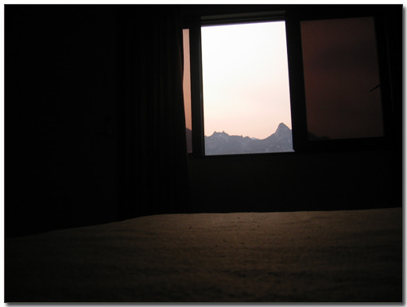

\- 내 방 창 밖으로 보이는 금강산 자락

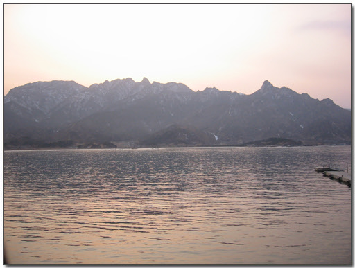

\- 창 밖으로 보니, 더 멋있군.

\- 카메라앞에 폼 잡고 있는 아내

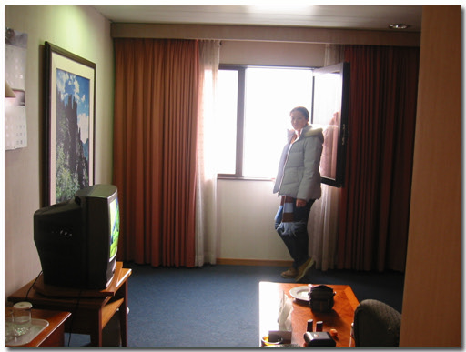

\- 내방 스위트룸. TV는 북한방송이 아닌, 남한 유선방송이 나오더군. 홈쇼핑방송까지

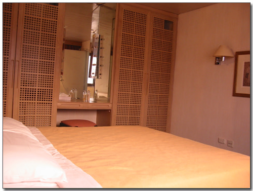

\- 침실

자유시간이 거의 없는 여행이라, 방에서는 특이하게도 알람시계가 있더군. Made in China란 게 좀 그랬었고, 5시 반에 맞춰 놨는데, 다음날 5시 반에 울리지 않아서, 역시 made in china라는 것을 알게 된 것도 그랬다.

