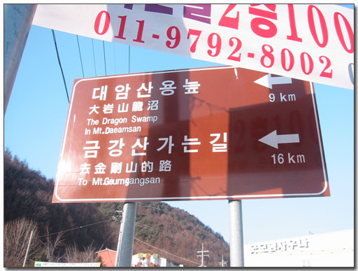
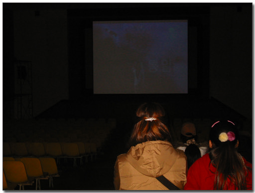
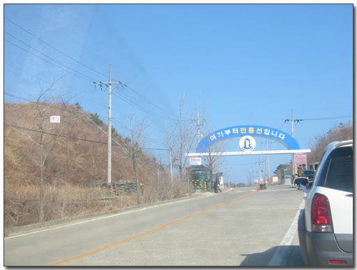
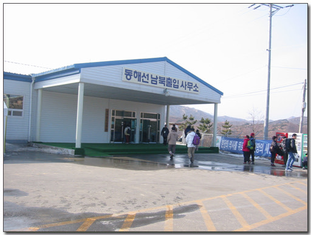

# 금강산 가는 길

금강산 가는 길

신혼여행으로 금강산을 갔다. 대부분의 사람들이 다들 이해못하겠다고 하더군. 하긴 금강산 관광이라 하면 실향민과 할아버지 할머니의 효도 관광이 제일 먼저 떠오르기는 하다.

신혼여행지를 고를 때 사실 여러군데를 후보로 두고 고민하기는 했다. 사람들이 많이 가는 태국이나 괌, 제주도 쪽을 두고 어디가 괜찮을까 했었다. 태국은 이미 출장으로 가본 곳이고, 괌도 이미 가본 곳이고, 제주도는 출장가면서 비행기에서 내려다 본 곳이고, 기타 다른 동남아시아도 출장으로 갈 수 있을 것 같고, 아주 먼 곳은 경비가 너무 클 것 같고 하여, 쉽게 어디가 좋을 까 결정을 못하고 있었다. 그러다 떠오른 곳이 금강산이었다. 금강산이야 출장 갈 일은 없을 테고, 그렇다고 국내 여행하듯이 쉽게 여행할 만한 곳도 아닌데다, 버스로 비무장지대로 건너 휴전선 너머 북한으로 가 보는 것이 꽤 흥미있어 보였다.

금강산 패키지는 2박 3일밖에는 없었다. 신혼여행으로 좀 짧긴하다. 숙소는 호텔과 팬션, 빌리지가 있는데, 신혼여행인지라 호텔로 정했다. 호텔은 매일 출발이 아닌, 격일이었다. 그래서 결혼을 토요일에 했지만, 금강산은 월요일에 출발을 해야했다. 금강산으로 출발하기 위해 집결하는 장소는 고성에 있는 금강산콘도다. 그래서 여유있게 지낼 겸 해서, 금강산콘도 하루 예약을 하고, 일요일 금강산 콘도로 출발을 했다.

나의 훌륭한 명차 록스타를 타고, 46번에 올랐다. 그 전에 금강산에서는 달러만이 통용되므로 600달러 정도 환전하여 갔다. 올림픽대로를 타고 46번 국도를 타고 쭉 올라갔다. 홍천을 지나 인제를 지나니 원통이 나왔다. 군대갈 때 제일 기피하던 지역이었다. 인제, 원통 지역. 인제가면 언제 오나 원통해서 못 살겠다 하면서.. 그 오지를 이제야 와 보는군..

원통을 지나니, 이 같은 안내 표시판이 보이더군. 금강산가는길 16km. 그래서 이 금강산 가는 길로 갔다. 그런데 죽 가는데, 아무래도 느낌이 이상한 거였다. 차를 세우고 지도를 펴 보니, 금강산으로 이어진 길이 맞긴 한데, 갈 수 없는 길이더군. 분단되기 전에 금강산 가는 길이었다. 다시 차를 돌려 원통으로 나와 다시 46번을 타고 쭉 가니, 진부령이 나왔다. 진부령 정상은 그리 높아 보이진 않더군. 진부령 정상에 알프스 스키기장 입구가 있었다. 스노보드를 싣고 올 껄 하는 후회가 들더군.

고성에서 통일전망대 쪽으로 향했다. 금강산 콘도가 통일 전망대 근처에 있었기에.. 통일의 길을 타고 올라가니, 이승만, 김일성 별장도 있고, 화진포도 있었다. 마침내 도착한 금강산 콘도. 여기서 하루를 묵고 다음날 북으로 갈 예정이다.

\- 방에서 바라본 풍경

금강산 콘도는 생각보다 좋았다. 내가 이제껏 가본 콘도가 대명, 휘닉스, 성우, 용평, 강화, 오크밸리인데, 이 들보다도 좋았다. 최북단에 있는 콘도라서 사람도 그리 많지는 않은 것 같고.. 넷포츠를 통해 예약한 거라, 16평에 5만5천원이었다. 그리고 방도 바닷가쪽 방으로 택할 수 있었다.

\- 역시 창 밖으로 바라본 풍경

다음 날. 금강산 콘도에서 금강산 가기 위한 집결 시각이 14시이므로, 오전 동안 시간이 있었다. 그래서 오전동안 뭘 할까 하다가, 통일 전망대 구경 가기로 했다. 금강산 콘도에서 300여 미터 올라가니, 통일전망대 출입신고소가 있었다. 그곳에서 주차료 2000원과, 입장료 각각 2000원씩 총 6000원을 냈다. 통일전망대 가기 위해선 매시 정각에 있는 안보 교육을 받고 가야 했다. 우리는 11시에 하는 안보교육을 받아야 했는데, 그걸 받기 위해 30여분 기다렸다. 이윽고 안보교육. 강당에서는 스크린으로 대한뉴스 비슷한 허접한 영상물을 틀어주더군. 괜히 들었다. 검사도 않던데, 그냥 갈 껄 그랬다.

\- 이게 안보교육하는 강당 내부

교육후, 차를 몰고 통일전망대로 갔다. 이곳에서 한 10여킬로미터 떨어져 있더군. 민통선이 보이더군. 간만에 통과해보는 민통선이다. 군대에 있을 때, 여단 BCT 훈련하면서 철원 위의 민통선 너머에서 훈련한 적이 있었는데, 그 후 민간인 신분으로서는 처음이군.

\- 민통선이다.

통일 전망대에 도착해 보니, 이곳에 남북출입국 사무소가 있더군. 아차 하는 생각이 들었다. 분명 이따 출국하기 위해 이곳에 올 텐데 하는 생각이 들더군. 통일전망대에 오르니, 멀리 금강산과 해금강의 모습, 그리고, 한참 남북을 잇는 도로와 철도 연결 공사 중이었다.

\- 저 멀리 있는 게 북쪽 땅 금강산과 해금강이다.

다시 콘도로 돌아와 체크아웃을 하고, 지하 1층에 있는 관광접수처로 갔다. 돗떼기 시장 같은 난잡함이 있었다. 내가 속한 조는 다-1조. 우리 말고도 신혼 여행 온 사람이 더 있더군.

\- 금강산 관광 접수하는 곳. 콘도 지하 1층에 있다. 금강산카드라고 하여 충전하여 쓸 수 있는 카드도 있더군..

금강산 콘도에 차를 두고, 1500원하는 노선버스를 타고 다시 통일전망대에 도착. 2시 30분 도착하였지만, 별 다른 할 것을 없었다. 명색이 출입국 하는 곳인데, 철도역 대합실 정도의 분위기였다. 공항 라운지 정도로 격을 높이면 좀 더 좋지 않았을까 싶다. 30분간을 시간 죽인 후 다시 출입국 사무소로 갔는데 아직 북에서 입국 대상이 도착하지 않아 더 기다려야 했다.

\- 남북출입사무소. 공항의 보안검사와 입국심사대 같은 거다.

\- 철조망 안쪽으로는 동해북부선 연결 공사를 하는 듯 하다.

\- 기다리고 있는 틈에, 메모를 하고 있는 나

\- 남는 시간동안 먹은 아바이 순대. 홍어회가 같이 나오더군.

3시쯤에 도착하여 입국신고 및 세관검사가 끝난 후에야 우리가 출국할 수 있는 거다. 그래서 또다시 시간 죽이기 위해 순대집에 들어갔다. 한 접시 만원이더군. 좀 비싸지. 그래도 이런 금강산관광 덕분에 이 지역 경제도 좀 살고 되는 게 좋겠지.

\- 통일 전망대의 식당들..

