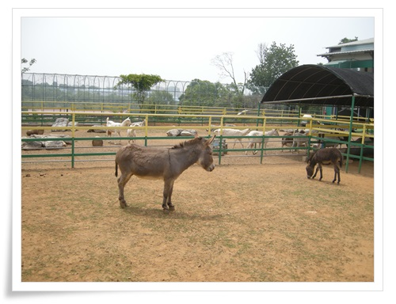

# 자연산양농장

경기도 농업기술원의 교육을 통해 자연산양농장을 방문했다.

농장이라는 어감과는 달리 평택시 청북면 고령리의 전혀 농장이 있을 만한 곳처럼 안 보이는 동네에 있었다.

여기 농장주가 귀농했을 당시에는 오지였었다고 하는데, 지금은 빼곡히 공장들이 가득차 있다.

\- 산양농장의 메인 건물

\- 나무로 이런 작품까지 만들어 놓고 재주가 많으신 주인분이다.

-입구에 설치되어 있는 표지판.

\- 체험행사로 버터만들기를 해 봤다.

\- 준비물은 산양유와 흔들 통, 그리고 만들어질 버터를 담을 종이컵과 스틱

\- 버터만들기에 대한 이론 교육.

산양유에 있는 규질화되지 않은 상태의 원유를 강하게 흔들면 지방끼리 뭉쳐 버터가 된다고 한다.

\- 통에 산양유를 넣고 한 10여분 열심히 흔든다.

\- 만들어진 버터.  흰색이다.

\- 버터를 찍어 먹을 수 있는 빵과 과자가 준비되어 있다.

\- 이렇게 버터를 찍어 먹었다.

아주 맛있다.

\- 자연산양농장 소개.

자전거대리점을 하시다가 2006년 귀농하셔다고 한다.

산양을 기르게 된 이유도 당시 초등학생이던 아들에게 우유를 먹이려고 하는데 오지라 우유 배달이 안되어 직접 산양을 키우신거라 한다.  그냥 이 말까지는 단지 운을 잘 잡으셨구나라고 생각했는데, 그 과정과 이 분야에 대한 해박한 설명을 들으며 엄청난 열정과 식견에 감탄을 하게 되었다.

\- 본 건물 위로 텃밭이 있고, 그 위로 산양축사가 있다.

저 구석에 있는 경운기를 보니 경운기 뽐뿌가 난다.

\- 산양이 있는 축사.

\- 어린이 체험객을 위해 저렇게 당나귀도 있고, 토끼, 닭도 있다.

\- 이게 산양.  영어로 무슨무슨 goat라고 하니 양보다는 염소에 가깝다 하겠다.

\- 직접 산양에게 풀도 줘보고..

\- 젖도 짜 본다.

\- 이 산양이 젖짜는 실습담당.

젖 짤때 저렇게 맛있는 먹이를 주기에 문만 열면 저 위치로 자발적으로 하는게 신기했다.

산양 젖 짤 수 있는 기간은 새끼낳고 8개월이라고 한다.

그래서 겨울철에 새끼낳아 키우는 동안 젖을 새끼에게만 먹이고 그 나머지 기간만 젖을 판다고 한다.

나도 산양 한마리 키워 우유를 자급자족해 보고 싶군.

