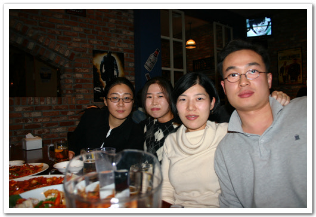

# 다음호스팅 OB 송년모임

실로 간만에 한 예전 회사 송년회

지난 주 화요일에 모였습니다. 강남역 도시인이란 술집에서.

나의 첫 회사 다음의 OB모임이었지요.

지금은 팀도 없어지고, 사람들도 다 각자 뿔뿔히 흩어졌지만, 2년만에 보는 모습들이라 그런지 반갑더군요.

다음에 대한 내 추억, 기억들.

연봉 1800으로 입사했었는데, 3개월동안은 수습이라며 60만원만 받던 기억. 매일 야근을 했었으니, 한달 밥값 25만원에 교통비 15만원을 빼면, 10만원밖에 남지 않았었죠. 그래도 국내 제일의 벤처에 다닌다는 착각에 불평없이 살았었죠.

그 후, 팀은 이재웅 사장에 의해 강제 분사 합병되어 다음솔루션이 내가 다니는 회사가 되었고, 그리고 1년 후, 자본금을 다 빼먹은 다음 이재웅 사장에 의해 해체되어, 순식간에 다 뿔뿔이 흩어져야 했던 동료들.. 얼마전 머니투데이에서 밝혀진 다음 분식 회계 사건이 얼마나 고소했던지... 그래도 이런 일이 회사와 사원은 별개라는 것을 깨달을 수 있는 좋은 기회이기도 했죠.

안좋은 기억들이 떠오르기도 하지만, 호스팅팀이란 곳에서 있었던 시절은 꽤나 재미있었죠.. 회사 출근하는게 재미었거든요. 회사라기보다, 대학원 연구실같은 분위기였고, 팀 사람들끼리 주말에 같이 놀러다니기도 했었죠. 사회생활 5년차인 지금 그 초년생 시절을 회상하니 흐믓해지네요...

요즘에는 아침이면 왜 이리 회사 출근하기가 싫고, 일요일이면 왜 그리도 월요일 오는게 두려운지..

